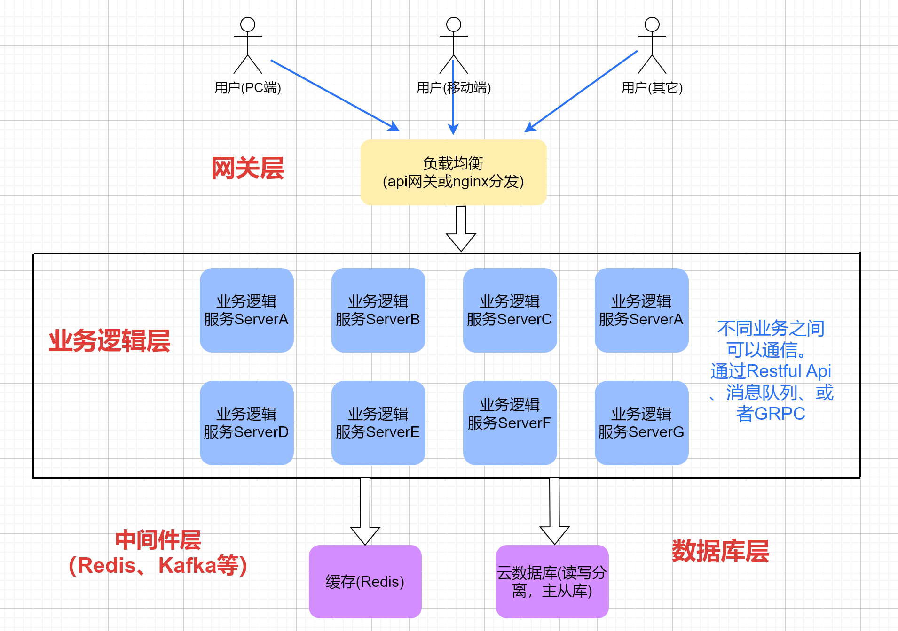

# 一、分布式微服务架构的原理和总体架构

    分布式服务，顾名思义就是服务是分散部署在不同的机器上的，一个服务可能负责单个或几个功能，是一种面向服务的架构，服务之间也是通过RPC（Remote Procedure Call）或者是RestfulAPI来交互。

    分布式系统是现代计算机科学中的一个重要领域，它涉及到多个计算机节点之间的协同工作，目标是实现更高的性能、可用性和可扩展性的系统。

    随着互联网的发展和数据规模的增长，分布式系统的应用范围不断扩大，成为许多企业和组织的核心基础设施。分布式应用开发也成为高级工程师必备的技能。

## 1、单体服务存在的不足

单体服务架构


**优点**：简单、开发效率快、开发成本低。

**缺点**：

- 脆弱，只要有一个环节出问题，整个系统就会崩溃。

- 随着互联网用户迅速发展，传统单体架构技术难以支撑海量用户的需求，无法应对高并发请求。

- 维护成本高，每个地方修改都会影响到整体。无法应对复杂业务带来的各种挑战。

单体服务架构改造的核心就是要对应用做微服务化改造，微服务化改造使用到的核心技术架构就是分布式服务框架。

## 2、分布式架构原理

    分布式架构的核心原理是将一个大的任务分解成若干个小的子任务，分布在不同的节点上并行处理。通过节点间的通信和协作，共同完成整个任务。这种架构可以充分利用多核处理器、集群、云计算等计算资源，提高系统的处理能力和响应速度。

这种架构在现代计算系统中发挥着重要的作用，尤其是在处理大规模数据、提供全球服务或应对高并发请求时。

## 3、分布式架构的实现方式

- **负载均衡**：通过负载均衡器将请求分发到各个节点上，使各节点的负载均衡。常见的负载均衡算法有轮询、加权轮询、最少连接等。

- **消息队列**：通过消息队列实现节点间的异步通信，提高系统的并发处理能力。常用的消息队列工具有RabbitMQ、Kafka等。

- **服务化架构**：将系统划分为多个服务，每个服务独立部署、独立维护，通过API网关进行服务间的调用和通信。

- **缓存Redis**：常用数据放到缓存层，实现快速读取，减小计算压力以及IO存取压力。

- **数据库集群**：通过将数据分散到多个数据库节点上，实现数据的水平和垂直拆分，提高数据库的读写性能和并发处理能力。

## 4、分布式架构总体架构图



## 5、分布式架构的优势和挑战

**优势**：

- **高性能**：通过负载均衡和并行处理，提高系统的处理能力和响应速度。

- **高可用性**：通过节点间的冗余备份和故障恢复机制，确保系统的可用性。

- **可伸缩性**：根据负载变化自动扩展或缩减节点数量，实现系统的可伸缩性。

- **灵活性**：可以快速部署新服务和功能，降低开发、维护成本。

**挑战**：

- **通信开销**：节点间的通信和协作可能带来较大的网络开销。

- **分布式一致性**：在分布式系统中实现数据一致性是一个挑战。需要采用合适的分布式一致性协议，如CAP理论、Paxos、Raft等。

- **系统复杂性**：分布式系统中的节点间依赖关系复杂，可能导致系统故障传播和性能瓶颈。

- **容错性**：某个节点发生故障时，如何保证整个系统的稳定性和可用性是一个挑战。

## 6、微服务的应用以及拆分

### （1）、微服务出现的背景

    传统的Web项目都是采用单体架构的方式来进行开发、部署、运维的。所谓单体架构就是将程序的所有业务模块全部打包在一个文件中进行部署。但是随着互联网的发展、用户数量的激增、业务的规模极速扩张，业务的复杂度急剧增加，传统的单体应用方式的缺点就逐渐显现出来了，给开发、部署、运维都带来了极大的难度，工作量会越来越大，难度越来越高。传统**单体架构主要存在以下的问题**：

- 随着业务复杂性的增加，开发变得困难，增加了研发成本抑制了研发效率的提升。

- 系统的运维成本很高，对某个功能的修改，都需要对整个系统进行构建、测试、部署。

- 技术栈单一，不能够很好地解决业务的多样化需求。

- 隔离性差，一个模块出现问题，可能导致整个系统崩溃。

- 可伸缩性差，对于部分业务的高并发，不能按需扩展。

    为了解决上述问题，微服务架构应运而生。简单来说，微服务就是将一个单体应用拆分成若干个小型的服务，协同完成系统功能的一种架构模式，在系统架构层面进行解耦合，将一个复杂问题拆分成若干个简单问题。下面是**采用微服务架构带来的优势**：

- 服务承载的业务逻辑内聚，易于开发与维护。

- 单个服务启动快。

- 技术栈灵活，独立的服务可以选用不同的技术栈。

- 独立的按需扩展，满足高并发与大流量。

### （2）、微服务的拆分原则

- **单一职责**
  单个服务内部功能高内聚服务间低耦合。

- **闭包原则**
  
  微服务的闭包原则就是当我们需要改变一个微服务的时候，所有依赖都在这个微服务的组件内，不需要修改其他微服务。

- **服务自治**
  
  避免对其他微服务的强依赖。
  避免环形依赖与双向依赖。
  环形依赖和双向依赖说明微服务划分不合理，业务边界不清晰或者通用功能未沉淀。

- **持续演进**
  
  先粗粒度拆分，逐步演进，避免服务数量的爆炸性增长。
  阶段性合并，随着对业务领域理解的逐渐深入或者业务本身逻辑发生了比较大的变化，亦或者之前的拆分没有考虑的很清楚，导致拆分后的服务边界变得越来越混乱，这时就要重新梳理领域边界，不断纠正拆分的合理性。

- **三个火枪手（服务拆分粒度原则）**
  
  服务拆分要考虑团队规模和业务复杂度，避免拆分过细带来较高的维护成本。
  业务发展期，需要大量设计和开发工作，3人负责一个微服务，业务和技术上可互相讨论，互相备份，避免人员单点。
  业务成熟期，主要以维护为主，开发工作较少，2人负责一个微服务，相互备份，避免人员单点。
  每个人维护多个微服务，每个微服务被多个人维护相互备份，避免人员单点。

### （3）、实战：电商系统微服务拆分

通常，电商系统包含以下几个功能模块：

- 用户管理模块：用户注册、登录、个人信息管理、订单查看、跟踪等功能。

- 后台商品管理模块：包括商品的添加、编辑、审核、上下架、库存管理、品牌管理等。

- 安全校验模块：短信验证码、邮箱验证码等安全验证。

- 订单模块：下订单、计算订单总价格、快递费等。

- 支付模块：集成多种支付模式。

- 减库存、订单状态模块：订单状态管理（已发货、已收货、售后中、已关闭等），减库存

- 营销与促销模块：优惠券、满减、限时打折、发放红包等活动设置和管理。

- 聊天与订单状态推送模块：实现客户售后服务、订单状态推送等功能。

- 热销商品、排行榜模块：实现热销商品、推荐商品、商品排行榜等功能。

- 第三方接口模块：物流、图像识别、身份认证。

根据这些功能模块，我们可以划分出10个微服务，分别如下：

**用户服务、后台管理服务、验证服务、订单服务、支付服务、库存服务、营销服务、IM（即时通讯）服务、排行榜服务、第三方服务**

微服务架构图如下：


# 二、Go语言的高并发编程

## 1、Go语言的出现

- Go语言 是Google公司 在2007开发一种静态强类型、编译型语言，并在 2009 年正式对外发布。

- Go语言以其近C的执行性能和近解析型语言的开发效率，以及近乎于完美的编译速度，已经风靡全球。很多人将Go语言称为21世纪的C语言，因为Go不仅拥有C的简洁和性能，而且针对多处理器系统应用程序的编程进行了优化，很好的提供了21世纪互联网环境下服务端开发的各种实用特性。

- Go 语言既有Python语言的灵活语法和开发效率，又有接近C语言的运行性能。因此，有人认为 **Go = Python + C** 

- Go语言天生就是为了多并发而设计的。Go语言提供了一些特性，如goroutines、channels和基于消息传递的并发模型，使得并发编程变得简单和安全。

Go 开启并发协程非常方便：

```go
go func() {
    fmt.Println("hello world")
}()

func startCoroutines(i int32) {
    fmt.Println("Good,start coroutines successfully! i=>", i)
}

for i := int32(0); i < 10; i++ {
    go startCoroutines(i)
}
```

Java 开启多线程就没有这么方便了。得继承Thread类，重写run() 方法。要么定义接口Runnable的实现类，并实现run() 方法。

## 2、Go语言GMP原理

先来看看什么是进程、线程、协程。

### （1）、进程

进程是具有一定独立功能的程序关于某个数据集合上的一次运行活动,进程是系统进行资源分配和调度的一个独立单位。每个进程都有自己的独立内存空间。由于进程比较重量，占据独立的内存，所以上下文进程间的切换开销（栈、寄存器、虚拟内存、文件句柄等）比较大，但相对比较稳定安全。

### （2）、线程

通常语义中的线程，指的是内核级线程，核心点如下：

- 是操作系统最小调度单元；

- 创建、销毁、调度交由内核完成，cpu 需完成用户态与内核态间的切换；

- 可充分利用多核，实现并行。

### （3）、协程

协程，又称为用户级线程，核心点如下：

- 与线程存在映射关系，为 多对1（M：1）关系；

- 创建、销毁、调度在用户态完成，对内核透明，所以更轻；

- 从属同一个内核级线程，无法并行；一个协程阻塞会导致从属同一线程的所有协程无法执行。

## 3、GMP设计思想和模型

在 Go 语言中，每一个 goroutine 是一个独立的执行单元，相较于每个 OS 线程固定分配 2M 内存的模式，goroutine 的栈采取了动态扩容方式， 初始时仅为2KB，随着任务执行按需增长，最大可达 1GB（64 位机器最大是 1G，32 位机器最大是 256M），且完全由 golang 自己的调度器（Go Scheduler）来调度。此外，GC 还会周期性地将不再使用的内存回收，收缩栈空间。 因此，Go 程序可以同时并发成千上万个 goroutine 是得益于它强劲的调度器和高效的内存模型。

### （1）、设计思想

G代表goroutine协程，M代表thread线程，P代表processor处理器；P包含了运行G所需要的资源，M想要运行goroutine必须先获取P。

### （2）、GMP模型


- **全局队列**：存放待运行的goroutine

- **P的本地队列**：存放的goroutine数量不超过256个，新建的goroutine会优先放到p的本地队列，如果队列满了，则会把本地队列中一半的 G 移动到全局队列

- **P处理器**：所有的 P 都在程序启动时创建，并保存在数组中，最多有 GOMAXPROCS(默认为CPU的核数) 个。

- **M线程**：线程想运行任务就得获取 P，从 P 的本地队列获取 G，P 本地队列为空时，M 会尝试从全局队列拿一批 G 放到 P 的本地队列，或从其他 P 的本地队列偷一半放到自己 P 的本地队列。M 运行 G，G 执行之后，M 会从 P 获取下一个 G，不断重复下去

## 4、Go语言协程之间的通信

我们上面讲的例子，协程是独立执行的，他们之间没有通信。但在很多项目中，他们必须通信才会变得更有用：彼此之间发送和接收信息并且协调/同步他们的工作。

协程可以使用共享变量来通信，但是我们很不提倡这样做，因为这种方式给所有的共享内存的多线程都带来了困难。

基于共享内存变量来通信，为了保证数据一致性，需要使用锁（如互斥锁、读写锁）来保护共享的资源，防止出现数据竞争（race condition）。举个例子，两个线程同时访问同一个全局变量，为了避免两个线程同时修改导致数据不一致，必须加锁来同步它们的操作。这样虽然解决了并发问题，但也带来了新的复杂性。

- 死锁：线程彼此等待对方释放锁，导致程序无法继续执行。

- 锁竞争：多个线程抢占锁，影响程序的执行效率。

- 锁的管理成本：随着代码规模的增大，锁的管理越来越复杂，容易出错。

而Go有一个特殊的类型，通道（**channel**），像是通道（管道），可以通过它们发送类型化的数据在协程之间通信，可以避开所有内存共享导致的坑。Golang通道的通信方式保证了同步性。数据通过通道，同一时间只有一个协程可以访问数据，这样设计不会出现数据竞争。数据的归属（可以读写数据的能力）被传递。

Golang的通道有两种，有缓冲（存）通道（**channel**），无缓冲（存）通道（**channel**）。

### （1）、无缓冲 Channel

- **定义**：无缓冲 channel 是一种在发送和接收操作时必须匹配的 channel。即，发送操作会被阻塞，直到有接收方准备好接收数据，反之亦然。
- **创建**：`make(chan Type)`，例如：`make(chan int)`
- **特性**：
  - 发送操作在接收操作之前必须等待。
  - 接收操作在发送操作之前必须等待。
  - 适用于需要确保同步的场景，比如确保发送者和接收者严格对齐数据流。

### （2）、有缓冲的 Channel

- **定义**：有缓存的 channel 具有指定的缓冲区大小，这允许发送操作在没有接收方时继续执行，直到缓冲区满。
- **创建**：`make(chan Type, capacity)`，例如：`make(chan int, 10)` 表示创建一个容量为 10 的缓存 channel。
- **特性**：
  - 发送操作在缓冲区未满时可以立即完成，而不需要等待接收操作。
  - 接收操作在缓冲区不空时可以立即完成，而不需要等待发送操作。
  - 可以处理多生产者、多消费者模式，缓冲可以提高性能，减少阻塞。

**两者主要区别**

1. **阻塞行为**：
   
   - **无缓冲 channel**：发送和接收操作都必须匹配，发送会阻塞直到有接收方，接收会阻塞直到有发送方。
   - **有缓存的 channel**：发送操作在缓冲区未满时不会阻塞，接收操作在缓冲区不空时不会阻塞。

2. **容量**：
   
   - **无缓冲 channel**：容量为 0。
   - **有缓存的 channel**：具有指定的缓冲区大小。

3. **用途**：
   
   - **无缓冲 channel**：适用于需要严格同步的场景。
   - **有缓存的 channel**：适用于需要处理大量数据的场景，或者需要减少阻塞和等待的场景。

在大多的应用场景，用到的是无缓冲通道，因此，下面的讲解主要围绕无缓冲通道。

### （3）、golang 通道的定义、读写

```go
//通道的定义 var 变量名 chan 类型
var ch1 chan int
//读、写前，要实例化，没实例化的chan，读、写会panic
ch1 = make(chan int)

//也可以直接这样定义
//比较简洁，也顺便实例化
ch2 := make(chan int)

ch := make(chan int)
//这段代码会出错
ch <- 8
fmt.Println(<-ch)
//运行输出：fatal error: all goroutines are asleep - deadlock!
//因为写入通道的时候，没有接收方
//要开启另一个协程去写入 
go func() {
    ch <- 8
}()
fmt.Println(<-ch)
//运行输出 8
//最后要记得关闭channel
close(ch)
```

### （4）、协程之间的通信实战

在电商系统中，我们知道，用户下单买了商品后，相应的商品要减库存。我们根据这个应用场景，来实战协程之间的通信。

```go
// 商品库存最基本结构
type ProductSku struct {
    ProductId  int64  //商品id
    ProductSku string //商品sku码
    StockNum   int64  //商品库存
}
//给它加一个输出的方法
func (p *ProductSku) Print() {
    fmt.Println("商品id:", p.ProductId, "商品Sku码:", p.ProductSku, "商品库存:", p.StockNum)
}
// 下订单，扣减库存 通信消息的结构体
type NotifySubInventory struct {
    ProductId  int64  //商品id
    ProductSku string //商品的sku码 例如：T00101
    SubNum     int64  //要扣除的库存数量
}

// 下订单
func CreateOrder(ch chan NotifySubInventory) {
    //每隔5秒随机商品下单，总下单50单停止
    count := 0
    for {
        //创建订单，下单逻辑
        //......
        if count > 50 {
            fmt.Println("模拟下单结束！")
            break
        }
        //通知减库存
        i := mathutils.RandInterval(0, 9)
        proId := int64(1000 + i)
        proSku := "T0010" + convert.ToString(i)
        notifyMsg := *NewNotifySubInventory(proId, proSku, 1)
        ch <- notifyMsg
        count++
        time.Sleep(time.Second * 2)
    }
}

// 减少库存
func SubInventory(ch chan NotifySubInventory, proSkuAr []*ProductSku) {
    for {
        select {
        case msg := <-ch:
            fmt.Println("收到减库存的消息")
            for _, proSku := range proSkuAr {
                if msg.SubNum > 0 && proSku.ProductId == msg.ProductId && proSku.ProductSku == msg.ProductSku {
                    proSku.StockNum -= msg.SubNum
                    proSku.Print()
                }
            }
        }
    }
}

//商品库存信息
fmt.Println("初始化商品库存的数据：")
productSkuAr := make([]*ProductSku, 10)
for i := int64(0); i < 10; i++ {
    proSku := NewProductSku(1000+i, "T0010"+fmt.Sprintf("%d", i), 100)
    productSkuAr[i] = proSku
}
//输出打印
for _, r := range productSkuAr {
    r.Print()
}
//
//初始化消息通知通道chan
ch := make(chan NotifySubInventory)
//开启一个协程去模拟下单
go CreateOrder(ch)
//开启一个协程去减库存
go SubInventory(ch, productSkuAr)

//等待终端输入，避免协程没执行，就退出
fmt.Scanln()
```

# 三、进程（微服务）间的通信（RestfulAPI）

## 1、前言

以前在单体式应用中，各个模块之间的调用是通过编程语言级别的方法或者函数来实现的。但是一个基于微服务的分布式应用是运行在多台机器上的。一般来说，每个服务实例都是一个进程。基于微服务的应用程序是在多个进程或服务上运行的分布式系统，通常甚至跨多个服务器或主机。 每个服务实例通常是一个进程。

 微服务设计其中一个挑战就是服务间的通信问题，服务间通信理论上可以归结为进程间通信，进程可以是同一个机器上的，也可以是不同机器的。服务可以使用同步请求响应机制通信，也可以使用异步的基于消息中间件间的通信机制。同步的有restful、RPC等方式，异步的有各种mq中间件，如nats、rabbitmq、rocketmq、kafka等，还有一些不常用的通讯方式，如websocket可以让服务间建立长链接，数据共享方式可以让服务通过数据库或文件的方式进行通讯。

## 2、什么是通信

### （1）、定义


通信是指人与人或人与自然之间通过某种行为或媒介进行的信息交流与传递，从广义上指需要信息的双方或多方在不违背各自意愿的情况下采用任意方法、任意媒质，将信息从某方准确安全地传送到另方。发送者通过媒介将信息传递给接收者，而这里的发送者、接收者可以是人与人、人与自然界，机器与机器、人与机器等等。

### （2）、通信媒介

在定义中提到的媒介就是通信媒介，那么具体什么是通信媒介呢？

通信媒介指的是信息传递的物理或逻辑通道，它是信息传递的途径或介质。通信媒介可以是多种形式，包括电缆、无线信号、光纤、空气等。在不同的场景中，使用不同的通信媒介来传递信息。例如，在计算机网络中，通信媒介可以是以太网、Wi-Fi等；在人际交往中，通信媒介可以是声音、文字、图像等。

### （3）、通信协议

通信协议指的是在信息传递过程中所遵循的规则和约定，以确保信息能够正确、可靠地传递和解释。通信协议规定了信息的格式、传输方式、错误检测和纠正方法等。通信协议是确保通信双方能够相互理解并成功交流的基础。例如，在计算机网络中，TCP/IP协议、Http协议是常用的通信协议；在人类交往中，语言和符号也是通信协议的一种形式。

## 3、微服务的通信方式有哪些

微服务之间的通讯方式可以有很多，我们可以分成两个维度去总结，一个是接收端多少的维度，一个是接口阻塞情况维度。通过接收端多少我们可以分为，点对点模式和广播模式，点对点模式则是发送者只向一个接收者发送消息，广播模式，则是发送者通过广播的信息发送给众多的接收者；通过接口阻塞情况维度可以分为同步通信和异步通信，同步通信则是发送者发送消息后需要等待接收者响应，等待的过程则是阻塞过程。异步通信则是发送者将消息发送出去后，就不用管了，接收者处理消息时，发送者还可以做其他事，不阻塞等待响应。

### （1）、微服务的同步通信 Restful Api

微服务之间的同步通信常见的有这两种方式：**REST方式**、**GRPC**方式。

REST（Representational State Transfer）是一种网络架构风格，用于设计分布式系统中的网络应用程序。它最初由Roy Fielding在他的博士论文中提出，并在2000年被正式引入。REST强调以资源为中心，通过使用一组预定义的操作对这些资源进行状态转移和交互。

REST 的核心思想是将资源（Resource）暴露为一组统一的、易于理解的URL，并使用不同的HTTP方法（如GET、POST、PUT、DELETE等）来对资源进行操作。每个资源可以用一个唯一的URL进行访问，而HTTP方法则指示了对该资源要执行的操作。例如，通过GET请求获取资源，资源可以通过xml、json对象、二进制等形式作为载体。REST使用简单的HTTP请求和响应来实现资源之间的交互，这使得REST服务在跨平台和跨语言的Web服务中广泛使用。

RESTful API是基于REST架构风格的API设计方式，用于构建可伸缩、可维护的Web服务。通过标准的HTTP方法和状态码进行数据交互。它以其简单易用、易于理解和扩展的特点，在微服务架构中得到了广泛应用。它有以下几个特点：

- 简单易用，易于理解
  RESTful API使用标准的HTTP方法（如GET、POST、PUT、DELETE）和状态码（如200、404、500等），使得服务间的通信变得简单明了。开发工程师无需掌握复杂的通信协议，即可轻松实现服务间的数据交换。

- 良好的可读性
  RESTful API的设计遵循REST架构风格，将资源表示为URI，并通过HTTP方法对其进行操作。这种设计方式使得API具有良好的可读性，即使对于非技术背景的人员来说，也能够理解API的功能和用途。

- 易于扩展
  RESTful API具有天然的扩展性。由于它基于HTTP协议，因此可以轻松实现跨平台、跨语言的通信。同时，通过添加新的URI和HTTP方法，可以方便地扩展API的功能，满足不断变化的业务需求。

- 支持多种数据格式
  RESTful API支持多种数据格式，如JSON、XML等。这使得它能够在不同的客户端和服务器之间传输数据，提高了系统的灵活性和兼容性。

- 易于实现负载均衡和故障转移
  RESTful API的无状态性使得它易于实现负载均衡和故障转移。通过将请求分发到多个服务实例上，可以均衡负载，提高系统的性能。同时，当某个服务实例出现故障时，可以将请求转移到其他可用的实例上，确保系统的稳定运行。

### （2）、微服务间的同步通信GRPC

GRPC 是一种高性能、开源的远程过程调用（RPC）框架，最初由 Google 开发并开源。它允许不同的应用程序在不同的环境中进行通信，使用了现代的协议和序列化机制，如 Protocol Buffers（ProtoBuf），以提供高效、可靠的跨网络通信。

GRPC 以下的一些关键特点和组成部分：

- 基于 HTTP/2：
  
  GRPC 基于 HTTP/2 协议，可以在一个连接上进行多路复用，减少了连接的数量，提高了性能。

- 多种支持语言：
  
  GRPC 提供了多种编程语言的支持，包括 Java、C++、Python、Go、C#、Node.js 等，使得不同语言的应用程序可以进行跨平台的通信。

- IDL（Interface Definition Language）：
  
  使用 Protobuf（Protocol Buffers）定义服务接口，IDL 会自动生成客户端和服务器端的代码，使得开发者可以专注于业务逻辑的实现。

- 支持多种通信模式：
  
  GRPC 支持多种通信模式，包括简单的请求-响应、流式请求、流式响应和双向流式通信。

- 强大的错误处理和元数据支持：
  
  GRPC 提供了丰富的错误处理和状态码，以及对元数据（Metadata）的支持，使得开发者可以更好地进行错误处理和上下文传递。

- 拦截器：
  
  GRPC 支持拦截器机制，可以在客户端和服务器端添加拦截器，用于处理日志、认证、鉴权等逻辑。

- 性能优越：
  
  GRPC 基于二进制协议，序列化效率高，性能优越，适用于高并发和低延迟的场景。

### （3）、微服务的异步通信


服务间的异步通信采用异步交换消息的方式完成，如RabbitMq、kafka

Kafka和RabbitMQ都是消息队列系统，它们的主要区别包括：

- 通信模型：Kafka基于发布-订阅模型，而RabbitMQ则采用了AMQP协议、MQTT协议等不同模型，支持点对点和发布-订阅等模型。

- 性能与可靠性：Kafka在高并发、大数据流时表现更出色，可实现每秒百万级别的数据处理；而RabbitMQ采用了AMQP协议，能够保证消息传输的可靠性和事务处理能力。

- 数据存储：Kafka将消息以文件的形式存储在磁盘上，存储的消息不会立刻被消费；而RabbitMQ则采用内存缓存，消息一旦发送就会立刻被消费掉，存储的消息数受到限制。

- 集群架构：Kafka支持集群架构的高可用和分区；而RabbitMQ则基于主从架构，支持镜像队列、负载均衡等机制。

## 4、实战微服务的同步通信 Restful Api

实现两个独立的微服务：微服务A、微服务B。微服务B通过Restful Api与服务A通信。例如，我们微服务A设定为用户服务，微服务B设定为测试服务。

我们《Golang 高级应用开发》学过的gin框架作为脚手架来开发。

### （1）、设计好数据库、数据库表、并插入一些数据以备测试用。

建立数据库：godistappdev，编码为utf8mb4 

建立用户表：ts_user，相应的字段如下：


插入一些测试数据。


我们需要的数据就完成了。

### （2）、建立项目，编写用户服务代码

接下去，我们用gin框架来打架项目，并用gorm来操作数据库。由于这些知识点是我们在《go高级应用开发学过的》。由于时间有限，这里就不细讲。

我们这里主要讲，通过Restful api 交互部分。

添加路由组：

```go
func InitUserRouter(r *gin.Engine) {
    // 用户路由组
    user := r.Group("/user")
    {
        //获取用户列表，分页
        user.GET("/list", v1.UserList)
        //获取单个用户信息
        user.GET("/info/:user_id", v1.GetUser)
    }
}
```

并实现相应的功能：

```go
// @Tags    APP接口/获取单个用户信息
// @Summary    获取单个用户信息
// @Param   param query int "user_id"
// @Router  /user/info/{user_id} [get]
func GetUser(c *gin.Context) {
    userId := c.Param("user_id")
    userLgc := &logics.User_lgc{}
    user, err := userLgc.GetUserByUid(convert.ToInt64(userId))
    if err != nil {
        c.JSON(-1, gin.H{
            "err": err.Error(),
        })
        return
    }
    c.JSON(0, gin.H{
        "user": user,
    })
}

// @Tags    APP接口/获取用户列表
// @Summary    获取用户列表 分页
// @Param   param query int "page_num" "page_size"
// @Router  /user/list [get]
func UserList(c *gin.Context) {
    pageNum := c.Param("page_num")
    pageSize := c.Param("page_size")
    userLgc := &logics.User_lgc{}
    userList, err := userLgc.GetUserList(convert.ToInt64(pageNum), convert.ToInt64(pageSize))
    if err != nil {
        c.JSON(-1, gin.H{
            "err": err.Error(),
        })
        return
    }
    c.JSON(0, gin.H{
        "user": userList,
    })
}
```

逻辑实现：

```go
//逻辑实现 
func (u *User_lgc) GetUserByUid(userId int64) (*models.User, error) {
    user := &models.User{}
    query := mysqldb.Mysql.Model(user)
    //查询单个用户
    query = query.Where("user_id = ?", userId)
    err := query.Find(&user).Limit(1).Error
    return user, err
}
//逻辑实现，分页查询
func (u *User_lgc) GetUserList(pageNum, pageSize int64) (userList []*models.User, err error) {
    //分页查询
    if pageNum < 1 {
        pageNum = 1
    }
    if pageSize < 2 {
        pageSize = 2
    }
    if pageSize > 1000 {
        pageSize = 1000
    }

    user := &models.User{}
    query := mysqldb.Mysql.Model(user)
    err = query.Limit(int(pageSize)).Offset(int((pageNum - 1) * pageSize)).Find(&userList).Error
    return userList, err
}
```

写好代码后，端口我们设置8188，运行程序。


看到这个画面，说明程序运行成功了。

我们自测下，浏览器输入接口地址：http://127.0.0.1:8188/user/info/5

可以看到返回：

```json
{
  "user": {
    "ID": 5,
    "CreatedAt": "2024-12-16T10:08:57+08:00",
    "UpdatedAt": "2024-12-16T10:08:57+08:00",
    "DeletedAt": null,
    "user_id": 5,
    "user_name": "test5",
    "user_pwd": "E10ADC3949BA59ABBE56E057F20F883E",
    "user_mobile": "13800138000"
  }
}
```

输入获取用户列表接口地址：http://127.0.0.1:8188/user/list?page_num=1&page_size=2

可以看到返回：

```json
{
  "user": [
    {
      "ID": 1,
      "CreatedAt": "2024-12-16T10:08:57+08:00",
      "UpdatedAt": "2024-12-16T10:08:57+08:00",
      "DeletedAt": null,
      "user_id": 1,
      "user_name": "test1",
      "user_pwd": "E10ADC3949BA59ABBE56E057F20F883E",
      "user_mobile": "13800138000"
    },
    {
      "ID": 2,
      "CreatedAt": "2024-12-16T10:08:57+08:00",
      "UpdatedAt": "2024-12-16T10:08:57+08:00",
      "DeletedAt": null,
      "user_id": 2,
      "user_name": "test2",
      "user_pwd": "E10ADC3949BA59ABBE56E057F20F883E",
      "user_mobile": "13800138000"
    }
  ]
}
```

至此，我们用户服务开发成功。

### （3）、编写测试服务代码

接下去，写一个测试服务，跟用户服务交互。

测试服务，main 主协程请求用户服务的列表接口，然后再启动一个协程不断访问获取单个用户的接口：

```go
func main() {
    //接口基础地址
    targetUrl := "http://127.0.0.1:8188/user/"
    //启动一个协程获取单个用户信息
    go func() {
        for i := 0; i < 100; i++ {
            //随机用户id
            userId := mathutils.RandInterval(1, 15)
            //通过restful api接口 与用户服务通信，从它那边获取想要的信息。
            rsp, err := http.Get(targetUrl + "info/" + convert.ToString(userId))
            if err != nil {
                panic(err)
            }
            defer rsp.Body.Close()
            println(rsp.Status)
            //处理结果并输出
            body, _ := io.ReadAll(rsp.Body)
            fmt.Println(string(body))
            time.Sleep(time.Second * 5) //休息5秒
        }
    }()
    //通过restful api接口 与用户服务通信，从它那边获取用户列表信息
    u, _ := url.ParseRequestURI(targetUrl + "list")
    data := url.Values{}
    data.Set("pageNum", "1")   //设置参数
    data.Set("pageSize", "5")

    u.RawQuery = data.Encode()
    rspList, err := http.Get(u.String())
    if err != nil {
        panic(err)
    }
    defer rspList.Body.Close()
    println(rspList.Status)
    //处理结果并输出
    bodyList, _ := io.ReadAll(rspList.Body)
    fmt.Println(string(bodyList))
    fmt.Scanln()
}
```

编好代码之后，运行：


两个服务之间，通信成功。

# 四、进程间（微服务）的通信GRPC

## 1、GRPC介绍

GRPC 是一个高性能、开源、通用的RPC框架，由Google推出，基于HTTP2协议标准设计开发，默认采用Protocol Buffers数据序列化协议，支持多种开发语言。GRPC提供了一种简单的方法来精确的定义服务，并且为客户端和服务端自动生成可靠的功能库。

在GRPC客户端可以直接调用不同服务器上的远程程序，使用姿势看起来就像调用本地程序一样，很容易去构建分布式应用和服务。和很多RPC系统一样，服务端负责实现定义好的接口并处理客户端的请求，客户端根据接口描述直接调用需要的服务。客户端和服务端可以分别使用GRPC支持的不同语言实现。


这里的客户端，不是指前端。前端、后端都可以作为客户端。

**主要特性：**

- 强大的IDL
  GRPC使用ProtoBuf来定义服务，ProtoBuf是由Google开发的一种数据序列化协议（类似于XML、JSON、hessian）。ProtoBuf能够将数据进行序列化，并广泛应用在数据存储、通信协议等方面。

- 多语言支持
  GRPC支持多种语言，并能够基于语言自动生成客户端和服务端功能库。目前已提供了C版本grpc、Java版本grpc-java 和 Go版本grpc-go，其它语言的版本正在积极开发中，其中，grpc支持C、C++、Node.js、Python、Ruby、Objective-C、PHP和C#等语言，grpc-java已经支持Android开发。

- HTTP2
  GRPC基于HTTP2标准设计，所以相对于其他RPC框架，GRPC带来了更多强大功能，如双向流、头部压缩、多复用请求等。这些功能给移动设备带来重大益处，如节省带宽、降低TCP链接次数、节省CPU使用和延长电池寿命等。同时，GRPC还能够提高了云端服务和Web应用的性能。GRPC既能够在客户端应用，也能够在服务器端应用，从而以透明的方式实现客户端和服务器端的通信和简化通信系统的构建。

## 2、ProtoBuf IDL 序列化协议介绍

### （1）、概念介绍

IDL是Interface Definition Language的缩写，即接口定义语言。它是用于描述分布式对象接口的定义语言，利用IDL进行接口定义之后，就确定了客户端与服务器之间的接口，这样即使客户端和服务器独立进行开发，也能够正确地定义和调用所需要的分布式方法。IDL是CORBA规范的一部分，是跨平台开发的基础。IDL通过一种独立于编程语言的方式来描述接口，使得在不同平台上运行的对象和用不同语言编写的程序可以相互通信交流。

所谓序列化通俗来说就是把内存的一段数据转化成二进制并存储或者通过网络传输，而读取磁盘或另一端收到后可以在内存中重建这段数据。

- protobuf协议是跨语言跨平台的序列化协议。

- protobuf本身并不是和GRPC绑定的。它也可以被用于非RPC场景，如存储等

- json、 xml都是一种序列化的方式，只是他们不需要提前预定义idl，且具备可读性，当然他们传输的体积也因此较大，可以说是各有优劣

protobuf 最新版本都是proto3。目前企业开发用的也都是proto3。我们主要学这个版本。

proto3 官方学习资料：[https://protobuf.dev/programming-guides/proto3/](https://protobuf.dev/programming-guides/proto3/)

### （2）、定义消息类型

首先让我们看一个非常简单的例子。假设您想要定义一个搜索请求消息格式，其中每个搜索请求都有一个查询字符串、您感兴趣的特定结果页面以及每页的结果数量。我们命名为search.proto 文件。内容如下：

```protobuf
syntax = "proto3"; //文件开头行，标记proto的版本。

option go_package = "./;search";  //指定包名 可选

//message 关键字。后面跟消息体的名字 SearchRequest 
//定义三个字段，名义字段格式：字段规则(可不填，默认) 字段类型 字段名字 = 字段编号;
message SearchRequest {
  string query = 1;
  int32 page_number = 2;
  int32 results_per_page = 3;
}
```

- **类型**：类型不仅可以是标量类型（int、string等），也可以是复合类型（enum等），也可以是其他message。

- **字段名**：字段名比较推荐的是使用下划线/分隔名称。

- **字段编号**：一个message内每一个字段编号都必须唯一的，在编码后其实传递的是这个编号而不是字段名。

- **字段规则**：消息字段可以是以下字段之一。
  
  **singular**：格式正确的消息可以有零个或一个字段（但不能超过一个）。使用 proto3 语法时，如果未为给定字段指定其他字段规则，则这是默认字段规则。
  
  **optional**：与 singular 相同，不过您可以检查该值是否明确设置。
  
  **repeated**：在格式正确的消息中，此字段类型可以重复零次或多次。系统会保留重复值的顺序。
  
  **map**：这是一个成对的键值对字段。

- 保留字段：为了避免再次使用到已移除的字段可以设定保留字段。如果任何未来用户尝试使用这些字段标识符，编译器就会报错。

### （3）、字段类型与golang类型对应关系


### （4）、复合类型

- **数组**

```protobuf
message SearchResponse {
  //repeated 重复 来定义数组
  repeated Result results = 1;
}

message Result {
  string url = 1;
  string title = 2;
  //repeated 重复 来定义数组
  repeated string snippets = 3;  
}
```

- **枚举**

```protobuf
//enum 定义枚举类型 语料库
enum Corpus {
  UNIVERSAL = 0;  //普遍的
  WEB = 1;
  IMAGES = 2;
  LOCAL = 3;
  NEWS = 4;
  PRODUCTS = 5;
  VIDEO = 6;
}

message SearchRequest {
  string query = 1;
  int32 page_number = 2;
  int32 result_per_page = 3;
  //使用枚举
  Corpus corpus = 4;
}
```

- **引用已有的proto文件**

import  带路经。

```protobuf
import "myproject/other_protos.proto";
```

- **定义服务**

```protobuf
service SearchService {
  rpc Search(SearchRequest) returns (SearchResponse);
}
```

### （5）、windows下protobuf安装

- 下载proto win版本。下载地址：[https://github.com/protocolbuffers/protobuf/releases]([Releases · protocolbuffers/protobuf · GitHub](https://github.com/protocolbuffers/protobuf/releases))

- 解压，放到任意目录下（例如：C:\protobuf）


- 添加系统环境变量。


- 测试是否成功。
  
  打开cmd，输入protoc --version  显示如下则安装成功。


- 安装生成golang代码的工具  
  
  go install google.golang.org/grpc/cmd/protoc-gen-go-grpc@latest
  
  go install github.com/golang/protobuf/protoc-gen-go@latest

如果安装后有错。可能有多个go版本。设置系统变量 path ，添加路径 （C:\Users\Administrator\go\bin，具体用go env 查看默认golang安装的路径）

## 3、实战：GRPC例子

按照惯例，这里也从一个Hello项目开始，本项目定义了一个Hello Service，客户端发送包含字符串名字的请求，服务端返回Hello消息。

流程：

- 编写.proto描述文件

- 编译生成.pb.go文件

- 服务端实现约定的接口并提供服务

- 客户端按照约定调用.pb.go文件中的方法请求服务

### （1）、编写protobuf 文件 hello.proto

```protobuf
syntax = "proto3"; // 指定proto版本

// 指定golang包名
option go_package = "./;hello";

// 定义Hello服务
service Hello {
  // 定义SayHello方法
  rpc SayHello(HelloRequest) returns (HelloResponse) {}
}

// HelloRequest 请求结构
message HelloRequest {
  string name = 1;
}

// HelloResponse 响应结构
message HelloResponse {
  string message = 1;
}
```

### （2）、编译生成.pb.go文件

进入到hello.proto所在的目录。

执行下面两条命令：

- protoc --go_out=.  hello.proto

- protoc --go-grpc_out=. hello.proto


生成的pb文件 样子如下：

```go
// Code generated by protoc-gen-go. DO NOT EDIT.
// versions:
//     protoc-gen-go v1.33.0
//     protoc        v5.29.1
// source: hello.proto

package hello

import (
    protoreflect "google.golang.org/protobuf/reflect/protoreflect"
    protoimpl "google.golang.org/protobuf/runtime/protoimpl"
    reflect "reflect"
    sync "sync"
)

const (
    // Verify that this generated code is sufficiently up-to-date.
    _ = protoimpl.EnforceVersion(20 - protoimpl.MinVersion)
    // Verify that runtime/protoimpl is sufficiently up-to-date.
    _ = protoimpl.EnforceVersion(protoimpl.MaxVersion - 20)
)

// HelloRequest 请求结构
type HelloRequest struct {
    state         protoimpl.MessageState
    sizeCache     protoimpl.SizeCache
    unknownFields protoimpl.UnknownFields

    Name string `protobuf:"bytes,1,opt,name=name,proto3" json:"name,omitempty"`
}

func (x *HelloRequest) Reset() {
    *x = HelloRequest{}
    if protoimpl.UnsafeEnabled {
        mi := &file_hello_proto_msgTypes[0]
        ms := protoimpl.X.MessageStateOf(protoimpl.Pointer(x))
        ms.StoreMessageInfo(mi)
    }
}

func (x *HelloRequest) String() string {
    return protoimpl.X.MessageStringOf(x)
}

func (*HelloRequest) ProtoMessage() {}

func (x *HelloRequest) ProtoReflect() protoreflect.Message {
    mi := &file_hello_proto_msgTypes[0]
    if protoimpl.UnsafeEnabled && x != nil {
        ms := protoimpl.X.MessageStateOf(protoimpl.Pointer(x))
        if ms.LoadMessageInfo() == nil {
            ms.StoreMessageInfo(mi)
        }
        return ms
    }
    return mi.MessageOf(x)
}

// Deprecated: Use HelloRequest.ProtoReflect.Descriptor instead.
func (*HelloRequest) Descriptor() ([]byte, []int) {
    return file_hello_proto_rawDescGZIP(), []int{0}
}

func (x *HelloRequest) GetName() string {
    if x != nil {
        return x.Name
    }
    return ""
}

// HelloResponse 响应结构
type HelloResponse struct {
    state         protoimpl.MessageState
    sizeCache     protoimpl.SizeCache
    unknownFields protoimpl.UnknownFields

    Message string `protobuf:"bytes,1,opt,name=message,proto3" json:"message,omitempty"`
}

func (x *HelloResponse) Reset() {
    *x = HelloResponse{}
    if protoimpl.UnsafeEnabled {
        mi := &file_hello_proto_msgTypes[1]
        ms := protoimpl.X.MessageStateOf(protoimpl.Pointer(x))
        ms.StoreMessageInfo(mi)
    }
}

func (x *HelloResponse) String() string {
    return protoimpl.X.MessageStringOf(x)
}

func (*HelloResponse) ProtoMessage() {}

func (x *HelloResponse) ProtoReflect() protoreflect.Message {
    mi := &file_hello_proto_msgTypes[1]
    if protoimpl.UnsafeEnabled && x != nil {
        ms := protoimpl.X.MessageStateOf(protoimpl.Pointer(x))
        if ms.LoadMessageInfo() == nil {
            ms.StoreMessageInfo(mi)
        }
        return ms
    }
    return mi.MessageOf(x)
}

// Deprecated: Use HelloResponse.ProtoReflect.Descriptor instead.
func (*HelloResponse) Descriptor() ([]byte, []int) {
    return file_hello_proto_rawDescGZIP(), []int{1}
}

func (x *HelloResponse) GetMessage() string {
    if x != nil {
        return x.Message
    }
    return ""
}

var File_hello_proto protoreflect.FileDescriptor

var file_hello_proto_rawDesc = []byte{
    0x0a, 0x0b, 0x68, 0x65, 0x6c, 0x6c, 0x6f, 0x2e, 0x70, 0x72, 0x6f, 0x74, 0x6f, 0x22, 0x22, 0x0a,
    0x0c, 0x48, 0x65, 0x6c, 0x6c, 0x6f, 0x52, 0x65, 0x71, 0x75, 0x65, 0x73, 0x74, 0x12, 0x12, 0x0a,
    0x04, 0x6e, 0x61, 0x6d, 0x65, 0x18, 0x01, 0x20, 0x01, 0x28, 0x09, 0x52, 0x04, 0x6e, 0x61, 0x6d,
    0x65, 0x22, 0x29, 0x0a, 0x0d, 0x48, 0x65, 0x6c, 0x6c, 0x6f, 0x52, 0x65, 0x73, 0x70, 0x6f, 0x6e,
    0x73, 0x65, 0x12, 0x18, 0x0a, 0x07, 0x6d, 0x65, 0x73, 0x73, 0x61, 0x67, 0x65, 0x18, 0x01, 0x20,
    0x01, 0x28, 0x09, 0x52, 0x07, 0x6d, 0x65, 0x73, 0x73, 0x61, 0x67, 0x65, 0x32, 0x34, 0x0a, 0x05,
    0x48, 0x65, 0x6c, 0x6c, 0x6f, 0x12, 0x2b, 0x0a, 0x08, 0x53, 0x61, 0x79, 0x48, 0x65, 0x6c, 0x6c,
    0x6f, 0x12, 0x0d, 0x2e, 0x48, 0x65, 0x6c, 0x6c, 0x6f, 0x52, 0x65, 0x71, 0x75, 0x65, 0x73, 0x74,
    0x1a, 0x0e, 0x2e, 0x48, 0x65, 0x6c, 0x6c, 0x6f, 0x52, 0x65, 0x73, 0x70, 0x6f, 0x6e, 0x73, 0x65,
    0x22, 0x00, 0x42, 0x0a, 0x5a, 0x08, 0x2e, 0x2f, 0x3b, 0x68, 0x65, 0x6c, 0x6c, 0x6f, 0x62, 0x06,
    0x70, 0x72, 0x6f, 0x74, 0x6f, 0x33,
}

var (
    file_hello_proto_rawDescOnce sync.Once
    file_hello_proto_rawDescData = file_hello_proto_rawDesc
)

func file_hello_proto_rawDescGZIP() []byte {
    file_hello_proto_rawDescOnce.Do(func() {
        file_hello_proto_rawDescData = protoimpl.X.CompressGZIP(file_hello_proto_rawDescData)
    })
    return file_hello_proto_rawDescData
}

var file_hello_proto_msgTypes = make([]protoimpl.MessageInfo, 2)
var file_hello_proto_goTypes = []interface{}{
    (*HelloRequest)(nil),  // 0: HelloRequest
    (*HelloResponse)(nil), // 1: HelloResponse
}
var file_hello_proto_depIdxs = []int32{
    0, // 0: Hello.SayHello:input_type -> HelloRequest
    1, // 1: Hello.SayHello:output_type -> HelloResponse
    1, // [1:2] is the sub-list for method output_type
    0, // [0:1] is the sub-list for method input_type
    0, // [0:0] is the sub-list for extension type_name
    0, // [0:0] is the sub-list for extension extendee
    0, // [0:0] is the sub-list for field type_name
}

func init() { file_hello_proto_init() }
func file_hello_proto_init() {
    if File_hello_proto != nil {
        return
    }
    if !protoimpl.UnsafeEnabled {
        file_hello_proto_msgTypes[0].Exporter = func(v interface{}, i int) interface{} {
            switch v := v.(*HelloRequest); i {
            case 0:
                return &v.state
            case 1:
                return &v.sizeCache
            case 2:
                return &v.unknownFields
            default:
                return nil
            }
        }
        file_hello_proto_msgTypes[1].Exporter = func(v interface{}, i int) interface{} {
            switch v := v.(*HelloResponse); i {
            case 0:
                return &v.state
            case 1:
                return &v.sizeCache
            case 2:
                return &v.unknownFields
            default:
                return nil
            }
        }
    }
    type x struct{}
    out := protoimpl.TypeBuilder{
        File: protoimpl.DescBuilder{
            GoPackagePath: reflect.TypeOf(x{}).PkgPath(),
            RawDescriptor: file_hello_proto_rawDesc,
            NumEnums:      0,
            NumMessages:   2,
            NumExtensions: 0,
            NumServices:   1,
        },
        GoTypes:           file_hello_proto_goTypes,
        DependencyIndexes: file_hello_proto_depIdxs,
        MessageInfos:      file_hello_proto_msgTypes,
    }.Build()
    File_hello_proto = out.File
    file_hello_proto_rawDesc = nil
    file_hello_proto_goTypes = nil
    file_hello_proto_depIdxs = nil
}
```

### （3）、实现服务端接口

```go
package main

import (
    pb "GoDistributedAppDevelop/demo05_grpc_hello/protos/hello"
    "context"
    "fmt"
    "google.golang.org/grpc"
    "net"
)
//要监听的地址 ip:端口号
const Address = "127.0.0.1:8001"

type HelloService struct {
    pb.UnimplementedHelloServer
}

func (h HelloService) SayHello(ctx context.Context, req *pb.HelloRequest) (*pb.HelloResponse, error) {
    fmt.Println("收到客户端的请求，请求参数：", req.Name)
    rsp := &pb.HelloResponse{
        Message: "Hello " + req.Name,
    }
    return rsp, nil
}

func main() {
    listen, err := net.Listen("tcp", Address)
    if err != nil {
        fmt.Println("监听失败,监听地址为:", Address)
    } else {
        fmt.Println("监听成功,监听地址为:", Address)
    }

    // 实例化grpc Server
    s := grpc.NewServer()

    // 注册HelloService
    helloSvr := HelloService{}
    pb.RegisterHelloServer(s, helloSvr)

    err = s.Serve(listen)
    if err != nil {
        fmt.Println("GRPC 服务启动失败", err)
    } else {
        fmt.Println("GRPC 服务启动成功")
    }
}
```

### （4）、实现客户端代码

```go
package main

import (
    pb "GoDistributedAppDevelop/demo05_grpc_hello/protos/hello"
    "context"
    "fmt"
    "google.golang.org/grpc"
    "google.golang.org/grpc/credentials/insecure"
)
//要通信的地址 ip:端口
const Address = "127.0.0.1:8001"

func main() {
    // 连接
    conn, err := grpc.Dial(Address, grpc.WithTransportCredentials(insecure.NewCredentials()))
    if err != nil {
        fmt.Println("连接GRPC服务端失败: %v", err)
    }
    defer conn.Close()

    // 初始化客户端
    c := pb.NewHelloClient(conn)

    // 调用方法
    req := &pb.HelloRequest{Name: "GRPC"}
    res, err := c.SayHello(context.Background(), req)

    if err != nil {
        fmt.Println("调用GRPC服务端方法失败: %v", err)
    }
    fmt.Println("接收到的信息:")
    fmt.Println(res.Message)
}
```

### （5）、运行

先运行服务端。

进入服务端代码目录所在地方，运行命令：go run .\HelloServer.go


运行成功，显示如上。

再运行客户端。

进入客户端代码目录所在地方，运行命令： go run .\HelloClient.go


运行成功，显示如上。

客户端发送消息给服务端，服务端处理后返回消息给客户端。

服务端收到消息后，也会打印出来：


至此，我们的GRPC交互实战成功！

# 五、分布式事务

## 1、什么是分布式事务

- 事务（Transaction）提供一种机制，将包含一系列操作的工作序列纳入到一个不可分割的执行单元。只有所有操作均被正确执行才能提交事务；任意一个操作失败都会导致整个事务回滚（Rollback）到之前状态，即所有操作均被取消。

- 简单来说，事务提供了一种机制，使得工作要么全部都不做，要么完全被执行，即 all or nothing。
  
  
  
  事务具有四个特征：原子性（ Atomicity ）、一致性（ Consistency ）、隔离性（ Isolation ）和持续性（ Durability ）。这四个特性简称为 ACID 特性。 
  
  - **原子性** 
    事务是数据库的逻辑工作单位，事务中包含的各操作要么都做，要么都不做。 
  
  - **一致性** 
    事 务执行的结果必须是使数据库从一个一致性状态变到另一个一致性状态。因此当数据库只包含成功事务提交的结果时，就说数据库处于一致性状态。如果数据库系统 运行中发生故障，有些事务尚未完成就被迫中断，这些未完成事务对数据库所做的修改有一部分已写入物理数据库，这时数据库就处于一种不正确的状态，或者说是 不一致的状态。 
  
  - **隔离性** 
    一个事务的执行不能其它事务干扰。即一个事务内部的操作及使用的数据对其它并发事务是隔离的，并发执行的各个事务之间不能互相干扰。 
  
  - **持续性** 
    也称永久性，指一个事务一旦提交，它对数据库中的数据的改变就应该是永久性的。接下来的其它操作或故障不应该对其执行结果有任何影响。

- 分布式事务是指在分布式系统中，由多个服务协同完成的一次操作。这种事务需要保证所有参与的服务要么全部成功，要么全部失败，以确保数据的一致性。

## 2、为什么需要分布式事务？

我们来看一个经典的银行转账业务。从 A 账户转 100 元至 B 账户，分为两个步骤：

- 从 A 账户取 100 元（数据表字段减100）。

- 存入 100 元至 B 账户（数据表字段加100）。

    这两步要么一起完成，要么一起不完成，如果只完成第一步，第二步失败，A账户的前阵钱减少了，B账户的钱没有增加，钱会莫名其妙少了 100 元。因此，需要事务来协同完成，以确保数据的一致性。两步都操作成功，那么此次操作执行完成。只要有一步不成功，执行失败。

    在单体服务中，事务的一致性，可以依靠数据库的事务来完成。但在实际企业应用中，单体应用比较少。大多有用户量的企业，都是微服务化架构。各个服务被部署在不同的机器上。这个时候就需要分布式事务，来确保数据的一致性。

例如，在电商系统中，下订单、减库存，涉及到订单服务和库存服务。


上图中包含了库存和订单两个独立的微服务，每个微服务维护了自己的数据表（数据库）。

在交易系统的业务逻辑中，一个商品在下单之前需要先调用库存服务，进行扣除库存，再调用订单服务，创建订单记录。


服务正常运行的情况下，两个数据表更新成功，两边数据保持一致。

但有可能服务出现异常，出现库存减少、订单没新增的情况下。


如上图所示。这种情况下，就会出现数据不一致的问题，业务就会出现混乱。

可以看到，如果多个数据表（数据库）之间的数据更新没有保证事务，将会导致出现服务之间数据不一致，业务出现问题。

## 3、分布式事务的难点

- 事务的原子性
  事务操作跨不同节点，当多个节点某一节点操作失败时，需要保证多节点操作的要么什么都不做，要么做全套（All or Nothing）的原子性。

- 事务的一致性
  当发生网络传输故障或者节点故障，节点间数据复制通道中断，在进行事务操作时需要保证数据一致性，保证事务的任何操作都不会使得数据违反数据库定义的约束、触发器等规则。

- 事务的隔离性
  事务隔离性的本质就是如何正确处理多个并发事务的读写冲突和写写冲突，因为在分布式事务控制中，可能会出现提交不同步的现象，这个时候就有可能出现“部分已经提交”的事务。
  
  此时并发应用访问数据如果没有加以控制，有可能出现“脏读”问题。

## 4、分布式系统的一致性

前面介绍到的分布式事务的难点涉及的问题，最终影响是导致数据出现不一致，下面对分布式系统的一致性问题进行理论分析，后面将基于这些理论进行分布式方案的介绍。

### （1）、CAP 理论

CAP 定理又被称作布鲁尔定理，是加州大学的计算机科学家布鲁尔在 2000 年提出的一个猜想。2002 年，麻省理工学院的赛斯·吉尔伯特和南希·林奇发表了布鲁尔猜想的证明，使之成为分布式计算领域公认的一个定理。

- **CAP 理论的定义**

一个分布式系统最多只能同时满足一致性（Consistency）、可用性（Availability）和分区容错性（Partition tolerance）这三项中的两项。


Consistency、Availability、Partition Tolerance 具体解释如下：

- C - Consistency 一致性：
  对某个指定的客户端来说，读操作保证能够返回最新的写操作结果。
  
  这里并不是强调同一时刻拥有相同的数据，对于系统执行事务来说，在事务执行过程中，系统其实处于一个不一致的状态，不同的节点的数据并不完全一致。
  
  一致性强调客户端读操作能够获取最新的写操作结果，是因为事务在执行过程中，客户端是无法读取到未提交的数据的。
  
  只有等到事务提交后，客户端才能读取到事务写入的数据，而如果事务失败则会进行回滚，客户端也不会读取到事务中间写入的数据。

- A - Availability 可用性：
  非故障的节点在合理的时间内返回合理的响应（不是错误和超时的响应）。
  
  这里强调的是合理的响应，不能超时，不能出错。注意并没有说“正确”的结果，例如，应该返回 100 但实际上返回了 90，肯定是不正确的结果，但可以是一个合理的结果。

- P - Partition Tolerance 分区容忍性：The system will continue to function when network partitions occur.
  当出现网络分区后，系统能够继续“履行职责”。
  
  这里网络分区是指：一个分布式系统里面，节点组成的网络本来应该是连通的。
  
  然而可能因为一些故障（节点间网络连接断开、节点宕机），使得有些节点之间不连通了，整个网络就分成了几块区域，数据就散布在了这些不连通的区域中。

### （2）、一致性、可用性、分区容忍性的选择：

- 虽然 CAP 理论定义是三个要素中只能取两个，但放到分布式环境下来思考，我们会发现必须选择 P（分区容忍）要素，因为网络本身无法做到 100% 可靠，有可能出故障，所以分区是一个必然的现象。

- 如果我们选择了 CA（一致性 + 可用性） 而放弃了 P（分区容忍性），那么当发生分区现象时，为了保证 C（一致性），系统需要禁止写入。当有写入请求时，系统返回 error（例如，当前系统不允许写入），这又和 A(可用性) 冲突了，因为 A（可用性）要求返回 no error 和 no timeout。

- 因此，分布式系统理论上不可能选择 CA （一致性 + 可用性）架构，只能选择 CP（一致性 + 分区容忍性） 或者 AP （可用性 + 分区容忍性）架构，在一致性和可用性做折中选择。

### （3）、CP - Consistency + Partition Tolerance （一致性 + 分区容忍性）


如上图所示，用户下订单，订单服务通知库存服务减库存，如果网络出现故障（也可能是库存服务节点出现故障），这个时候就存在着通知不成功的情况。商家查询库存量，系统返回的也是Error，提示客户端“系统内部发生了错误”。这种处理方式违背了可用性（Availability）的要求。这系统设计，CAP三者只能满足其中CP两个。


### （4）、AP - Availability + Partition Tolerance （可用性 + 分区容忍性）


如上图所示，如果商家查询库存，返回的是库存量。实际上，商家得到的库存量数据是旧的，因为用户下订单后，通知减库存不成功。

这系统设计，就不满足一致性（Consistency）的要求了。CAP三者只能满足其中AP两个。

- 注意：这里商家查询库存返回的库存量，虽然不是一个“正确”的结果，但是一个“合理”的结果，因为返回的是旧数据，并不是一个错乱的值，只是不是最新的数据。

- 值得补充的是，CAP 理论告诉我们分布式系统只能选择 AP 或者 CP，但实际上并不是说整个系统只能选择 AP 或者 CP。一般不出故障的时候，整个系统都是可以达到一致性、可用性的，CAP理论是在有故障的情况下，做出的平衡选择。

### （5）、CAP 理论的延伸：BASE理论

BASE 是指基本可用（Basically Available）、软状态（ Soft State）、最终一致性（ Eventual Consistency）。

它的核心思想是即使无法做到强一致性（CAP 的一致性就是强一致性），但应用可以采用适合的方式达到最终一致性。

- **BA - Basically Available 基本可用**
  分布式系统在出现故障时，允许损失部分可用性，即保证核心可用。
  
  这里的关键词是“部分”和“核心”，实际实践上，哪些是核心需要根据具体业务来权衡。
  
  例如登录功能相对注册功能更加核心，注册不了最多影响流失一部分用户，如果用户已经注册但无法登录，那就意味着用户无法使用系统，造成的影响范围更大。

- **S - Soft State 软状态**
  允许系统存在中间状态，而该中间状态不会影响系统整体可用性。这里的中间状态就是 CAP 理论中的数据不一致。

- **E - Eventual Consistency 最终一致性**
  系统中的所有数据副本经过一定时间后，最终能够达到一致的状态。
  
  这里的关键词是“一定时间” 和 “最终”，“一定时间”和数据的特性是强关联的，不同业务不同数据能够容忍的不一致时间是不同的。
  
  例如支付类业务是要求秒级别内达到一致，因为用户时时关注；用户发的最新微博，可以容忍 30 分钟内达到一致的状态，因为用户短时间看不到明星发的微博是无感知的。
  
  而“最终”的含义就是不管多长时间，最终还是要达到一致性的状态。
  
  

BASE 理论本质上是对 CAP 的延伸和补充，更具体地说，是对 CAP 中 AP 方案的一个补充：CAP 理论是忽略延时的，而实际应用中延时是无法避免的。

这一点就意味着完美的 CP 场景是不存在的，即使是几毫秒的数据复制延迟，在这几毫秒时间间隔内，系统是不符合 CP 要求的。

因此 CAP 中的 CP 方案，实际上也是实现了最终一致性，只是“一定时间”是指几毫秒而已。


AP 方案中牺牲一致性只是指发生分区故障期间，而不是永远放弃一致性。

这一点其实就是 BASE 理论延伸的地方，分区期间牺牲一致性，但分区故障恢复后，系统应该达到最终一致性。

 

## 5、常见分布式事务解决方案

介绍完分布式事务相关理论后，下面基于不同的一致性模型介绍分布式事务的常见的分布式事务解决方案。


### （1）、二阶段提交协议（2PC）

**方案简介**
二阶段提交协议（Two-phase Commit，即 2PC）是常用的分布式事务解决方案，即将事务的提交过程分为两个阶段来进行处理：准备阶段和提交阶段。事务的发起者称协调者，事务的执行者称参与者。


在分布式系统里，每个节点都可以知晓自己操作的成功或者失败，却无法知道其他节点操作的成功或失败。


当一个事务跨多个节点时，为了保持事务的原子性与一致性，而引入一个协调者来统一掌控所有参与者的操作结果，并指示它们是否要把操作结果进行真正的提交或者回滚（rollback）。


二阶段提交的算法思路可以概括为：参与者将操作成败通知协调者，再由协调者根据所有参与者的反馈情报决定各参与者是否要提交操作还是中止操作。


核心思想就是对每一个事务都采用先尝试后提交的处理方式，处理后所有的读操作都要能获得最新的数据，因此也可以将二阶段提交看作是一个强一致性算法。


**处理流程**

- 阶段 1：准备阶段
  准备阶段有如下三个步骤：
  
  a、协调者向所有参与者发送事务内容，询问是否可以提交事务，并等待所有参与者答复。
  b、各参与者执行事务操作，将 undo 和 redo 信息记入事务日志中（但不提交事务）。
  c、如参与者执行成功，给协调者反馈 yes，即可以提交；如执行失败，给协调者反馈 no，即不可提交。
  
  

- 阶段 2：提交阶段
  如果协调者收到了参与者的失败消息或者超时，直接给每个参与者发送回滚(rollback)消息；否则，发送提交(commit)消息。
  
  参与者根据协调者的指令执行提交或者回滚操作，释放所有事务处理过程中使用的锁资源。(注意：必须在最后阶段释放锁资源) 接下来分两种情况分别讨论提交阶段的过程。
  
  

成功情况：


失败情况：


**方案总结**
2PC 方案实现起来简单，实际项目中使用比较少，主要因为以下问题：

- 性能问题：所有参与者在事务提交阶段处于同步阻塞状态，占用系统资源，容易导致性能瓶颈。

- 可靠性问题：如果协调者存在单点故障问题，如果协调者出现故障，参与者将一直处于锁定状态。

- 数据一致性问题：在阶段 2 中，如果发生局部网络问题，一部分事务参与者收到了提交消息，另一部分事务参与者没收到提交消息，那么就导致了节点之间数据的不一致。


### （2）、TCC

关于 TCC（Try-Confirm-Cancel）的概念，最早是由 Pat Helland 于 2007 年发表的一篇名为《Life beyond Distributed Transactions:an Apostate’s Opinion》的论文提出。

**TCC分为3个阶段**

- Try 阶段：尝试执行，完成所有业务检查（一致性）, 预留必须业务资源（准隔离性）

- Confirm 阶段：确认执行真正执行业务，不作任何业务检查，只使用 Try 阶段预留的业务资源，Confirm 操作要求具备幂等设计，Confirm 失败后需要进行重试。

- Cancel 阶段：取消执行，释放 Try 阶段预留的业务资源。Cancel 阶段的异常和 Confirm 阶段异常处理方案基本上一致，要求满足幂等设计。
  
  
  把上面的下订单、减库存作为例子，通常会在Try里面冻结商品数量，但不扣减，Confirm里面扣减，Cancel里面解冻商品数量，一个成功完成的TCC事务时序图如下：
  
  
