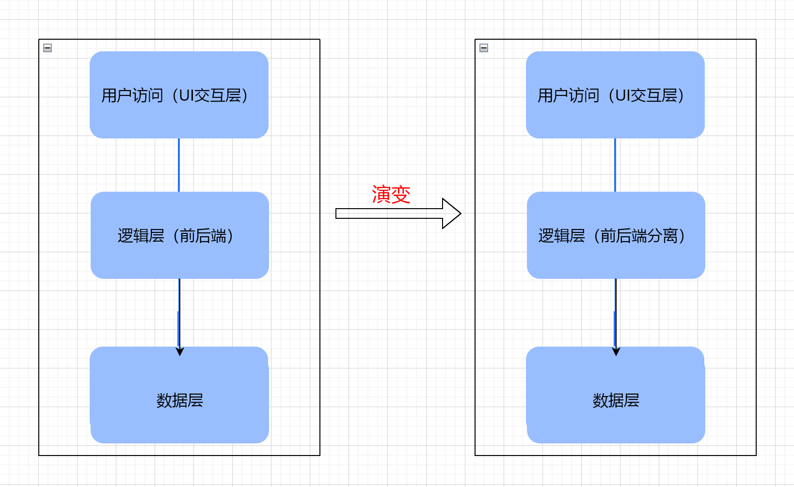
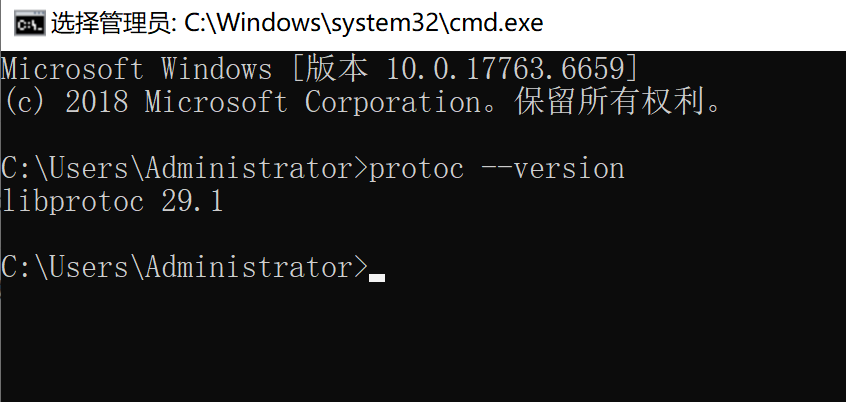
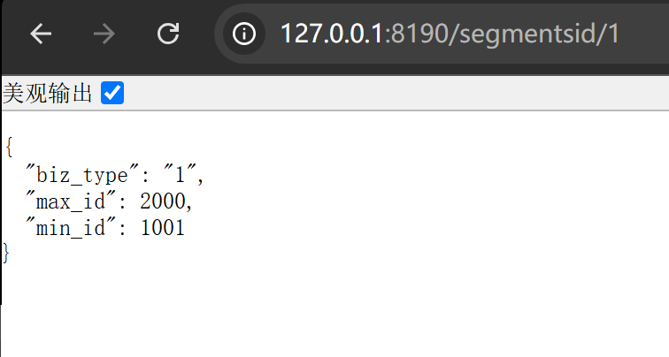
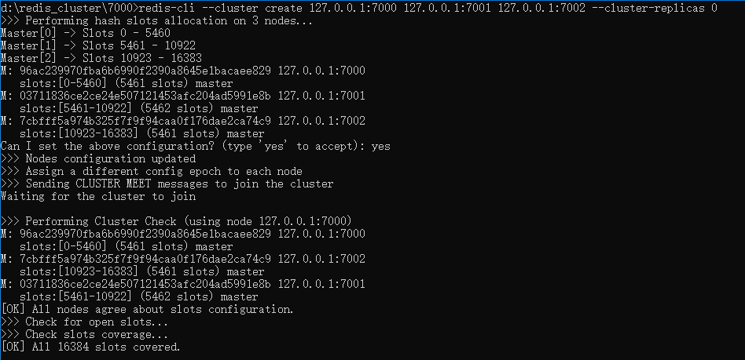

# 一、分布式微服务架构的原理和总体架构

    分布式服务，顾名思义就是服务是分散部署在不同的机器上的，一个服务可能负责单个或几个功能，是一种面向服务的架构，服务之间也是通过RPC（Remote Procedure Call）或者是RestfulAPI来交互。

    分布式系统是现代计算机科学中的一个重要领域，它涉及到多个计算机节点之间的协同工作，目标是实现更高的性能、可用性和可扩展性的系统。

    随着互联网的发展和数据规模的增长，分布式系统的应用范围不断扩大，成为许多企业和组织的核心基础设施。分布式应用开发也成为高级工程师必备的技能。

## 1、单体服务存在的不足

单体服务架构



**优点**：简单、开发效率快、开发成本低。

**缺点**：

- 脆弱，只要有一个环节出问题，整个系统就会崩溃。

- 随着互联网用户迅速发展，传统单体架构技术难以支撑海量用户的需求，无法应对高并发请求。

- 维护成本高，每个地方修改都会影响到整体。无法应对复杂业务带来的各种挑战。

单体服务架构改造的核心就是要对应用做微服务化改造，微服务化改造使用到的核心技术架构就是分布式服务框架。

## 2、分布式架构原理

    分布式架构的核心原理是将一个大的任务分解成若干个小的子任务，分布在不同的节点上并行处理。通过节点间的通信和协作，共同完成整个任务。这种架构可以充分利用多核处理器、集群、云计算等计算资源，提高系统的处理能力和响应速度。

这种架构在现代计算系统中发挥着重要的作用，尤其是在处理大规模数据、提供全球服务或应对高并发请求时。

## 3、分布式架构的实现方式

- **负载均衡**：通过负载均衡器将请求分发到各个节点上，使各节点的负载均衡。常见的负载均衡算法有轮询、加权轮询、最少连接等。

- **消息队列**：通过消息队列实现节点间的异步通信，提高系统的并发处理能力。常用的消息队列工具有RabbitMQ、Kafka等。

- **服务化架构**：将系统划分为多个服务，每个服务独立部署、独立维护，通过API网关进行服务间的调用和通信。

- **缓存Redis**：常用数据放到缓存层，实现快速读取，减小计算压力以及IO存取压力。

- **数据库集群**：通过将数据分散到多个数据库节点上，实现数据的水平和垂直拆分，提高数据库的读写性能和并发处理能力。

## 4、分布式架构总体架构图


## 5、分布式架构的优势和挑战

**优势**：

- **高性能**：通过负载均衡和并行处理，提高系统的处理能力和响应速度。

- **高可用性**：通过节点间的冗余备份和故障恢复机制，确保系统的可用性。

- **可伸缩性**：根据负载变化自动扩展或缩减节点数量，实现系统的可伸缩性。

- **灵活性**：可以快速部署新服务和功能，降低开发、维护成本。

**挑战**：

- **通信开销**：节点间的通信和协作可能带来较大的网络开销。

- **分布式一致性**：在分布式系统中实现数据一致性是一个挑战。需要采用合适的分布式一致性协议，如CAP理论、Paxos、Raft等。

- **系统复杂性**：分布式系统中的节点间依赖关系复杂，可能导致系统故障传播和性能瓶颈。

- **容错性**：某个节点发生故障时，如何保证整个系统的稳定性和可用性是一个挑战。

## 6、微服务的应用以及拆分

### （1）、微服务出现的背景

    传统的Web项目都是采用单体架构的方式来进行开发、部署、运维的。所谓单体架构就是将程序的所有业务模块全部打包在一个文件中进行部署。但是随着互联网的发展、用户数量的激增、业务的规模极速扩张，业务的复杂度急剧增加，传统的单体应用方式的缺点就逐渐显现出来了，给开发、部署、运维都带来了极大的难度，工作量会越来越大，难度越来越高。传统**单体架构主要存在以下的问题**：

- 随着业务复杂性的增加，开发变得困难，增加了研发成本抑制了研发效率的提升。

- 系统的运维成本很高，对某个功能的修改，都需要对整个系统进行构建、测试、部署。

- 技术栈单一，不能够很好地解决业务的多样化需求。

- 隔离性差，一个模块出现问题，可能导致整个系统崩溃。

- 可伸缩性差，对于部分业务的高并发，不能按需扩展。

    为了解决上述问题，微服务架构应运而生。简单来说，微服务就是将一个单体应用拆分成若干个小型的服务，协同完成系统功能的一种架构模式，在系统架构层面进行解耦合，将一个复杂问题拆分成若干个简单问题。下面是**采用微服务架构带来的优势**：

- 服务承载的业务逻辑内聚，易于开发与维护。

- 单个服务启动快。

- 技术栈灵活，独立的服务可以选用不同的技术栈。

- 独立的按需扩展，满足高并发与大流量。

### （2）、微服务的拆分原则

- **单一职责**
  单个服务内部功能高内聚服务间低耦合。

- **闭包原则**
  
  微服务的闭包原则就是当我们需要改变一个微服务的时候，所有依赖都在这个微服务的组件内，不需要修改其他微服务。

- **服务自治**
  
  避免对其他微服务的强依赖。
  避免环形依赖与双向依赖。
  环形依赖和双向依赖说明微服务划分不合理，业务边界不清晰或者通用功能未沉淀。
  
  > 实战：根据以上3点规则，试试做电商系统的微服务划分。

- **持续演进**
  
  先粗粒度拆分，逐步演进，避免服务数量的爆炸性增长。
  阶段性合并，随着对业务领域理解的逐渐深入或者业务本身逻辑发生了比较大的变化，亦或者之前的拆分没有考虑的很清楚，导致拆分后的服务边界变得越来越混乱，这时就要重新梳理领域边界，不断纠正拆分的合理性。

- **三个火枪手（服务拆分粒度原则）**
  
  服务拆分要考虑团队规模和业务复杂度，避免拆分过细带来较高的维护成本。
  业务发展期，需要大量设计和开发工作，3人负责一个微服务，业务和技术上可互相讨论，互相备份，避免人员单点。
  业务成熟期，主要以维护为主，开发工作较少，2人负责一个微服务，相互备份，避免人员单点。
  每个人维护多个微服务，每个微服务被多个人维护相互备份，避免人员单点。

### （3）、实战：电商系统微服务拆分

通常，电商系统包含以下几个功能模块：

- 用户管理模块：用户注册、登录、个人信息管理、订单查看、跟踪等功能。

- 后台商品管理模块：包括商品的添加、编辑、审核、上下架、库存管理、品牌管理等。

- 安全校验模块：短信验证码、邮箱验证码等安全验证。

- 订单模块：下订单、计算订单总价格、快递费等。

- 支付模块：集成多种支付模式。

- 减库存、订单状态模块：订单状态管理（已发货、已收货、售后中、已关闭等），减库存

- 营销与促销模块：优惠券、满减、限时打折、发放红包等活动设置和管理。

- 聊天与订单状态推送模块：实现客户售后服务、订单状态推送等功能。

- 热销商品、排行榜模块：实现热销商品、推荐商品、商品排行榜等功能。

- 第三方接口模块：物流、图像识别、身份认证。

根据这些功能模块，我们可以划分出10个微服务，分别如下：

**用户服务、后台管理服务、验证服务、订单服务、支付服务、库存服务、营销服务、IM（即时通讯）服务、排行榜服务、第三方服务**

微服务架构图如下：


# 二、Go语言的高并发编程

## 1、Go语言的出现

- Go语言 是Google公司 在2007开发一种静态强类型、编译型语言，并在 2009 年正式对外发布。

- Go语言以其近C的执行性能和近解析型语言的开发效率，以及近乎于完美的编译速度，已经风靡全球。很多人将Go语言称为21世纪的C语言，因为Go不仅拥有C的简洁和性能，而且针对多处理器系统应用程序的编程进行了优化，很好的提供了21世纪互联网环境下服务端开发的各种实用特性。

- Go 语言既有Python语言的灵活语法和开发效率，又有接近C语言的运行性能。因此，有人认为 **Go = Python + C** 

- Go语言天生就是为了多并发而设计的。Go语言提供了一些特性，如goroutines、channels和基于消息传递的并发模型，使得并发编程变得简单和安全。

Go 开启并发协程非常方便：

```go
go func() {
    fmt.Println("hello world")
}()

func startCoroutines(i int32) {
    fmt.Println("Good,start coroutines successfully! i=>", i)
}

for i := int32(0); i < 10; i++ {
    go startCoroutines(i)
}
```

Java 开启多线程就没有这么方便了。得继承Thread类，重写run() 方法。要么定义接口Runnable的实现类，并实现run() 方法。

## 2、Go语言GMP原理

先来看看什么是进程、线程、协程。

### （1）、进程

进程是具有一定独立功能的程序关于某个数据集合上的一次运行活动,进程是系统进行资源分配和调度的一个独立单位。每个进程都有自己的独立内存空间。由于进程比较重量，占据独立的内存，所以上下文进程间的切换开销（栈、寄存器、虚拟内存、文件句柄等）比较大，但相对比较稳定安全。

### （2）、线程

通常语义中的线程，指的是内核级线程，核心点如下：

- 是操作系统最小调度单元；

- 创建、销毁、调度交由内核完成，cpu 需完成用户态与内核态间的切换；

- 可充分利用多核，实现并行。

### （3）、协程

协程，又称为用户级线程，核心点如下：

- 与线程存在映射关系，为 多对1（M：1）关系；

- 创建、销毁、调度在用户态完成，对内核透明，所以更轻；

- 从属同一个内核级线程，无法并行；一个协程阻塞会导致从属同一线程的所有协程无法执行。

## 3、GMP设计思想和模型

在 Go 语言中，每一个 goroutine 是一个独立的执行单元，相较于每个 OS 线程固定分配 2M 内存的模式，goroutine 的栈采取了动态扩容方式， 初始时仅为2KB，随着任务执行按需增长，最大可达 1GB（64 位机器最大是 1G，32 位机器最大是 256M），且完全由 golang 自己的调度器（Go Scheduler）来调度。此外，GC 还会周期性地将不再使用的内存回收，收缩栈空间。 因此，Go 程序可以同时并发成千上万个 goroutine 是得益于它强劲的调度器和高效的内存模型。

### （1）、设计思想

G代表goroutine协程，M代表thread线程，P代表processor处理器；P包含了运行G所需要的资源，M想要运行goroutine必须先获取P。

### （2）、GMP模型


- **全局队列**：存放待运行的goroutine

- **P的本地队列**：存放的goroutine数量不超过256个，新建的goroutine会优先放到p的本地队列，如果队列满了，则会把本地队列中一半的 G 移动到全局队列

- **P处理器**：所有的 P 都在程序启动时创建，并保存在数组中，最多有 GOMAXPROCS(默认为CPU的核数) 个。

- **M线程**：线程想运行任务就得获取 P，从 P 的本地队列获取 G，P 本地队列为空时，M 会尝试从全局队列拿一批 G 放到 P 的本地队列，或从其他 P 的本地队列偷一半放到自己 P 的本地队列。M 运行 G，G 执行之后，M 会从 P 获取下一个 G，不断重复下去

## 4、Go语言协程之间的通信

我们上面讲的例子，协程是独立执行的，他们之间没有通信。但在很多项目中，他们必须通信才会变得更有用：彼此之间发送和接收信息并且协调/同步他们的工作。

协程可以使用共享变量来通信，但是我们很不提倡这样做，因为这种方式给所有的共享内存的多线程都带来了困难。

基于共享内存变量来通信，为了保证数据一致性，需要使用锁（如互斥锁、读写锁）来保护共享的资源，防止出现数据竞争（race condition）。举个例子，两个线程同时访问同一个全局变量，为了避免两个线程同时修改导致数据不一致，必须加锁来同步它们的操作。这样虽然解决了并发问题，但也带来了新的复杂性。

- 死锁：线程彼此等待对方释放锁，导致程序无法继续执行。

- 锁竞争：多个线程抢占锁，影响程序的执行效率。

- 锁的管理成本：随着代码规模的增大，锁的管理越来越复杂，容易出错。

而Go有一个特殊的类型，通道（**channel**），像是通道（管道），可以通过它们发送类型化的数据在协程之间通信，可以避开所有内存共享导致的坑。Golang通道的通信方式保证了同步性。数据通过通道，同一时间只有一个协程可以访问数据，这样设计不会出现数据竞争。数据的归属（可以读写数据的能力）被传递。

Golang的通道有两种，有缓冲（存）通道（**channel**），无缓冲（存）通道（**channel**）。

### （1）、无缓冲 Channel

- **定义**：无缓冲 channel 是一种在发送和接收操作时必须匹配的 channel。即，发送操作会被阻塞，直到有接收方准备好接收数据，反之亦然。
- **创建**：`make(chan Type)`，例如：`make(chan int)`
- **特性**：
  - 发送操作在接收操作之前必须等待。
  - 接收操作在发送操作之前必须等待。
  - 适用于需要确保同步的场景，比如确保发送者和接收者严格对齐数据流。

### （2）、有缓冲的 Channel

- **定义**：有缓存的 channel 具有指定的缓冲区大小，这允许发送操作在没有接收方时继续执行，直到缓冲区满。
- **创建**：`make(chan Type, capacity)`，例如：`make(chan int, 10)` 表示创建一个容量为 10 的缓存 channel。
- **特性**：
  - 发送操作在缓冲区未满时可以立即完成，而不需要等待接收操作。
  - 接收操作在缓冲区不空时可以立即完成，而不需要等待发送操作。
  - 可以处理多生产者、多消费者模式，缓冲可以提高性能，减少阻塞。

**两者主要区别**

1. **阻塞行为**：
   
   - **无缓冲 channel**：发送和接收操作都必须匹配，发送会阻塞直到有接收方，接收会阻塞直到有发送方。
   - **有缓存的 channel**：发送操作在缓冲区未满时不会阻塞，接收操作在缓冲区不空时不会阻塞。

2. **容量**：
   
   - **无缓冲 channel**：容量为 0。
   - **有缓存的 channel**：具有指定的缓冲区大小。

3. **用途**：
   
   - **无缓冲 channel**：适用于需要严格同步的场景。
   - **有缓存的 channel**：适用于需要处理大量数据的场景，或者需要减少阻塞和等待的场景。

在大多的应用场景，用到的是无缓冲通道，因此，下面的讲解主要围绕无缓冲通道。

### （3）、golang 通道的定义、读写

```go
//通道的定义 var 变量名 chan 类型
var ch1 chan int
//读、写前，要实例化，没实例化的chan，读、写会panic
ch1 = make(chan int)

//也可以直接这样定义
//比较简洁，也顺便实例化
ch2 := make(chan int)

ch := make(chan int)
//这段代码会出错
ch <- 8
fmt.Println(<-ch)
//运行输出：fatal error: all goroutines are asleep - deadlock!
//因为写入通道的时候，没有接收方
//要开启另一个协程去写入 
go func() {
    ch <- 8
}()
fmt.Println(<-ch)
//运行输出 8
//最后要记得关闭channel
close(ch)
```

### （4）、协程之间的通信实战

在电商系统中，我们知道，用户下单买了商品后，相应的商品要减库存。我们根据这个应用场景，来实战协程之间的通信。

```go
// 商品库存最基本结构
type ProductSku struct {
    ProductId  int64  //商品id
    ProductSku string //商品sku码
    StockNum   int64  //商品库存
}
//给它加一个输出的方法
func (p *ProductSku) Print() {
    fmt.Println("商品id:", p.ProductId, "商品Sku码:", p.ProductSku, "商品库存:", p.StockNum)
}
// 下订单，扣减库存 通信消息的结构体
type NotifySubInventory struct {
    ProductId  int64  //商品id
    ProductSku string //商品的sku码 例如：T00101
    SubNum     int64  //要扣除的库存数量
}

// 下订单
func CreateOrder(ch chan NotifySubInventory) {
    //每隔5秒随机商品下单，总下单50单停止
    count := 0
    for {
        //创建订单，下单逻辑
        //......
        if count > 50 {
            fmt.Println("模拟下单结束！")
            break
        }
        //通知减库存
        i := mathutils.RandInterval(0, 9)
        proId := int64(1000 + i)
        proSku := "T0010" + convert.ToString(i)
        notifyMsg := *NewNotifySubInventory(proId, proSku, 1)
        ch <- notifyMsg
        count++
        time.Sleep(time.Second * 2)
    }
}

// 减少库存
func SubInventory(ch chan NotifySubInventory, proSkuAr []*ProductSku) {
    for {
        select {
        case msg := <-ch:
            fmt.Println("收到减库存的消息")
            for _, proSku := range proSkuAr {
                if msg.SubNum > 0 && proSku.ProductId == msg.ProductId && proSku.ProductSku == msg.ProductSku {
                    proSku.StockNum -= msg.SubNum
                    proSku.Print()
                }
            }
        }
    }
}

//商品库存信息
fmt.Println("初始化商品库存的数据：")
productSkuAr := make([]*ProductSku, 10)
for i := int64(0); i < 10; i++ {
    proSku := NewProductSku(1000+i, "T0010"+fmt.Sprintf("%d", i), 100)
    productSkuAr[i] = proSku
}
//输出打印
for _, r := range productSkuAr {
    r.Print()
}
//
//初始化消息通知通道chan
ch := make(chan NotifySubInventory)
//开启一个协程去模拟下单
go CreateOrder(ch)
//开启一个协程去减库存
go SubInventory(ch, productSkuAr)

//等待终端输入，避免协程没执行，就退出
fmt.Scanln()
```

# 三、进程（微服务）间的通信（RestfulAPI）

## 1、前言

以前在单体式应用中，各个模块之间的调用是通过编程语言级别的方法或者函数来实现的。但是一个基于微服务的分布式应用是运行在多台机器上的。一般来说，每个服务实例都是一个进程。基于微服务的应用程序是在多个进程或服务上运行的分布式系统，通常甚至跨多个服务器或主机。 每个服务实例通常是一个进程。

 微服务设计其中一个挑战就是服务间的通信问题，服务间通信理论上可以归结为进程间通信，进程可以是同一个机器上的，也可以是不同机器的。服务可以使用同步请求响应机制通信，也可以使用异步的基于消息中间件间的通信机制。同步的有restful、RPC等方式，异步的有各种mq中间件，如nats、rabbitmq、rocketmq、kafka等，还有一些不常用的通讯方式，如websocket可以让服务间建立长链接，数据共享方式可以让服务通过数据库或文件的方式进行通讯。

## 2、什么是通信

### （1）、定义


通信是指人与人或人与自然之间通过某种行为或媒介进行的信息交流与传递，从广义上指需要信息的双方或多方在不违背各自意愿的情况下采用任意方法、任意媒质，将信息从某方准确安全地传送到另方。发送者通过媒介将信息传递给接收者，而这里的发送者、接收者可以是人与人、人与自然界，机器与机器、人与机器等等。

### （2）、通信媒介

在定义中提到的媒介就是通信媒介，那么具体什么是通信媒介呢？

通信媒介指的是信息传递的物理或逻辑通道，它是信息传递的途径或介质。通信媒介可以是多种形式，包括电缆、无线信号、光纤、空气等。在不同的场景中，使用不同的通信媒介来传递信息。例如，在计算机网络中，通信媒介可以是以太网、Wi-Fi等；在人际交往中，通信媒介可以是声音、文字、图像等。

### （3）、通信协议

通信协议指的是在信息传递过程中所遵循的规则和约定，以确保信息能够正确、可靠地传递和解释。通信协议规定了信息的格式、传输方式、错误检测和纠正方法等。通信协议是确保通信双方能够相互理解并成功交流的基础。例如，在计算机网络中，TCP/IP协议、Http协议是常用的通信协议；在人类交往中，语言和符号也是通信协议的一种形式。

## 3、微服务的通信方式有哪些

微服务之间的通讯方式可以有很多，我们可以分成两个维度去总结，一个是接收端多少的维度，一个是接口阻塞情况维度。通过接收端多少我们可以分为，点对点模式和广播模式，点对点模式则是发送者只向一个接收者发送消息，广播模式，则是发送者通过广播的信息发送给众多的接收者；通过接口阻塞情况维度可以分为同步通信和异步通信，同步通信则是发送者发送消息后需要等待接收者响应，等待的过程则是阻塞过程。异步通信则是发送者将消息发送出去后，就不用管了，接收者处理消息时，发送者还可以做其他事，不阻塞等待响应。

### （1）、微服务的同步通信 Restful Api

微服务之间的同步通信常见的有这两种方式：**REST方式**、**GRPC**方式。

REST（Representational State Transfer）是一种网络架构风格，用于设计分布式系统中的网络应用程序。它最初由Roy Fielding在他的博士论文中提出，并在2000年被正式引入。REST强调以资源为中心，通过使用一组预定义的操作对这些资源进行状态转移和交互。

REST 的核心思想是将资源（Resource）暴露为一组统一的、易于理解的URL，并使用不同的HTTP方法（如GET、POST、PUT、DELETE等）来对资源进行操作。每个资源可以用一个唯一的URL进行访问，而HTTP方法则指示了对该资源要执行的操作。例如，通过GET请求获取资源，资源可以通过xml、json对象、二进制等形式作为载体。REST使用简单的HTTP请求和响应来实现资源之间的交互，这使得REST服务在跨平台和跨语言的Web服务中广泛使用。

RESTful API是基于REST架构风格的API设计方式，用于构建可伸缩、可维护的Web服务。通过标准的HTTP方法和状态码进行数据交互。它以其简单易用、易于理解和扩展的特点，在微服务架构中得到了广泛应用。它有以下几个特点：

- 简单易用，易于理解
  RESTful API使用标准的HTTP方法（如GET、POST、PUT、DELETE）和状态码（如200、404、500等），使得服务间的通信变得简单明了。开发工程师无需掌握复杂的通信协议，即可轻松实现服务间的数据交换。

- 良好的可读性
  RESTful API的设计遵循REST架构风格，将资源表示为URI，并通过HTTP方法对其进行操作。这种设计方式使得API具有良好的可读性，即使对于非技术背景的人员来说，也能够理解API的功能和用途。

- 易于扩展
  RESTful API具有天然的扩展性。由于它基于HTTP协议，因此可以轻松实现跨平台、跨语言的通信。同时，通过添加新的URI和HTTP方法，可以方便地扩展API的功能，满足不断变化的业务需求。

- 支持多种数据格式
  RESTful API支持多种数据格式，如JSON、XML等。这使得它能够在不同的客户端和服务器之间传输数据，提高了系统的灵活性和兼容性。

- 易于实现负载均衡和故障转移
  RESTful API的无状态性使得它易于实现负载均衡和故障转移。通过将请求分发到多个服务实例上，可以均衡负载，提高系统的性能。同时，当某个服务实例出现故障时，可以将请求转移到其他可用的实例上，确保系统的稳定运行。

### （2）、微服务间的同步通信GRPC

GRPC 是一种高性能、开源的远程过程调用（RPC）框架，最初由 Google 开发并开源。它允许不同的应用程序在不同的环境中进行通信，使用了现代的协议和序列化机制，如 Protocol Buffers（ProtoBuf），以提供高效、可靠的跨网络通信。

GRPC 以下的一些关键特点和组成部分：

- 基于 HTTP/2：
  
  GRPC 基于 HTTP/2 协议，可以在一个连接上进行多路复用，减少了连接的数量，提高了性能。

- 多种支持语言：
  
  GRPC 提供了多种编程语言的支持，包括 Java、C++、Python、Go、C#、Node.js 等，使得不同语言的应用程序可以进行跨平台的通信。

- IDL（Interface Definition Language）：
  
  使用 Protobuf（Protocol Buffers）定义服务接口，IDL 会自动生成客户端和服务器端的代码，使得开发者可以专注于业务逻辑的实现。

- 支持多种通信模式：
  
  GRPC 支持多种通信模式，包括简单的请求-响应、流式请求、流式响应和双向流式通信。

- 强大的错误处理和元数据支持：
  
  GRPC 提供了丰富的错误处理和状态码，以及对元数据（Metadata）的支持，使得开发者可以更好地进行错误处理和上下文传递。

- 拦截器：
  
  GRPC 支持拦截器机制，可以在客户端和服务器端添加拦截器，用于处理日志、认证、鉴权等逻辑。

- 性能优越：
  
  GRPC 基于二进制协议，序列化效率高，性能优越，适用于高并发和低延迟的场景。

### （3）、微服务的异步通信


服务间的异步通信采用异步交换消息的方式完成，如RabbitMq、kafka

Kafka和RabbitMQ都是消息队列系统，它们的主要区别包括：

- 通信模型：Kafka基于发布-订阅模型，而RabbitMQ则采用了AMQP协议、MQTT协议等不同模型，支持点对点和发布-订阅等模型。

- 性能与可靠性：Kafka在高并发、大数据流时表现更出色，可实现每秒百万级别的数据处理；而RabbitMQ采用了AMQP协议，能够保证消息传输的可靠性和事务处理能力。

- 数据存储：Kafka将消息以文件的形式存储在磁盘上，存储的消息不会立刻被消费；而RabbitMQ则采用内存缓存，消息一旦发送就会立刻被消费掉，存储的消息数受到限制。

- 集群架构：Kafka支持集群架构的高可用和分区；而RabbitMQ则基于主从架构，支持镜像队列、负载均衡等机制。

## 4、实战微服务的同步通信 Restful Api

实现两个独立的微服务：微服务A、微服务B。微服务B通过Restful Api与服务A通信。例如，我们微服务A设定为用户服务，微服务B设定为测试服务。

我们《Golang 高级应用开发》学过的gin框架作为脚手架来开发。

### （1）、设计好数据库、数据库表、并插入一些数据以备测试用。

建立数据库：godistappdev，编码为utf8mb4 

建立用户表：ts_user，相应的字段如下：


插入一些测试数据。


我们需要的数据就完成了。

### （2）、建立项目，编写用户服务代码

接下去，我们用gin框架来打架项目，并用gorm来操作数据库。由于这些知识点是我们在《go高级应用开发学过的》。由于时间有限，这里就不细讲。

我们这里主要讲，通过Restful api 交互部分。

添加路由组：

```go
func InitUserRouter(r *gin.Engine) {
    // 用户路由组
    user := r.Group("/user")
    {
        //获取用户列表，分页
        user.GET("/list", v1.UserList)
        //获取单个用户信息
        user.GET("/info/:user_id", v1.GetUser)
    }
}
```

并实现相应的功能：

```go
// @Tags    APP接口/获取单个用户信息
// @Summary    获取单个用户信息
// @Param   param query int "user_id"
// @Router  /user/info/{user_id} [get]
func GetUser(c *gin.Context) {
    userId := c.Param("user_id")
    userLgc := &logics.User_lgc{}
    user, err := userLgc.GetUserByUid(convert.ToInt64(userId))
    if err != nil {
        c.JSON(-1, gin.H{
            "err": err.Error(),
        })
        return
    }
    c.JSON(0, gin.H{
        "user": user,
    })
}

// @Tags    APP接口/获取用户列表
// @Summary    获取用户列表 分页
// @Param   param query int "page_num" "page_size"
// @Router  /user/list [get]
func UserList(c *gin.Context) {
    pageNum := c.Param("page_num")
    pageSize := c.Param("page_size")
    userLgc := &logics.User_lgc{}
    userList, err := userLgc.GetUserList(convert.ToInt64(pageNum), convert.ToInt64(pageSize))
    if err != nil {
        c.JSON(-1, gin.H{
            "err": err.Error(),
        })
        return
    }
    c.JSON(0, gin.H{
        "user": userList,
    })
}
```

逻辑实现：

```go
//逻辑实现 
func (u *User_lgc) GetUserByUid(userId int64) (*models.User, error) {
    user := &models.User{}
    query := mysqldb.Mysql.Model(user)
    //查询单个用户
    query = query.Where("user_id = ?", userId)
    err := query.Find(&user).Limit(1).Error
    return user, err
}
//逻辑实现，分页查询
func (u *User_lgc) GetUserList(pageNum, pageSize int64) (userList []*models.User, err error) {
    //分页查询
    if pageNum < 1 {
        pageNum = 1
    }
    if pageSize < 2 {
        pageSize = 2
    }
    if pageSize > 1000 {
        pageSize = 1000
    }

    user := &models.User{}
    query := mysqldb.Mysql.Model(user)
    err = query.Limit(int(pageSize)).Offset(int((pageNum - 1) * pageSize)).Find(&userList).Error
    return userList, err
}
```

写好代码后，端口我们设置8188，运行程序。


看到这个画面，说明程序运行成功了。

我们自测下，浏览器输入接口地址：http://127.0.0.1:8188/user/info/5

可以看到返回：

```json
{
  "user": {
    "ID": 5,
    "CreatedAt": "2024-12-16T10:08:57+08:00",
    "UpdatedAt": "2024-12-16T10:08:57+08:00",
    "DeletedAt": null,
    "user_id": 5,
    "user_name": "test5",
    "user_pwd": "E10ADC3949BA59ABBE56E057F20F883E",
    "user_mobile": "13800138000"
  }
}
```

输入获取用户列表接口地址：http://127.0.0.1:8188/user/list?page_num=1&page_size=2

可以看到返回：

```json
{
  "user": [
    {
      "ID": 1,
      "CreatedAt": "2024-12-16T10:08:57+08:00",
      "UpdatedAt": "2024-12-16T10:08:57+08:00",
      "DeletedAt": null,
      "user_id": 1,
      "user_name": "test1",
      "user_pwd": "E10ADC3949BA59ABBE56E057F20F883E",
      "user_mobile": "13800138000"
    },
    {
      "ID": 2,
      "CreatedAt": "2024-12-16T10:08:57+08:00",
      "UpdatedAt": "2024-12-16T10:08:57+08:00",
      "DeletedAt": null,
      "user_id": 2,
      "user_name": "test2",
      "user_pwd": "E10ADC3949BA59ABBE56E057F20F883E",
      "user_mobile": "13800138000"
    }
  ]
}
```

至此，我们用户服务开发成功。

### （3）、编写测试服务代码

接下去，写一个测试服务，跟用户服务交互。

测试服务，main 主协程请求用户服务的列表接口，然后再启动一个协程不断访问获取单个用户的接口：

```go
func main() {
    //接口基础地址
    targetUrl := "http://127.0.0.1:8188/user/"
    //启动一个协程获取单个用户信息
    go func() {
        for i := 0; i < 100; i++ {
            //随机用户id
            userId := mathutils.RandInterval(1, 15)
            //通过restful api接口 与用户服务通信，从它那边获取想要的信息。
            rsp, err := http.Get(targetUrl + "info/" + convert.ToString(userId))
            if err != nil {
                panic(err)
            }
            defer rsp.Body.Close()
            println(rsp.Status)
            //处理结果并输出
            body, _ := io.ReadAll(rsp.Body)
            fmt.Println(string(body))
            time.Sleep(time.Second * 5) //休息5秒
        }
    }()
    //通过restful api接口 与用户服务通信，从它那边获取用户列表信息
    u, _ := url.ParseRequestURI(targetUrl + "list")
    data := url.Values{}
    data.Set("pageNum", "1")   //设置参数
    data.Set("pageSize", "5")

    u.RawQuery = data.Encode()
    rspList, err := http.Get(u.String())
    if err != nil {
        panic(err)
    }
    defer rspList.Body.Close()
    println(rspList.Status)
    //处理结果并输出
    bodyList, _ := io.ReadAll(rspList.Body)
    fmt.Println(string(bodyList))
    fmt.Scanln()
}
```

编好代码之后，运行：


两个服务之间，通信成功。

# 四、进程间（微服务）的通信GRPC

## 1、GRPC介绍

GRPC 是一个高性能、开源、通用的RPC框架，由Google推出，基于HTTP2协议标准设计开发，默认采用Protocol Buffers数据序列化协议，支持多种开发语言。GRPC提供了一种简单的方法来精确的定义服务，并且为客户端和服务端自动生成可靠的功能库。

在GRPC客户端可以直接调用不同服务器上的远程程序，使用姿势看起来就像调用本地程序一样，很容易去构建分布式应用和服务。和很多RPC系统一样，服务端负责实现定义好的接口并处理客户端的请求，客户端根据接口描述直接调用需要的服务。客户端和服务端可以分别使用GRPC支持的不同语言实现。


这里的客户端，不是指前端。前端、后端都可以作为客户端。

**主要特性：**

- 强大的IDL
  GRPC使用ProtoBuf来定义服务，ProtoBuf是由Google开发的一种数据序列化协议（类似于XML、JSON、hessian）。ProtoBuf能够将数据进行序列化，并广泛应用在数据存储、通信协议等方面。

- 多语言支持
  GRPC支持多种语言，并能够基于语言自动生成客户端和服务端功能库。目前已提供了C版本grpc、Java版本grpc-java 和 Go版本grpc-go，其它语言的版本正在积极开发中，其中，grpc支持C、C++、Node.js、Python、Ruby、Objective-C、PHP和C#等语言，grpc-java已经支持Android开发。

- HTTP2
  GRPC基于HTTP2标准设计，所以相对于其他RPC框架，GRPC带来了更多强大功能，如双向流、头部压缩、多复用请求等。这些功能给移动设备带来重大益处，如节省带宽、降低TCP链接次数、节省CPU使用和延长电池寿命等。同时，GRPC还能够提高了云端服务和Web应用的性能。GRPC既能够在客户端应用，也能够在服务器端应用，从而以透明的方式实现客户端和服务器端的通信和简化通信系统的构建。

## 2、ProtoBuf IDL 序列化协议介绍

### （1）、概念介绍

IDL是Interface Definition Language的缩写，即接口定义语言。它是用于描述分布式对象接口的定义语言，利用IDL进行接口定义之后，就确定了客户端与服务器之间的接口，这样即使客户端和服务器独立进行开发，也能够正确地定义和调用所需要的分布式方法。IDL是CORBA规范的一部分，是跨平台开发的基础。IDL通过一种独立于编程语言的方式来描述接口，使得在不同平台上运行的对象和用不同语言编写的程序可以相互通信交流。

所谓序列化通俗来说就是把内存的一段数据转化成二进制并存储或者通过网络传输，而读取磁盘或另一端收到后可以在内存中重建这段数据。

- protobuf协议是跨语言跨平台的序列化协议。

- protobuf本身并不是和GRPC绑定的。它也可以被用于非RPC场景，如存储等

- json、 xml都是一种序列化的方式，只是他们不需要提前预定义idl，且具备可读性，当然他们传输的体积也因此较大，可以说是各有优劣

protobuf 最新版本都是proto3。目前企业开发用的也都是proto3。我们主要学这个版本。

proto3 官方学习资料：[https://protobuf.dev/programming-guides/proto3/](https://protobuf.dev/programming-guides/proto3/)

### （2）、定义消息类型

首先让我们看一个非常简单的例子。假设您想要定义一个搜索请求消息格式，其中每个搜索请求都有一个查询字符串、您感兴趣的特定结果页面以及每页的结果数量。我们命名为search.proto 文件。内容如下：

```protobuf
syntax = "proto3"; //文件开头行，标记proto的版本。

option go_package = "./;search";  //指定包名 可选

//message 关键字。后面跟消息体的名字 SearchRequest 
//定义三个字段，名义字段格式：字段规则(可不填，默认) 字段类型 字段名字 = 字段编号;
message SearchRequest {
  string query = 1;
  int32 page_number = 2;
  int32 results_per_page = 3;
}
```

- **类型**：类型不仅可以是标量类型（int、string等），也可以是复合类型（enum等），也可以是其他message。

- **字段名**：字段名比较推荐的是使用下划线/分隔名称。

- **字段编号**：一个message内每一个字段编号都必须唯一的，在编码后其实传递的是这个编号而不是字段名。

- **字段规则**：消息字段可以是以下字段之一。
  
  **singular**：格式正确的消息可以有零个或一个字段（但不能超过一个）。使用 proto3 语法时，如果未为给定字段指定其他字段规则，则这是默认字段规则。
  
  **optional**：与 singular 相同，不过您可以检查该值是否明确设置。
  
  **repeated**：在格式正确的消息中，此字段类型可以重复零次或多次。系统会保留重复值的顺序。
  
  **map**：这是一个成对的键值对字段。

- 保留字段：为了避免再次使用到已移除的字段可以设定保留字段。如果任何未来用户尝试使用这些字段标识符，编译器就会报错。

### （3）、字段类型与golang类型对应关系


### （4）、复合类型

- **数组**

```protobuf
message SearchResponse {
  //repeated 重复 来定义数组
  repeated Result results = 1;
}

message Result {
  string url = 1;
  string title = 2;
  //repeated 重复 来定义数组
  repeated string snippets = 3;  
}
```

- **枚举**

```protobuf
//enum 定义枚举类型 语料库
enum Corpus {
  UNIVERSAL = 0;  //普遍的
  WEB = 1;
  IMAGES = 2;
  LOCAL = 3;
  NEWS = 4;
  PRODUCTS = 5;
  VIDEO = 6;
}

message SearchRequest {
  string query = 1;
  int32 page_number = 2;
  int32 result_per_page = 3;
  //使用枚举
  Corpus corpus = 4;
}
```

- **引用已有的proto文件**

import  带路经。

```protobuf
import "myproject/other_protos.proto";
```

- **定义服务**

```protobuf
service SearchService {
  rpc Search(SearchRequest) returns (SearchResponse);
}
```

### （5）、windows下protobuf安装

- 下载proto win版本。下载地址：[https://github.com/protocolbuffers/protobuf/releases]([Releases · protocolbuffers/protobuf · GitHub](https://github.com/protocolbuffers/protobuf/releases))

- 解压，放到任意目录下（例如：C:\protobuf）


- 添加系统环境变量。


- 测试是否成功。
  
  打开cmd，输入protoc --version  显示如下则安装成功。



- 安装生成golang代码的工具  
  
  go install google.golang.org/grpc/cmd/protoc-gen-go-grpc@latest
  
  go install github.com/golang/protobuf/protoc-gen-go@latest

如果安装后有错。可能有多个go版本。设置系统变量 path ，添加路径 （C:\Users\Administrator\go\bin，具体用go env 查看默认golang安装的路径）

## 3、实战：GRPC例子

按照惯例，这里也从一个Hello项目开始，本项目定义了一个Hello Service，客户端发送包含字符串名字的请求，服务端返回Hello消息。

流程：

- 编写.proto描述文件

- 编译生成.pb.go文件

- 服务端实现约定的接口并提供服务

- 客户端按照约定调用.pb.go文件中的方法请求服务

### （1）、编写protobuf 文件 hello.proto

```protobuf
syntax = "proto3"; // 指定proto版本

// 指定golang包名
option go_package = "./;hello";

// 定义Hello服务
service Hello {
  // 定义SayHello方法
  rpc SayHello(HelloRequest) returns (HelloResponse) {}
}

// HelloRequest 请求结构
message HelloRequest {
  string name = 1;
}

// HelloResponse 响应结构
message HelloResponse {
  string message = 1;
}
```

### （2）、编译生成.pb.go文件

进入到hello.proto所在的目录。

执行下面两条命令：

- protoc --go_out=.  hello.proto

- protoc --go-grpc_out=. hello.proto


生成的pb文件 样子如下：

```go
// Code generated by protoc-gen-go. DO NOT EDIT.
// versions:
//     protoc-gen-go v1.33.0
//     protoc        v5.29.1
// source: hello.proto

package hello

import (
    protoreflect "google.golang.org/protobuf/reflect/protoreflect"
    protoimpl "google.golang.org/protobuf/runtime/protoimpl"
    reflect "reflect"
    sync "sync"
)

const (
    // Verify that this generated code is sufficiently up-to-date.
    _ = protoimpl.EnforceVersion(20 - protoimpl.MinVersion)
    // Verify that runtime/protoimpl is sufficiently up-to-date.
    _ = protoimpl.EnforceVersion(protoimpl.MaxVersion - 20)
)

// HelloRequest 请求结构
type HelloRequest struct {
    state         protoimpl.MessageState
    sizeCache     protoimpl.SizeCache
    unknownFields protoimpl.UnknownFields

    Name string `protobuf:"bytes,1,opt,name=name,proto3" json:"name,omitempty"`
}

func (x *HelloRequest) Reset() {
    *x = HelloRequest{}
    if protoimpl.UnsafeEnabled {
        mi := &file_hello_proto_msgTypes[0]
        ms := protoimpl.X.MessageStateOf(protoimpl.Pointer(x))
        ms.StoreMessageInfo(mi)
    }
}

func (x *HelloRequest) String() string {
    return protoimpl.X.MessageStringOf(x)
}

func (*HelloRequest) ProtoMessage() {}

func (x *HelloRequest) ProtoReflect() protoreflect.Message {
    mi := &file_hello_proto_msgTypes[0]
    if protoimpl.UnsafeEnabled && x != nil {
        ms := protoimpl.X.MessageStateOf(protoimpl.Pointer(x))
        if ms.LoadMessageInfo() == nil {
            ms.StoreMessageInfo(mi)
        }
        return ms
    }
    return mi.MessageOf(x)
}

// Deprecated: Use HelloRequest.ProtoReflect.Descriptor instead.
func (*HelloRequest) Descriptor() ([]byte, []int) {
    return file_hello_proto_rawDescGZIP(), []int{0}
}

func (x *HelloRequest) GetName() string {
    if x != nil {
        return x.Name
    }
    return ""
}

// HelloResponse 响应结构
type HelloResponse struct {
    state         protoimpl.MessageState
    sizeCache     protoimpl.SizeCache
    unknownFields protoimpl.UnknownFields

    Message string `protobuf:"bytes,1,opt,name=message,proto3" json:"message,omitempty"`
}

func (x *HelloResponse) Reset() {
    *x = HelloResponse{}
    if protoimpl.UnsafeEnabled {
        mi := &file_hello_proto_msgTypes[1]
        ms := protoimpl.X.MessageStateOf(protoimpl.Pointer(x))
        ms.StoreMessageInfo(mi)
    }
}

func (x *HelloResponse) String() string {
    return protoimpl.X.MessageStringOf(x)
}

func (*HelloResponse) ProtoMessage() {}

func (x *HelloResponse) ProtoReflect() protoreflect.Message {
    mi := &file_hello_proto_msgTypes[1]
    if protoimpl.UnsafeEnabled && x != nil {
        ms := protoimpl.X.MessageStateOf(protoimpl.Pointer(x))
        if ms.LoadMessageInfo() == nil {
            ms.StoreMessageInfo(mi)
        }
        return ms
    }
    return mi.MessageOf(x)
}

// Deprecated: Use HelloResponse.ProtoReflect.Descriptor instead.
func (*HelloResponse) Descriptor() ([]byte, []int) {
    return file_hello_proto_rawDescGZIP(), []int{1}
}

func (x *HelloResponse) GetMessage() string {
    if x != nil {
        return x.Message
    }
    return ""
}

var File_hello_proto protoreflect.FileDescriptor

var file_hello_proto_rawDesc = []byte{
    0x0a, 0x0b, 0x68, 0x65, 0x6c, 0x6c, 0x6f, 0x2e, 0x70, 0x72, 0x6f, 0x74, 0x6f, 0x22, 0x22, 0x0a,
    0x0c, 0x48, 0x65, 0x6c, 0x6c, 0x6f, 0x52, 0x65, 0x71, 0x75, 0x65, 0x73, 0x74, 0x12, 0x12, 0x0a,
    0x04, 0x6e, 0x61, 0x6d, 0x65, 0x18, 0x01, 0x20, 0x01, 0x28, 0x09, 0x52, 0x04, 0x6e, 0x61, 0x6d,
    0x65, 0x22, 0x29, 0x0a, 0x0d, 0x48, 0x65, 0x6c, 0x6c, 0x6f, 0x52, 0x65, 0x73, 0x70, 0x6f, 0x6e,
    0x73, 0x65, 0x12, 0x18, 0x0a, 0x07, 0x6d, 0x65, 0x73, 0x73, 0x61, 0x67, 0x65, 0x18, 0x01, 0x20,
    0x01, 0x28, 0x09, 0x52, 0x07, 0x6d, 0x65, 0x73, 0x73, 0x61, 0x67, 0x65, 0x32, 0x34, 0x0a, 0x05,
    0x48, 0x65, 0x6c, 0x6c, 0x6f, 0x12, 0x2b, 0x0a, 0x08, 0x53, 0x61, 0x79, 0x48, 0x65, 0x6c, 0x6c,
    0x6f, 0x12, 0x0d, 0x2e, 0x48, 0x65, 0x6c, 0x6c, 0x6f, 0x52, 0x65, 0x71, 0x75, 0x65, 0x73, 0x74,
    0x1a, 0x0e, 0x2e, 0x48, 0x65, 0x6c, 0x6c, 0x6f, 0x52, 0x65, 0x73, 0x70, 0x6f, 0x6e, 0x73, 0x65,
    0x22, 0x00, 0x42, 0x0a, 0x5a, 0x08, 0x2e, 0x2f, 0x3b, 0x68, 0x65, 0x6c, 0x6c, 0x6f, 0x62, 0x06,
    0x70, 0x72, 0x6f, 0x74, 0x6f, 0x33,
}

var (
    file_hello_proto_rawDescOnce sync.Once
    file_hello_proto_rawDescData = file_hello_proto_rawDesc
)

func file_hello_proto_rawDescGZIP() []byte {
    file_hello_proto_rawDescOnce.Do(func() {
        file_hello_proto_rawDescData = protoimpl.X.CompressGZIP(file_hello_proto_rawDescData)
    })
    return file_hello_proto_rawDescData
}

var file_hello_proto_msgTypes = make([]protoimpl.MessageInfo, 2)
var file_hello_proto_goTypes = []interface{}{
    (*HelloRequest)(nil),  // 0: HelloRequest
    (*HelloResponse)(nil), // 1: HelloResponse
}
var file_hello_proto_depIdxs = []int32{
    0, // 0: Hello.SayHello:input_type -> HelloRequest
    1, // 1: Hello.SayHello:output_type -> HelloResponse
    1, // [1:2] is the sub-list for method output_type
    0, // [0:1] is the sub-list for method input_type
    0, // [0:0] is the sub-list for extension type_name
    0, // [0:0] is the sub-list for extension extendee
    0, // [0:0] is the sub-list for field type_name
}

func init() { file_hello_proto_init() }
func file_hello_proto_init() {
    if File_hello_proto != nil {
        return
    }
    if !protoimpl.UnsafeEnabled {
        file_hello_proto_msgTypes[0].Exporter = func(v interface{}, i int) interface{} {
            switch v := v.(*HelloRequest); i {
            case 0:
                return &v.state
            case 1:
                return &v.sizeCache
            case 2:
                return &v.unknownFields
            default:
                return nil
            }
        }
        file_hello_proto_msgTypes[1].Exporter = func(v interface{}, i int) interface{} {
            switch v := v.(*HelloResponse); i {
            case 0:
                return &v.state
            case 1:
                return &v.sizeCache
            case 2:
                return &v.unknownFields
            default:
                return nil
            }
        }
    }
    type x struct{}
    out := protoimpl.TypeBuilder{
        File: protoimpl.DescBuilder{
            GoPackagePath: reflect.TypeOf(x{}).PkgPath(),
            RawDescriptor: file_hello_proto_rawDesc,
            NumEnums:      0,
            NumMessages:   2,
            NumExtensions: 0,
            NumServices:   1,
        },
        GoTypes:           file_hello_proto_goTypes,
        DependencyIndexes: file_hello_proto_depIdxs,
        MessageInfos:      file_hello_proto_msgTypes,
    }.Build()
    File_hello_proto = out.File
    file_hello_proto_rawDesc = nil
    file_hello_proto_goTypes = nil
    file_hello_proto_depIdxs = nil
}
```

### （3）、实现服务端接口

```go
package main

import (
    pb "GoDistributedAppDevelop/demo05_grpc_hello/protos/hello"
    "context"
    "fmt"
    "google.golang.org/grpc"
    "net"
)
//要监听的地址 ip:端口号
const Address = "127.0.0.1:8001"

type HelloService struct {
    pb.UnimplementedHelloServer
}

func (h HelloService) SayHello(ctx context.Context, req *pb.HelloRequest) (*pb.HelloResponse, error) {
    fmt.Println("收到客户端的请求，请求参数：", req.Name)
    rsp := &pb.HelloResponse{
        Message: "Hello " + req.Name,
    }
    return rsp, nil
}

func main() {
    listen, err := net.Listen("tcp", Address)
    if err != nil {
        fmt.Println("监听失败,监听地址为:", Address)
    } else {
        fmt.Println("监听成功,监听地址为:", Address)
    }

    // 实例化grpc Server
    s := grpc.NewServer()

    // 注册HelloService
    helloSvr := HelloService{}
    pb.RegisterHelloServer(s, helloSvr)

    err = s.Serve(listen)
    if err != nil {
        fmt.Println("GRPC 服务启动失败", err)
    } else {
        fmt.Println("GRPC 服务启动成功")
    }
}
```

### （4）、实现客户端代码

```go
package main

import (
    pb "GoDistributedAppDevelop/demo05_grpc_hello/protos/hello"
    "context"
    "fmt"
    "google.golang.org/grpc"
    "google.golang.org/grpc/credentials/insecure"
)
//要通信的地址 ip:端口
const Address = "127.0.0.1:8001"

func main() {
    // 连接
    conn, err := grpc.Dial(Address, grpc.WithTransportCredentials(insecure.NewCredentials()))
    if err != nil {
        fmt.Println("连接GRPC服务端失败: %v", err)
    }
    defer conn.Close()

    // 初始化客户端
    c := pb.NewHelloClient(conn)

    // 调用方法
    req := &pb.HelloRequest{Name: "GRPC"}
    res, err := c.SayHello(context.Background(), req)

    if err != nil {
        fmt.Println("调用GRPC服务端方法失败: %v", err)
    }
    fmt.Println("接收到的信息:")
    fmt.Println(res.Message)
}
```

### （5）、运行

先运行服务端。

进入服务端代码目录所在地方，运行命令：go run .\HelloServer.go


运行成功，显示如上。

再运行客户端。

进入客户端代码目录所在地方，运行命令： go run .\HelloClient.go


运行成功，显示如上。

客户端发送消息给服务端，服务端处理后返回消息给客户端。

服务端收到消息后，也会打印出来：


至此，我们的GRPC交互实战成功！

# 五、分布式事务

## 1、什么是分布式事务

- 事务（Transaction）提供一种机制，将包含一系列操作的工作序列纳入到一个不可分割的执行单元。只有所有操作均被正确执行才能提交事务；任意一个操作失败都会导致整个事务回滚（Rollback）到之前状态，即所有操作均被取消。

- 简单来说，事务提供了一种机制，使得工作要么全部都不做，要么完全被执行，即 all or nothing。
  
  
  
  事务具有四个特征：原子性（ Atomicity ）、一致性（ Consistency ）、隔离性（ Isolation ）和持续性（ Durability ）。这四个特性简称为 ACID 特性。 
  
  - **原子性** 
    事务是数据库的逻辑工作单位，事务中包含的各操作要么都做，要么都不做。 
  
  - **一致性** 
    事 务执行的结果必须是使数据库从一个一致性状态变到另一个一致性状态。因此当数据库只包含成功事务提交的结果时，就说数据库处于一致性状态。如果数据库系统 运行中发生故障，有些事务尚未完成就被迫中断，这些未完成事务对数据库所做的修改有一部分已写入物理数据库，这时数据库就处于一种不正确的状态，或者说是 不一致的状态。 
  
  - **隔离性** 
    一个事务的执行不能其它事务干扰。即一个事务内部的操作及使用的数据对其它并发事务是隔离的，并发执行的各个事务之间不能互相干扰。 
  
  - **持续性** 
    也称永久性，指一个事务一旦提交，它对数据库中的数据的改变就应该是永久性的。接下来的其它操作或故障不应该对其执行结果有任何影响。

- 分布式事务是指在分布式系统中，由多个服务协同完成的一次操作。这种事务需要保证所有参与的服务要么全部成功，要么全部失败，以确保数据的一致性。

## 2、为什么需要分布式事务？

我们来看一个经典的银行转账业务。从 A 账户转 100 元至 B 账户，分为两个步骤：

- 从 A 账户取 100 元（数据表字段减100）。

- 存入 100 元至 B 账户（数据表字段加100）。

    这两步要么一起完成，要么一起不完成，如果只完成第一步，第二步失败，A账户的前阵钱减少了，B账户的钱没有增加，钱会莫名其妙少了 100 元。因此，需要事务来协同完成，以确保数据的一致性。两步都操作成功，那么此次操作执行完成。只要有一步不成功，执行失败。

    在单体服务中，事务的一致性，可以依靠数据库的事务来完成。但在实际企业应用中，单体应用比较少。大多有用户量的企业，都是微服务化架构。各个服务被部署在不同的机器上。这个时候就需要分布式事务，来确保数据的一致性。

例如，在电商系统中，下订单、减库存，涉及到订单服务和库存服务。


上图中包含了库存和订单两个独立的微服务，每个微服务维护了自己的数据表（数据库）。

在交易系统的业务逻辑中，一个商品在下单之前需要先调用库存服务，进行扣除库存，再调用订单服务，创建订单记录。


服务正常运行的情况下，两个数据表更新成功，两边数据保持一致。

但有可能服务出现异常，出现库存减少、订单没新增的情况下。


如上图所示。这种情况下，就会出现数据不一致的问题，业务就会出现混乱。

可以看到，如果多个数据表（数据库）之间的数据更新没有保证事务，将会导致出现服务之间数据不一致，业务出现问题。

## 3、分布式事务的难点

- 事务的原子性
  事务操作跨不同节点，当多个节点某一节点操作失败时，需要保证多节点操作的要么什么都不做，要么做全套（All or Nothing）的原子性。

- 事务的一致性
  当发生网络传输故障或者节点故障，节点间数据复制通道中断，在进行事务操作时需要保证数据一致性，保证事务的任何操作都不会使得数据违反数据库定义的约束、触发器等规则。

- 事务的隔离性
  事务隔离性的本质就是如何正确处理多个并发事务的读写冲突和写写冲突，因为在分布式事务控制中，可能会出现提交不同步的现象，这个时候就有可能出现“部分已经提交”的事务。
  
  此时并发应用访问数据如果没有加以控制，有可能出现“脏读”问题。

## 4、分布式系统的一致性

前面介绍到的分布式事务的难点涉及的问题，最终影响是导致数据出现不一致，下面对分布式系统的一致性问题进行理论分析，后面将基于这些理论进行分布式方案的介绍。

### （1）、CAP 理论

CAP 定理又被称作布鲁尔定理，是加州大学的计算机科学家布鲁尔在 2000 年提出的一个猜想。2002 年，麻省理工学院的赛斯·吉尔伯特和南希·林奇发表了布鲁尔猜想的证明，使之成为分布式计算领域公认的一个定理。

- **CAP 理论的定义**

一个分布式系统最多只能同时满足一致性（Consistency）、可用性（Availability）和分区容错性（Partition tolerance）这三项中的两项。


Consistency、Availability、Partition Tolerance 具体解释如下：

- C - Consistency 一致性：
  对某个指定的客户端来说，读操作保证能够返回最新的写操作结果。
  
  这里并不是强调同一时刻拥有相同的数据，对于系统执行事务来说，在事务执行过程中，系统其实处于一个不一致的状态，不同的节点的数据并不完全一致。
  
  一致性强调客户端读操作能够获取最新的写操作结果，是因为事务在执行过程中，客户端是无法读取到未提交的数据的。
  
  只有等到事务提交后，客户端才能读取到事务写入的数据，而如果事务失败则会进行回滚，客户端也不会读取到事务中间写入的数据。

- A - Availability 可用性：
  非故障的节点在合理的时间内返回合理的响应（不是错误和超时的响应）。
  
  这里强调的是合理的响应，不能超时，不能出错。注意并没有说“正确”的结果，例如，应该返回 100 但实际上返回了 90，肯定是不正确的结果，但可以是一个合理的结果。

- P - Partition Tolerance 分区容忍性：The system will continue to function when network partitions occur.
  当出现网络分区后，系统能够继续“履行职责”。
  
  这里网络分区是指：一个分布式系统里面，节点组成的网络本来应该是连通的。
  
  然而可能因为一些故障（节点间网络连接断开、节点宕机），使得有些节点之间不连通了，整个网络就分成了几块区域，数据就散布在了这些不连通的区域中。

### （2）、一致性、可用性、分区容忍性的选择：

- 虽然 CAP 理论定义是三个要素中只能取两个，但放到分布式环境下来思考，我们会发现必须选择 P（分区容忍）要素，因为网络本身无法做到 100% 可靠，有可能出故障，所以分区是一个必然的现象。

- 如果我们选择了 CA（一致性 + 可用性） 而放弃了 P（分区容忍性），那么当发生分区现象时，为了保证 C（一致性），系统需要禁止写入。当有写入请求时，系统返回 error（例如，当前系统不允许写入），这又和 A(可用性) 冲突了，因为 A（可用性）要求返回 no error 和 no timeout。

- 因此，分布式系统理论上不可能选择 CA （一致性 + 可用性）架构，只能选择 CP（一致性 + 分区容忍性） 或者 AP （可用性 + 分区容忍性）架构，在一致性和可用性做折中选择。

### （3）、CP - Consistency + Partition Tolerance （一致性 + 分区容忍性）


如上图所示，用户下订单，订单服务通知库存服务减库存，如果网络出现故障（也可能是库存服务节点出现故障），这个时候就存在着通知不成功的情况。商家查询库存量，系统返回的也是Error，提示客户端“系统内部发生了错误”。这种处理方式违背了可用性（Availability）的要求。这系统设计，CAP三者只能满足其中CP两个。

### （4）、AP - Availability + Partition Tolerance （可用性 + 分区容忍性）


如上图所示，如果商家查询库存，返回的是库存量。实际上，商家得到的库存量数据是旧的，因为用户下订单后，通知减库存不成功。

这系统设计，就不满足一致性（Consistency）的要求了。CAP三者只能满足其中AP两个。

- 注意：这里商家查询库存返回的库存量，虽然不是一个“正确”的结果，但是一个“合理”的结果，因为返回的是旧数据，并不是一个错乱的值，只是不是最新的数据。

- 值得补充的是，CAP 理论告诉我们分布式系统只能选择 AP 或者 CP，但实际上并不是说整个系统只能选择 AP 或者 CP。一般不出故障的时候，整个系统都是可以达到一致性、可用性的，CAP理论是在有故障的情况下，做出的平衡选择。

### （5）、CAP 理论的延伸：BASE理论

BASE 是指基本可用（Basically Available）、软状态（ Soft State）、最终一致性（ Eventual Consistency）。

它的核心思想是即使无法做到强一致性（CAP 的一致性就是强一致性），但应用可以采用适合的方式达到最终一致性。

- **BA - Basically Available 基本可用**
  分布式系统在出现故障时，允许损失部分可用性，即保证核心可用。
  
  这里的关键词是“部分”和“核心”，实际实践上，哪些是核心需要根据具体业务来权衡。
  
  例如登录功能相对注册功能更加核心，注册不了最多影响流失一部分用户，如果用户已经注册但无法登录，那就意味着用户无法使用系统，造成的影响范围更大。

- **S - Soft State 软状态**
  允许系统存在中间状态，而该中间状态不会影响系统整体可用性。这里的中间状态就是 CAP 理论中的数据不一致。

- **E - Eventual Consistency 最终一致性**
  系统中的所有数据副本经过一定时间后，最终能够达到一致的状态。
  
  这里的关键词是“一定时间” 和 “最终”，“一定时间”和数据的特性是强关联的，不同业务不同数据能够容忍的不一致时间是不同的。
  
  例如支付类业务是要求秒级别内达到一致，因为用户时时关注；用户发的最新微博，可以容忍 30 分钟内达到一致的状态，因为用户短时间看不到明星发的微博是无感知的。
  
  而“最终”的含义就是不管多长时间，最终还是要达到一致性的状态。

BASE 理论本质上是对 CAP 的延伸和补充，更具体地说，是对 CAP 中 AP 方案的一个补充：CAP 理论是忽略延时的，而实际应用中延时是无法避免的。

这一点就意味着完美的 CP 场景是不存在的，即使是几毫秒的数据复制延迟，在这几毫秒时间间隔内，系统是不符合 CP 要求的。

因此 CAP 中的 CP 方案，实际上也是实现了最终一致性，只是“一定时间”是指几毫秒而已。

AP 方案中牺牲一致性只是指发生分区故障期间，而不是永远放弃一致性。

这一点其实就是 BASE 理论延伸的地方，分区期间牺牲一致性，但分区故障恢复后，系统应该达到最终一致性。

## 5、常见分布式事务解决方案

介绍完分布式事务相关理论后，下面基于不同的一致性模型介绍分布式事务的常见的分布式事务解决方案。

### （1）、二阶段提交协议（2PC）

**方案简介**
二阶段提交协议（Two-phase Commit，即 2PC）是常用的分布式事务解决方案，即将事务的提交过程分为两个阶段来进行处理：准备阶段和提交阶段。事务的发起者称协调者，事务的执行者称参与者。

在分布式系统里，每个节点都可以知晓自己操作的成功或者失败，却无法知道其他节点操作的成功或失败。

当一个事务跨多个节点时，为了保持事务的原子性与一致性，而引入一个协调者来统一掌控所有参与者的操作结果，并指示它们是否要把操作结果进行真正的提交或者回滚（rollback）。

二阶段提交的算法思路可以概括为：参与者将操作成败通知协调者，再由协调者根据所有参与者的反馈情报决定各参与者是否要提交操作还是中止操作。

核心思想就是对每一个事务都采用先尝试后提交的处理方式，处理后所有的读操作都要能获得最新的数据，因此也可以将二阶段提交看作是一个强一致性算法。

**处理流程**

- 阶段 1：准备阶段
  准备阶段有如下三个步骤：
  
  a、协调者向所有参与者发送事务内容，询问是否可以提交事务，并等待所有参与者答复。
  b、各参与者执行事务操作，将 undo 和 redo 信息记入事务日志中（但不提交事务）。
  c、如参与者执行成功，给协调者反馈 yes，即可以提交；如执行失败，给协调者反馈 no，即不可提交。

- 阶段 2：提交阶段
  如果协调者收到了参与者的失败消息或者超时，直接给每个参与者发送回滚(rollback)消息；否则，发送提交(commit)消息。
  
  参与者根据协调者的指令执行提交或者回滚操作，释放所有事务处理过程中使用的锁资源。(注意：必须在最后阶段释放锁资源) 接下来分两种情况分别讨论提交阶段的过程。

成功情况：


失败情况：


**方案总结**
2PC 方案实现起来简单，实际项目中使用比较少，主要因为以下问题：

- 性能问题：所有参与者在事务提交阶段处于同步阻塞状态，占用系统资源，容易导致性能瓶颈。

- 可靠性问题：如果协调者存在单点故障问题，如果协调者出现故障，参与者将一直处于锁定状态。

- 数据一致性问题：在阶段 2 中，如果发生局部网络问题，一部分事务参与者收到了提交消息，另一部分事务参与者没收到提交消息，那么就导致了节点之间数据的不一致。

### （2）、TCC

关于 TCC（Try-Confirm-Cancel）的概念，最早是由 Pat Helland 于 2007 年发表的一篇名为《Life beyond Distributed Transactions:an Apostate’s Opinion》的论文提出。

**TCC分为3个阶段**

- Try 阶段：尝试执行，完成所有业务检查（一致性）, 预留必须业务资源（准隔离性）

- Confirm 阶段：确认执行真正执行业务，不作任何业务检查，只使用 Try 阶段预留的业务资源，Confirm 操作要求具备幂等设计，Confirm 失败后需要进行重试。

- Cancel 阶段：取消执行，释放 Try 阶段预留的业务资源。Cancel 阶段的异常和 Confirm 阶段异常处理方案基本上一致，要求满足幂等设计。
  
  把上面的下订单、减库存作为例子，通常会在Try里面冻结商品数量，但不扣减，Confirm里面扣减，Cancel里面解冻商品数量。

**TCC 分布式事务里，有 3 个角色，与经典的 XA 分布式事务一样**：

- AP/应用程序，发起全局事务，定义全局事务包含哪些事务分支

- RM/资源管理器，负责分支事务各项资源的管理

- TM/事务管理器，负责协调全局事务的正确执行，包括 Confirm，Cancel 的执行，并处理网络异常

我们用上面的例子，用户下订单的业务，一个成功完成的TCC事务时序图如下：


TCC的Confirm/Cancel阶段在业务逻辑上是不允许返回失败的，如果因为网络或者其他临时故障，导致不能返回成功，TM会不断的重试，直到Confirm/Cancel返回成功。

### （3）、消息队列最终一致性

利用消息中间件来异步完成事务的后半部分更新，实现系统的最终一致性。这个方式避免了像XA协议那样的性能问题。

如下图。使用MQ中间件完成事务在分布式的另外一个子系统（微服务）上的操作，保证了动作一致性。


通过消息队列保证上、下游服务数据操作的一致性。

- **设计思路**：
  
  将本地操作和发送消息放在一个事务中，保证本地操作和消息发送两者要么都成功或者都失败。
  
  下游服务向消息系统订阅消息，收到消息后执行相应的操作。
  
  消息方案从本质上讲是将分布式事务转换为两个本地事务，然后依靠下游业务的重试机制达到最终一致性。

- 常用的消息队列（也称中间件）：
  
  RocketMQ、KafKa、RabbitMQ、Redis（用于缓存最多，目前也有部分企业使用它的消息队列功能）

## 6、实战基于Redis消息队列实现数据一致性

由于我们前面的其它课程学过Redis，但不一定学过RocketMQ、KafKa、RabbitMQ。因此，我们这里选择Redis来实战。

Redis作为专业的缓存中间件，它也有消息队列功能，但相比其它消息队列中间件，缺少失败重试功能。但Redis Stream队列有消息确认机制，保证消息至少被消费一次。也能实现数据的一致性。

我们用上面的例子，电商系统，下订单、减库存、Redis 的Stream 来实现。

# 六、分布式锁

## 1 、引言

在分布式系统中，多个进程或服务可能需要访问共享资源，如数据库记录、文件或其他网络资源。为了确保这些资源的一致性和完整性，避免并发问题（如竞态条件），我们需要一种机制来协调对这些资源的访问。这就是分布式锁的作用所在。下面我们来学习分布式锁的概念、原理、实现方式及其应用。

## 2、回顾Golang主要锁机制

在学习分布式锁之前，我们来回顾一下golang语言的主要锁机制。Go语言通过 `sync` 包可以实现对并发控制的支持，包括互斥锁（Mutex）、读写锁（RWMutex）等。这些锁机制可以帮助开发者安全地管理共享资源的访问，防止数据竞争。下面是关于 Go 语言中提供的几种主要锁机制：

### （1）、 Mutex (互斥锁)

`sync.Mutex` 是一个最简单的锁类型，它确保同一时间只有一个 goroutine 能够持有该锁，并因此获得对特定资源的独占访问权限。

```go
package main

import "sync"

func main() {
    var i int64 = 0
    var mu sync.Mutex
    //开始锁
    mu.Lock()
    //对共享资源进行操作
    i++
    //解锁
    mu.Unlock()
}
```

### 2. RWMutex (读写锁)

`sync.RWMutex` 提供了更细粒度的锁定策略，允许多个读者同时读取，但写入时会排他性地获取锁，禁止其他任何读或写的操作。这非常适合于读多写少的情况。

```go
var rwMu sync.RWMutex
//读锁，允许多个协程同时读
rwMu.RLock()
//只读操作
//这里读取i，输出到控制台
fmt.Println(i)
rwMu.RUnlock()

//写锁，只允许一个协程写
rwMu.Lock()
//写入操作
i++
//解锁
rwMu.Unlock()
```

### 3. Once (单次执行)

`sync.Once` 确保某个代码段只会被执行一次，即使多个 goroutine 同时调用它也是如此。这对于初始化操作非常有用。

```go
import "sync"

var once sync.Once
var initVar int64

func doInit() {
    //初始化代码
    initVar = 99
}
func main(){
    //执行一次，即使多个协程对它调用也只执行一次
    once.Do(doInit)
} 
```

通过以上提供的锁机制，Go 语言为开发者提供了强大的并发控制能力，使得编写高效且线程安全的代码变得更加容易。

但是，这种线程安全仅作用在同一进程环境中。在实际业务中，为了保障服务的可靠性，我们通常会采用多节点进行部署。在这种分布式情况下，各微服务独立，服务间的内存不共享，线程安全并不能保证并发安全，如下例，同一实例中协程A与协程B之间的并发安全并不能保证服务1与服务2之间的并发安全：


因此，分布式环境的部署下，需要分布式锁。

## 3、什么是分布式锁？

**定义**：在分布式系统中，多个服务实例可能并发访问共享资源，为了保证数据的一致性和正确性，需要一种机制来控制对共享资源的互斥访问，这就是分布式锁的作用。


**特点**：

- **互斥性**：同一时刻只能有一个线程或进程持有锁，确保对共享资源的独占访问。
- **可重入性**：同一节点上的同一个线程如果获取了锁之后能够再次获取锁，避免因重入导致的死锁等问题。
- **锁超时**：支持锁超时机制，防止因为持有锁的客户端崩溃等情况导致死锁。
- **高性能和高可用**：加锁和解锁操作需要高效执行，并且整个分布式锁机制要具备高可用性，避免出现因分布式锁失效而影响业务的情况。
- **具备阻塞和非阻塞性**：能够在需要时使线程处于阻塞状态等待锁的释放，并且在合适的情况下及时被唤醒或者以非阻塞的方式快速判断锁的获取情况。

## 4、分布式锁的重要性

- 防止数据不一致：确保数据在并发环境下的一致性。
- 控制并发访问：限制同时操作共享资源的数量，保护关键代码段。
- 提高系统的可靠性和稳定性：尤其是在大规模分布式系统中。

## 5、分布式锁的实现方式

### （1）、 基于关系型数据库

使用唯一索引或排他锁来实现简单的分布式锁。我们用常用的关系型数据库如 MySQL 来实现分布式锁，虽然不是最高效的解决方案，但在某些情况下可以满足需求。

- **原理**：通过在特定表上创建唯一索引来确保同一时间只有一个客户端能够成功插入记录，从而获取锁。

- **步骤**：
  
  - **创建锁表**：我们需要创建一张表来存储锁信息。这里可以简单地使用一个包含单个字段的表。
    
    ```sql
    CREATE TABLE lock_table (
        id INT NOT NULL AUTO_INCREMENT,
        name VARCHAR(255) NOT NULL,
        PRIMARY KEY (id)
    );
    ```
  
  - **尝试获取锁**：客户端尝试通过 `SELECT ... FOR UPDATE` 对某一行进行查询并锁定。由于我们只关心锁定行为而不是实际的数据内容，所以可以选择任意一行或根据业务逻辑选择特定的行。
    
    ```sql
    START TRANSACTION;
    SELECT id FROM lock_table WHERE name = 'resource_name' FOR UPDATE;
    -- 在此执行临界区代码 逻辑
    COMMIT;
    ```
  
  - **释放锁**：一旦完成了对共享资源的操作，客户端应当结束当前事务（即提交或回滚），这将自动释放持有的锁。               

- **优点**：易于理解和实现。

- **缺点**：
  
  - **性能问题**：数据库操作本身相对较慢，尤其是在高并发环境下，可能会成为系统瓶颈。
  
  - **死锁风险**：如果不正确地管理事务或者长时间持有锁，可能会导致死锁现象。
  
  - **扩展性差**：随着系统的增长，基于数据库的锁方案可能难以满足性能要求。
  
  - **锁超时机制**：MySQL 本身不提供锁超时功能，因此如果某个客户端崩溃而未能正常释放锁，可能导致其他客户端永远无法获取锁。

### （2）、 基于Redis

Redis 由于其高性能、使用及部署便利性，在很多场景下是实现分布式锁的首选。在单机部署的模式下，Redis 由于其单线程处理命令的线程模型，天然的具备互斥能力；而在哨兵/集群模式下，写命令也是单独发送到某个单独节点上进行处理，可以保证互斥性；其核心的命令是 SETNX（set if not exist），步骤如下：

**a、获取锁并设置过期时间**

尝试使用 SETNX 设置一个键，如果返回值为 1 表示成功获取锁；如果返回值为 0 表示已经存在该键，即锁已被其他客户端持有。

```lua
SETNX lock_key "key_value"
```

例如，我们图书馆，要为一本非常特殊的书，设置一个分布式锁，表示已经被预定了，其它人预定不了了。


> 实战：启动一个redis-cli 手动设置一个分布式锁，课室009，已被预定，预定人张三。启动另一个redis-cli 做同样的设置，但预定人是李四，看看结果如何。

在实际开发中，为了避免死锁，为锁设置一个超时时间是非常必要的。如果没有设置超时的话，有可能导致锁一直存在，资源一直被占用。系统出现故障。

Redis中可以使用EXPIRE命令设置key的生存时间（TTL），需要注意的是，SETNX命令和EXPIRE命令本身不是原子性操作。在高并发场景下，可能会出现问题，例如先SETNX成功但还未设置EXPIRE时就发生故障的情况。

为解决此问题，可以将获取锁（SETNX）和设置超时时间（EXPIRE）合并为一个原子性操作，即使用SET key value  EX seconds这样的命令形式

```redis
//EX 后面带的是过期时间秒
SET lock_key "value" EX  10

//或者如下  PX 后面带的过期时间毫秒
SET lock_key "value" PX 10000
```

> 实战：设置带过期的分布式锁。key 为 hello ，value 为 everyone，过期时间为20秒。

**c、释放锁**

- 释放锁时需要确保只有持有锁的客户端才能释放锁。
- 原理是当客户端要释放锁时，在释放操作中比较锁的`value`值。如果`value`值与自己当初设置锁时的`value`值相同，则可以执行删除锁操作；否则，不执行删除操作。这也是为了防止误删其他客户端的锁。
- 同样为了确保释放锁的原子性，需要使用Lua脚本。例如：

```lua
if redis.call("get",KEYS[1]) == ARGV[1] then
    return redis.call("del",KEYS[1])
else
    return 0
end
```

这里`KEYS[1]`是锁对应的`key` 例如：xiyouji_2025_1，`ARGV[1]`是客户端当初设置锁时使用的`value`值，例如：booked。

**Redis实现分布式锁的应用场景和注意事项：**

- **应用场景**
  - 适用于需要有严格的互斥访问共享资源的分布式业务场景，如订单处理系统防止重复下单、库存管理系统防止超卖、抢红包金额超出总金额等情况。
- **注意事项**
  - 要确保锁的唯一标识（`value`值）的生成可靠性，避免因标识冲突导致锁误删或无法正确获取锁。
  - 在高并发场景下，要充分测试锁机制的可靠性，包括极端情况下（如大量并发请求、短时间内的高负载等）锁的性能和正确性。
  - 对于锁超时时间的设置要谨慎权衡，超时时间过短可能导致业务还未完成就失去锁，过长则可能导致其他客户端等待时间过长。

### （3）、基于Zookeeper

- Zookeeper是专门为分布式应用提供协调服务的开源项目，其临时顺序节点特性非常适合用来实现分布式锁。
- **创建临时顺序节点**：每个尝试获取锁的客户端都会创建一个临时顺序节点，只有当所有编号更小的节点都消失时，才能成功获取锁。
- **监听器机制**：一旦前驱节点消失，当前节点就会收到通知，从而有机会尝试获取锁。


- 微服务节点尝试创建一个 znode 节点，比如/lock，比如server1先到达就创建成功了，相当于拿到了锁
- 其它的节点（server2）会创建失败（znode 已存在），获取锁失败。
- server2可以进入一种等待状态，等待当/lock 节点被删除的时候，ZooKeeper 通过 watch 机制通知它
- 持有锁的server1访问共享资源完成后，将 znode 删掉，锁释放掉了
- server2继续完成获取锁操作，直到获取到锁为止

ZooKeeper不需要考虑过期时间，而是用【临时节点】，server拿到锁之后，只要连接不断，就会一直持有锁。即使server崩溃，相应临时节点Znode也会自动删除，保证了锁释放。

> Zookeeper 是怎么检测这个客户端是否崩溃的呢？

每个客户端都与 ZooKeeper 维护着一个 Session，这个 Session 依赖定期的心跳(heartbeat)来维持。

如果 Zookeeper 长时间收不到节点的心跳，就认为这个 Session 过期了，也会把这个临时节点删除。

Zookeeper 在使用分布式锁时优劣：

**优点**：

- 不需要考虑锁的过期时间，使用起来比较方便

- watch 机制，加锁失败，可以 watch 等待锁释放，实现乐观锁

**缺点**：

- 性能不如 Redis

- 部署和运维成本高

- 节点与 Zookeeper 的长时间失联，锁被释放问题

### （4）、 其他实现方式

- **基于Consul**：类似于Zookeeper，但更加轻量级。
- **基于Etcd**：Google开发的分布式键值存储系统，适用于构建可靠的分布式系统。

## 6 、设计和使用分布式锁时需要注意的问题

- **性能瓶颈**：分布式锁可能会成为系统的性能瓶颈，特别是在高并发的情况下。
- **超时设置**：合理的超时设置至关重要，太短可能导致频繁的锁重试，太长则可能引发死锁。
- **异常处理**：考虑网络中断、服务器故障等异常情况下的恢复策略。
- **锁粒度**：选择合适的锁粒度，既能保证效率又能满足业务需求。

## 7、实战：基于Redis 实现分布式锁

## 8、总结

分布式锁是分布式系统中的一个重要组件，它帮助我们解决了多客户端并发访问共享资源的问题。不同的实现方式各有优劣，选择哪种取决于具体的应用场景和技术栈。理解并正确使用分布式锁对于构建高效稳定的分布式应用程序至关重要。

# 七、数据库分库、分表

## 1、分库分表的概念

### （1）、分库

- 分库就是将一个数据库按照一定的规则拆分成多个数据库。这些数据库可以部署在不同的服务器上，也可以部署在同一服务器上。
- 目的是分散和减轻单一数据库的运行压力，例如当数据库面临性能瓶颈，尤其是在处理千万级别数据量时，分库有助于提升整体性能。

### （2）、分表

- 分表是把一个数据表拆分成多个结构相同或不同的小表。这些小表可分布在同一数据库或不同数据库中。
- 同样是为了解决数据量过大导致的性能问题，如大表的查询效率低下等问题。

## 2、分库的类型

### （1）、垂直分库

- **原理**：根据业务模块来划分，将不同的表（业务模块）分布到不同的数据库中。
  
  我们来看下图书管理系统，如果要做垂直分库的，如何分。

- 首先，我们明确图书馆管理系统的各个功能模块及其对应的数据表。例如用户管理、书籍信息管理、借阅记录、预约系统等。

- 其次，我们根据功能模块，抽象出核心实体，如：用户信息、书籍信息、借阅/归还记录、预约信息、系统日志。

- 最后，根据抽象出来的核心实体，按功能进行划分。
  
  
  
  这种分法使得不同的数据库的数据表不相同，每个数据库专门负责一部分业务相关的数据存储和管理，提升了业务的清晰度和数据库管理的针对性。

> 实战：垂直分库电商系统。

### （2）、水平分库

- **原理**：根据数据行的范围划分，将相同结构的数据库表数据分布到不同的数据库中。
- **示例**：
  - 例如对于一个存储用户信息的大表，按时间划分用户数据，将2020年之前的用户数据放在一个数据库，2020 - 2023年的用户数据放在另一个数据库，2024年及以后的用户数据放在第三个数据库。
  - 这样做的好处是通过将数据分散到多个数据库，减轻了单个数据库的数据量和访问压力，提升了查询和写入的效率。

    在学习系统中，比较好做水平分库。因为，活跃用户就是在校学生，毕业后，再访问学校网站、图书馆，相对频次会小非常多。

> 实战：根据这个思路，试试水平划分学校图书馆的数据库。

## 3、分表的类型

### （1）、垂直分表

- **原理**：垂直分表是基于数据库中的"列"进行，某个表字段较多，可以新建一张扩展表，将不经常用或字段长度较大的字段拆分出去到扩展表中。在字段很多的情况下（例如一个大表有100多个字段），通过"大表拆小表"，更便于开发与维护，也能避免跨页问题，MySQL底层是通过数据页存储的，一条记录占用空间过大会导致跨页，造成额外的性能开销。另外数据库以行为单位将数据加载到内存中，这样表中字段长度较短且访问频率较高，内存能加载更多的数据，命中率更高，减少了磁盘IO，从而提升了数据库性能。

- **示例**：
  
  - 假设有一个用户表，包含用户基本信息（如姓名、年龄、性别）、联系信息（如电话、邮箱）、获得总积分、已兑换的积分、领取总红包额、已用掉红包。我们可以安装下图进行分表：
    
    

### （2）、水平分表

- **原理**：将同一个表的数据按一定规则拆分为多个表，通常是按照数据行的范围划分，或者根据id取模划分。
  
  还是以用户表为例，如果用户ID是连续递增的，可以根据用户ID的范围进行水平分表。如创建users_0表存储user_id从0到9999999的用户数据，users_1表存储user_id从10000000到19999999的用户数据，以此类推。
  
  根据user_id 范围划分：
  
  
  
  根据user_id 取模划分：
  
  
  
  这种分法能减少单表的数据量，从而优化查询、写入等操作的性能。

## 4、分库分表的必要性

### （1）、应对性能瓶颈

- 随着业务量增长，数据库在处理大量数据时会出现性能下降。例如，当SQL查询面对千万级数据量时，查询效率明显降低；单个数据库容量过大可能导致存储和I/O问题，表结构中字段数量增加也可能使效率下降。

### （2）、提升整体系统性能

- 通过分库分表，将数据分散，既能减轻单个数据库或表的压力，又能提高数据处理的并发能力，从而提升整个系统在高并发场景下的性能。

## 5、分库分表的注意事项

### （1）、数据一致性

- 分库分表后，跨库或跨表操作时需要更加谨慎地处理数据一致性问题。例如在不同数据库进行关联查询或数据同步时，要确保数据的准确性和一致性。

### （2）、复杂的查询与操作

- 分库分表会导致查询和操作分散在多个数据库和表中，一些复杂的多表联合查询可能会变得困难，需要重新设计查询逻辑或采用分布式查询中间件来解决。

### （3）、开发与维护成本

- 分库分表增加了系统的复杂度，无论是开发阶段的设计、编码，还是后期的维护都需要更多的精力。在系统设计阶段要谨慎评估是否真的需要进行分库分表，例如可以先考虑缓存、读写分离、索引技术等方案，当数据量和访问压力确实很大且持续增长时再采用分库分表方案。

## 6、分库分表的最佳实践

### （1）、系统设计阶段考虑

- 根据业务耦合松紧来确定垂直分库、垂直分表方案。在数据量及访问压力不是很大的情况下，优先考虑缓存、读写分离、索引技术等优化手段。
- 如果数据量极大且持续增长，再考虑水平分库水平分表方案。

### （2）、减少跨库联查

- 尽量从业务角度避免跨库联查，因为这会带来较高的复杂度和性能损耗。如果在垂直分库时将相关的表放在同一库中，可以在一定程度上减少跨库联查的情况。

### （3）、合理选择分片规则

- 在分库分表时，对于分片规则的确定要综合考虑业务特点、数据分布特点等因素。例如在选择根据用户ID进行水平分库分表时，要考虑用户ID的生成规则是否均匀分布，避免数据倾斜等问题。

数据库分库分表是一种在大数据和高并发场景下优化数据库性能的重要手段，但在实施过程中需要充分考虑到各种因素，权衡利弊，以达到提升系统性能和稳定性的目的。

## 7、分表实战：用户表根据用户id取模分表

用户表有id（表自增id）、用户id、昵称、手机号码、邮箱等基本字段，根据用户id取模，插入100000条数据，分散到10个表，然后提供一个接口，根据用户id查询出用户相应的信息。

```sql
//先创建一个名字叫 godist_partition 的数据库 
CREATE DATABASE godist_partition CHARACTER SET utf8mb4 COLLATE utf8mb4_general_ci;
//建表 建10个用户表  这里用模板建 不需要复制10个表的脚步 
-- 创建用户表模板
CREATE TABLE user_template (
    `id` bigint NOT NULL AUTO_INCREMENT COMMENT '自增ID',
    `user_id` bigint NOT NULL DEFAULT 0 COMMENT '用户ID',
    `user_name` varchar(64) CHARACTER SET utf8mb4 COLLATE utf8mb4_general_ci NULL DEFAULT NULL COMMENT '用户名',
    `user_pwd` varchar(64) CHARACTER SET utf8mb4 COLLATE utf8mb4_general_ci NULL DEFAULT NULL COMMENT '密码',
    `user_mobile` varchar(32) CHARACTER SET utf8mb4 COLLATE utf8mb4_general_ci NULL DEFAULT NULL COMMENT '手机号码',
    `user_email` varchar(32) CHARACTER SET utf8mb4 COLLATE utf8mb4_general_ci NULL DEFAULT NULL COMMENT '邮箱',
    `created_at` datetime NULL DEFAULT NULL COMMENT '创建时间',
    `updated_at` datetime NULL DEFAULT NULL COMMENT '更新时间',
    `deleted_at` datetime NULL DEFAULT NULL COMMENT '删除时间',
    PRIMARY KEY (`id`) USING BTREE,
    UNIQUE INDEX `user_id`(`user_id` ASC) USING BTREE
) ENGINE = InnoDB AUTO_INCREMENT = 16 CHARACTER SET = utf8mb4 COLLATE = utf8mb4_general_ci ROW_FORMAT = Dynamic;

-- 使用模板生成具体表
CREATE TABLE `user_1` LIKE `user_template`;
CREATE TABLE `user_2` LIKE `user_template`;
CREATE TABLE `user_3` LIKE `user_template`;
CREATE TABLE `user_4` LIKE `user_template`;
CREATE TABLE `user_5` LIKE `user_template`;
CREATE TABLE `user_6` LIKE `user_template`;
CREATE TABLE `user_7` LIKE `user_template`;
CREATE TABLE `user_8` LIKE `user_template`;
CREATE TABLE `user_9` LIKE `user_template`;
CREATE TABLE `user_10` LIKE `user_template`;
```


表建好，我们来根据用户id取模，插入10万条数据，写golang程序来插入。

```go
func TestInitPartitionUsers(t *testing.T) {
    config.Init()
    //初始化log
    logs.InitLogger(config.CONFIG.Logger.LogTypes, config.CONFIG.Logger.Dir, logs.LogEnvType(config.CONFIG.System.Mode), config.CONFIG.Logger.LogMaxAge)
    //初始化数据库链接
    mysqldb.InitMysql()
    defer mysqldb.CloseMysql()
    defer logs.CloseLog()
    nowTime := timeutils.GetNowTime()
    for i := int64(1); i < 100001; i++ {
        user := &models.User{
            UserId:     i,
            UserName:   "user" + convert.ToString(i),
            UserMobile: convert.ToString(13800000000 + i),
            UserEmail:  "user_" + convert.ToString(i) + "@qq.com",
            UserPwd:    "E10ADC3949BA59ABBE56E057F20F883E",
            CreatedAt:  nowTime,
            UpdatedAt:  nowTime,
        }
        tableName := "user_" + convert.ToString(i%10+1) //这里是关键，取模 插入到相应的表去
        ret := mysqldb.Mysql.Table(tableName).Create(user)
        if ret.Error != nil {
            t.Error(ret.Error)
        } else {
            fmt.Println("插入用户成功:", user)
        }
    }
}
```

插入数据后的表：


根据用户id，获取用户信息的关键点：

```go
user := &models.User{}
//关键点 表名不是固定的了，是根据用户id取模
tableName := "user_" + convert.ToString(userId%10+1)
query := mysqldb.Mysql.Table(tableName).Model(user)
//查询单个用户
query = query.Where("user_id = ?", userId)
err := query.Find(&user).Limit(1).Error
```

写好之后，我们运行代码，然后通过浏览器，调用接口，可以看到输出：

  


# 八、MySQL数据库集群部署

## 1、MySQL集群简介

- **定义**：
  
  MySQL集群是由多个节点组成的分布式系统，这些节点可以分布在不同的物理或虚拟服务器上，每个节点负责数据库的一部分操作。MySQL集群提供了高度的可用性和扩展性，适用于需要高并发访问和数据冗余的应用场景。
  
  MySQL集群的核心组件包括MySQL服务器、数据节点（Data Node）、管理节点（Management Node）和SQL节点（SQL Node）。其中，MySQL服务器和SQL节点负责处理SQL查询，数据节点负责存储和管理数据，管理节点负责集群的配置和管理。

- **优势**：
  
  - 高可用性：多节点协作，部分节点故障时仍能提供服务。
  
  - 负载均衡：分布式计算分担负载，提高响应速度。
  
  - 数据冗余：数据多份复制，避免单点故障导致数据丢失。
  
  - 横向扩展：增加节点可扩展系统处理能力。

## 2、系统环境要求

- 操作系统：
  
  一般操作系统（Windows、Linux、Mac）都可以，企业服务器使用Linux系统居多。

- 内存和存储：
  
  参与集群的节点（服务器）建议至少有4GB内存和20GB可以磁盘空间。

- 网络：
  
  参与集群的节点（服务器）需要在同一局域网内，确保网络互通。

## 3、MySQL集群方案

MySQL 集群方案有多种。分MySQL原厂集群方案、第三方优化方案、依托硬件配合、其它

- **MySQL原厂集群方案**：
  
  - MySQL Replication：mysql复制（MySQL Replication），是mysql自带的功能。
  
  - MySQL Fabirc：mysql织物（MySQL Fabirc），是mysql官方提供的。
    
    这是在MySQL Replication的基础上，增加了故障检测与转移，自动数据分片功能。不过依旧是一主多从的结构，MySQL Fabirc只有一个主节点，区别是当该主节点挂了以后，会从从节点中选择一个来当主节点。
  
  - MySQL Cluster：mysql集群（MySQL Cluster）也是mysql官方提供的。MySQL Cluster是多主多从结构。

- **第三方优化方案**：
  
  - MMM：MMM是在MySQL Replication的基础上，对其进行优化。
    
    MMM（Master Replication Manager for MySQL）是双主多从结构，这是Google的开源项目，使用Perl语言来对MySQL Replication做扩展，提供一套支持双主故障切换和双主日常管理的脚本程序，主要用来监控mysql主主复制并做失败转移。
  
  - MHA：MHA是在MySQL Replication的基础上，对其进行优化。
    
    MHA（Master High Availability）是多主多从结构，这是日本DeNA公司的youshimaton开发，主要提供更多的主节点，但是缺少VIP（虚拟IP），需要配合keepalived等一起使用。
  
  - Galera Cluster：Galera Cluster是由Codership开发的MySQL多主结构集群，这些主节点互为其它节点的从节点。不同于MySQL原生的主从异步复制，Galera采用的是多主同步复制，并针对同步复制过程中，会大概率出现的事务冲突和死锁进行优化，就是复制不基于官方binlog而是Galera复制插件，重写了wsrep api。

- **依托硬件配合**：
  
  - heartbeat+SAN：共享存储，主库从库用的一个存储。SAN的概念是允许存储设施和解决器（服务器）之间建立直接的高速连接，通过这种连接实现数据的集中式存储。
  
  - heartbeat+DRDB：这是linux内核板块实现的快级别的同步复制技术。通过各主机之间的网络，复制对方磁盘的内容。当客户将数据写入本地磁盘时，还会将数据发送到网络中另一台主机的磁盘上，这样的本地主机(主节点)与远程主机(备节点)的数据即可以保证明时同步。

- **其它**：
  
  - Zookeeper+proxy：Zookeeper使用分布式算法保证集群数据的一致性，使用zookeeper可以有效的保证proxy的高可用性，可以较好的避免网络分区现象的产生。
  
  - Paxos：分布式一致性算法，Paxos 算法处理的问题是一个分布式系统如何就某个值（决议）达成一致。这个算法被认为是同类算法中最有效的。Paxos与MySQL相结合可以实现在分布式的MySQL数据的强一致性。

集群方案很多，下面我们主要讲MySQL Replication（主从复制）、MySQL Cluster 这两种。

## 4、MySQL Replication

mysql复制（MySQL Replication），是mysql自带的功能。

**介绍**：

主从复制是通过重放binlog实现主库数据的异步复制。即当主库执行了一条sql命令，那么在从库同样的执行一遍，从而达到主从复制的效果。在这个过程中，master对数据的写操作记入二进制日志文件中(binlog)，生成一个 log dump 线程，用来给从库的 i/o线程传binlog。

而从库的i/o线程去请求主库的binlog，并将得到的binlog日志写到中继日志（relaylog）中，从库的sql线程，会读取relaylog文件中的日志，并解析成具体操作，通过主从的操作一致，而达到最终数据一致。


MySQL Replication一主多从的结构，主要目的是实现数据的多点备份（没有故障自动转移和负载均衡）。相比于单个的mysql，一主多从下的优势如下：

- 如果让后台读操作连接从数据库，让写操作连接主数据库，能起到读写分离的作用，这个时候多个从数据库可以做负载均衡。
- 可以在某个从数据库中暂时中断复制进程，来备份数据，从而不影响主数据的对外服务（如果在master上执行backup，需要让master处于readonly状态，这也意味这所有的write请求需要阻塞）。

就各个集群方案来说，其优势为：

- 主从复制是mysql自带的，无需借助第三方。
- 数据被删除，可以从binlog日志中恢复。
- 配置较为简单方便。

其劣势为：

- 从库要从binlog获取数据并重放，这肯定与主库写入数据存在时间延迟，因此从库的数据总是要滞后主库。
- 对主库与从库之间的网络延迟要求较高，若网络延迟太高，将加重上述的滞后，造成最终数据的不一致。
- 单一的主节点挂了，将不能对外提供写服务。

## 5、MySQL Cluster

**介绍**：

- MySQL Cluster 是一个高度可扩展的，兼容 ACID 事务的实时数据库，基于分布式架构不存在单点故障，MySQL Cluster 支持自动水平扩容，并能做自动的读写负载均衡。

- MySQL Cluster 使用了一个叫 NDB 的内存存储引擎来整合多个 MySQL 实例，提供一个统一的服务集群。
  
  NDB 是一种内存性的存储引擎,使用 Sarding-Nothing 的无共享的架构。Sarding-Nothing 指的是每个节点有独立的处理器，磁盘和内存，节点之间没有共享资源完全独立互不干扰，节点之间通过告诉网络组在一起，每个节点相当于是一个小型的数据库，存储部分数据。这种架构的好处是可以利用节点的分布性并行处理数据，调高整体的性能，还有就是有很高的水平扩展性能，只需要增加节点就能增加数据的处理能力。

- MySQL Cluster 集群中有三种节点：管理节点、数据节点和SQL节点。群集中的某计算机可能是某一种节点，也可能是两种或三种节点的集合。这三种节点只是在逻辑上的划分，所以它们不一定和物理计算机是一一对应的关系。
  
  - 管理节点（也可以称管理服务器）主要负责管理数据节点和SQL节点，还有群集配置文件和群集日志文件。它监控其他节点的工作状态，能够启动、关闭或重启某个节点。其他节点从管理节点检索配置数据，当数据节点有新事件时就把事件信息发送给管理节点并写入群集日志。
  
  - 数据节点用于存储数据。
  
  - SQL节点跟一般的MySQL服务器是一样的，我们可以通过它进行SQL操作。
    
    它们三者以及与应用程序间的关系图如下：
    
    
    
    Applications主要是指需要连接数据库的应用程序。
    SQL中每一个mysqld都是一个sql节点，Applications需要通过连接sql节点来存储数据，您可以把它看成应用程序与数据库集群进行数据交换的大门。
    Storage有‘仓库’的意思，所以数据都是存在数据节点（ndbd）中的，而且每个数据节点的数据都是一致的，都是一整套最新的数据。
    Management中就是管理节点，一个MySQL中只有一个管理节点，用来管理其他节点。还有集群配置文件和集群日志文件。它监控其他节点的工作状态，能够启动、关闭或重启某个节点。其他节点从管理节点检索配置数据，当数据节点有新事件时就把事件信息发送给管理节点并写入集群日志。

## 6、实战基于Windows，搭建MySQL 集群（主从同步）

### （1）、集群环境

- 机器：准备两台可以联网的机器，ip分别为 10.23.22.171（主）、10.23.104.98（从）。

- mysql软件：给机器装好mysql，版本8.0以上，教案实战的版本是8.0.40。

### （2）、关闭防火墙

    关闭防火墙，主从服务器需要允许对方访问自己的3306端口。

### （3）、设置主+从服务器mysql的root账号能被远程访问。

- 执行登陆mysql -u root -p 密码

- 执行use mysql;

- 执行update user set host = '%' where user = 'root';

- 执行 FLUSH PRIVILEGES;
  
  ```sql
  mysql -uroot -p
  //输入密码
  use mysql;
  update user set host = '%' where user = 'root';
  FLUSH PRIVILEGES;
  ```

### （4）、创建要同步的数据库：ms_test，主+从

```sql
create database ms_test; 
```

### （5）、改主从服务器mysql的配置文件

- 改主 的 my.ini
  
  - 先services.msc关掉mysql的服务，先关掉mysql的服务!! 否则没法改my.ini !!
  
  - 然后资源管理器打开允许查看隐藏文件夹。
  
  - 然后去C:/programdata/mysql 找my.ini (安装到默认的位置)。或者去D:/programdata/mysql 找my.ini (安装自己选的位置)。此处若是C盘这里，那么文件的权限高，无法修改，需要先右键my.ini -属性- 安全，给账号加修改权限。如果是D盘，那么无需额外修改权限。
    
    
    
    如果上面这两项都有，那就不用任何修改。log-bin是 binlog日志的文件名，server-id是服务id，在所有的主从数据库上，这个id不能相同。修改之后重启mysql服务。
    
    什么是binlog日志？
    
    这个日志非常重要，将master数据库的任何修改同步到slave数据库就是靠这个日志的。binlog记录了所有增加、修改、删除操作及数据。即使表数据误删除了，或者数据库误删除了，通过binlog都能恢复，实际上就是重新执行一遍binlog中的操作就可以了。
    
    改完之后记得保存！

- 改从库的my.ini
  
  - 同样找到从服务器的my.ini
    
    
    
    修改server-id 为2。replicate-do-db = ms_test。刚刚我们创建要来同步的数据库。如果需要复制多个 ，可以重复写。
    
    ```sql
    replicate-do-db = ms_test
    replicate-do-db = ms_test2
    replicate-do-db = ms_test3
    ```
  
  - 保存配置文件后，主从都重启。

### （6）、建立slave账号（主）

在master（主服务器）数据库中创建一个账号，用于给slave（从）使用，因为slave需要连接到master，然后下载binlog，那么就必须给它分配一个账号，而且账号权限只能用于同步binlog。

```sql
CREATE USER 'slave'@'%' IDENTIFIED BY '123456';#创建新的账号，账号名称为slave，密码为123456
GRANT REPLICATION SLAVE ON *.* TO 'slave'@'%'; #赋予账号slave同步binlog的权限
FLUSH PRIVILEGES;#刷新一下
```

### （7）、记录主库的参数（主）

这里要用数据库连接工具，查看方便一些。cmd查看，信息多的话，排版会乱。

```sql
show master status;
```


File和Position这两个参数值记录一下，后面会用。

### （8）、slave 数据库配置连接到master的信息（从）

```sql
#先停止。stop slave必须是单独一条指令，不能和后面连起来。
stop slave;

#CHANGE MASTER TO master_host = 后面是实际的 主 数据库的IP
CHANGE MASTER TO 
    master_host='10.23.22.171',  
    master_user='slave',    #从库连接主库的账号名，上面我们创建的
    master_password='123456',  #密码 
    master_log_file='PC-20240401WKHN-bin.000126',  #bin-log名字 上面重点圈的
    master_log_pos=157,  #位置
    get_master_public_key=1;
```


再启动从库同步。


设置同步主库的信息之后，运行以下命令看看主从设置成功了没。

```sql
show slave status;
```


看到的信息如上图，证明主从库部署成功。

### （9）、实测主从数据同步

- 主库创建数据表：t1
  
  ```sql
  CREATE TABLE t1(
      id BIGINT PRIMARY KEY AUTO_INCREMENT COMMENT '自增',
          user_name VARCHAR(50) NOT NULL COMMENT '名称'
  );
  ```
  
  查看从库表：
  
  
  
  从库数据表，也都有了。跟主库一模一样。

- 主库插入数据：
  
  ```sql
  INSERT INTO t1 (user_name) VALUES('user1');
  INSERT INTO t1 (user_name) VALUES('user2');
  INSERT INTO t1 (user_name) VALUES('user3');
  INSERT INTO t1 (user_name) VALUES('user4');
  INSERT INTO t1 (user_name) VALUES('user5');
  ```
  
  查看从库的：
  
  

- 主库删除数据：
  
  ```sql
  DELETE from t1 WHERE id in (2,3);
  ```
  
  查看从库的数据：
  
  

主从库的数据时刻保持同步。至此我们的主从集群部署成功。

# 九、分布式系统唯一id生成的几种方法

## 1、分布式ID的必要性

在业务开发中，大量场景需要唯一ID来进行标识：用户需要唯一身份标识、商品需要唯一标识、消息需要唯一标识、事件需要唯一标识等，都需要全局唯一ID，尤其是复杂的分布式业务场景中全局唯一ID更为重要。

分布式ID需满足那些条件

- 全局唯一：基本要求就是必须保证ID是全局性唯一的。
- 高性能：高可用低延时，ID生成响应要快。
- 高可用：无限接近于100%的可用性。
- 好接入：遵循拿来主义原则，在系统设计和实现上要尽可能的简单。
- 趋势递增：最好趋势递增，便于数据库插入以及排序。
- 安全性：不暴露系统和业务的信息, 如：订单数,用户数等。

## 2、UUID

- UUID 是指Universally Unique Identifier，翻译为中文是通用唯一识别码，UUID 的目的是让分布式系统中的所有元素都能有唯一的识别信息，而无需通过中心节点指定，同时无需考虑数据创建时的名称重复问题。目前最广泛使用的UUID是RFC4122协议。

- 为保证UUID的唯一性，RFC4122规范定义了包括网卡MAC地址、时间戳、命名空间、随机、伪随机、时序等元素，以及从这些元素中生成UUID的算法。UUID的复杂特性在保证其唯一性同时，意味着也只能通过计算机来生成。

- UUID 经过多个版本的演化，每个版本有不同的算法，其标准格式如下：
  
          xxxxxxxx-xxxx-Mxxx-Nxxx-xxxxxxxxxxxx
            M: 表示版本号，只会是 1 2 3 4 5
            N: 只会是 8 9 a b

- 各版本的实现原理也不同：
  
  - V1：基于时间，通过当前时间戳、机器 MAC 地址生成，因为 MAC 地址是全球唯一的，从而间接的可以保证 UUID 全球唯一，不过它暴露了电脑的 MAC 地址和生成这个 UUID 的时间；
  
  - V2：DCE安全，也是通过当前时间戳、机器 MAC 地址生成，但会把时间戳的前 4 位置换为 POSIX 的 UID 或 GID，不过这个版本在 UUID 规范中没有明确指定，基本不会实现；
  
  - V3：基于命名空间，由用户指定一个命名空间和一个具体的字符串，然后通过 MD5 散列来生成 UUID，主要是为了向后兼容，所以很少用到；
  
  - V4：基于随机数，根据随机数或者伪随机数生成 UUID，这个版本是最常使用的；
  
  - V5:基于名字空间，和 V3 类似，不过散列函数换成了 SHA1；

- 使用（golang）
  
  - go get github.com/google/uuid   下载包
    
    ```go
    go get github.com/google/uuid
    ```
    
    再用V4版本生成新的uuid
    
    ```go
    package main
    
    import (
        "fmt"
        "github.com/google/uuid"
    )
    
    func main() {
        id := uuid.New()  //生成新的uuid
        fmt.Println("生成唯一id成功")
        fmt.Println("uint32 id", id.ID(), id.Version())
        fmt.Println("string id", id.String())
    }
    ```
    
    运行，输出如下：
    
    

> 实战，for 循环，生成几十个 uuid，观察下有什么规律。

## 3、基于数据库自增ID

基于数据库的auto_increment自增ID完全可以充当分布式ID，具体实现：需要一个单独的MySQL实例用来生成ID，建表结构如下：

```sql
CREATE DATABASE `uuid_test`;
CREATE TABLE uuid_test.sequence_id(
    `id` bigint(20) unsigned NOT NULL auto_increment, 
    `value` char(10) NOT NULL default '',
    `update_time` timestamp NOT NULL DEFAULT CURRENT_TIMESTAMP ON UPDATE CURRENT_TIMESTAMP,
    PRIMARY KEY (id),
);
insert into sequence_id(value) VALUES ('values');
```

当我们需要一个ID的时候，向表中插入一条记录返回主键ID，但这种方式有一个比较致命的缺点，访问量激增时MySQL本身就是系统的瓶颈！无法扛住高并发场景。

## 4、基于数据库的号段模式

号段模式是当下分布式ID生成器的主流实现方式之一，号段模式可以理解为`从数据库批量的获取自增ID`，每次从数据库取出一个号段范围，例如 (1,1000] 代表1000个ID，具体的业务服务将本号段，生成1~1000的自增ID并加载到内存。表结构如下：

```sql
CREATE TABLE id_generator (
    `id`            BIGINT NOT NULL AUTO_INCREMENT,
    `max_id`        BIGINT NOT NULL COMMENT '当前最大id',
    `step`          BIGINT NOT NULL COMMENT '号段的步长',
    `biz_type`      int NOT NULL COMMENT '业务类型',
    `version`       BIGINT NOT NULL COMMENT '版本号',
    `created_at`    DATETIME,
    `updated_at`    DATETIME,
    `deleted_at`    DATETIME,
    PRIMARY KEY (`id`)
);
```

- max_id ：当前最大的可用id
- step ：代表号段的长度
- biz_type ：代表不同业务类型
- version ：是一个乐观锁，每次都更新version，保证并发时数据的正确性

| id                                                                                                                          | biz_type | max_id | step | version |
| --------------------------------------------------------------------------------------------------------------------------- | -------- | ------ | ---- | ------- |
| 1                                                                                                                           | 101      | 1000   | 2000 | 0       |
| 等这批号段ID用完，再次向数据库申请新号段，对max_id字段做一次`update`操作，update max_id= max_id + step，update成功则说明新号段获取成功，新的号段范围是(max_id ,max_id +step]。 |          |        |      |         |

```sql
#update 
update id_generator set max_id = {max_id+step}, version = version + 1
 where version =  {version} and biz_type = XX
```

**流程步骤**：

- 计算新的max_id: new_max_id = max_id + step。
- 更新DB中的max_id：update tiny_id_info set max_id=#{new_max_id} , verison=version+1 where id=#{id} and max_id=#{max_id} and version=#{version}。
- 如果更新成功，则可用号段获取成功，新的可用号段为(max_id, new_max_id]。
- 如果更新失败，则号段可能被其他线程获取，回到第一步，进行重试。或返回给业务逻辑，由业务逻辑重试。

由于多业务端可能同时操作，所以采用版本号 version `乐观锁`方式更新，这种分布式ID生成方式不强依赖于数据库，不会频繁的访问数据库，对数据库的压力小很多。但是如果遇到了双十一或者秒杀类似的活动还是会对数据库有比较高的访问。

## 5、基于Redis模式

[Redis](https://www.cnblogs.com/huigelaile/p/10888339.html) 也同样可以实现，原理就是Redis 是单线程的，因此我们可以利用redis的`incr`命令实现ID的原子性自增。

```shell
127.0.0.1:6379> set seq_id 1     // 初始化自增ID为1
OK
127.0.0.1:6379> incr seq_id      // 增加1，并返回递增后的数值(integer) 2
```

用redis实现需要注意一点，要考虑到redis持久化的问题。

> 实战，Redis 实操，incr 命令。

## 6、基于雪花算法（Snowflake）模式

### （1）、介绍

SnowFlake 算法，是 Twitter 开源的分布式 id 生成算法。

其核心思想就是：**使用一个 64 bit 的 long 型的数字作为全局唯一 id**。在分布式系统中的应用十分广泛，且ID 引入了时间戳，为什么叫雪花算法呢？众所周知**世界上没有一对相同的雪花**。雪花算法基本上保持自增的，后面的代码中有详细的注解。 [](https://camo.githubusercontent.com/d4d4849033f22b84e5118612a077564533bfcc12e5a6a5b0376063301696ad01/68747470733a2f2f696d672d626c6f672e6373646e696d672e636e2f32303230303732383135313032373137322e706e67237069635f63656e746572) 这 64 个 bit 中，其中 1 个 bit 是不用的，然后用其中的 41 bit 作为毫秒数，用 10 bit 作为工作机器 id，12 bit 作为序列号。举例如上图：

- 第一个部分是 1 个 bit：0， 这个是无意义的。因为二进制里第一个 bit 位如果是 1，那么都是负数，但是我们生成的 id 都是正数，所以第一个 bit 统一都是 0。
- 第二个部分是 41 个 bit：表示的是时间戳。单位是毫秒。 41 bit 可以表示的数字多达 2^41 - 1，也就是可以标识 2 ^ 41 - 1 个毫秒值，换算成年就是表示 `69` 年的时间。
- 第三个部分是 5 个 bit：表示的是机房 id 5 个 bit 代表机器 id。意思就是最多代表 2 ^ 5 个机房（32 个机房）
- 第四个部分是 5 个 bit：表示的是机器 id。每个机房里可以代表 2 ^ 5 个机器（32 台机器），也可以根据自己公司的实际情况确定。
- 第五个部分是 12 个 bit：表示的序号，就是某个机房某台机器上这**一毫秒**内同时生成的 id 的序号。 12 bit 可以代表的最大正整数是 2 ^ 12 - 1 = 4096，也就是说可以用这个 12 bit 代表的数字来区分同一个毫秒内的 4096 个不同的 id。

总结： 简单来说，你的某个服务假设要生成一个全局唯一 id，那么就可以发送一个请求给部署了 SnowFlake 算法的系统，由这个 SnowFlake 算法系统来生成唯一 id。

这个 SnowFlake 算法系统首先肯定是知道自己所在的机房和机器的，比如机房 id = 17，机器 id = 12。

接着 SnowFlake 算法系统接收到这个请求之后，首先就会用二进制位运算的方式生成一个 64 bit 的 long 型 id，64 个 bit 中的第一个 bit 是无意义的。

接着 41 个 bit，就可以用当前时间戳（单位到毫秒），然后接着 5 个 bit 设置上这个机房 id，还有 5 个 bit 设置上机器 id。

最后再判断一下，当前这台机房的这台机器上这一毫秒内，这是**第几个请求**，给这次生成 id 的请求累加一个序号，作为最后的 12 个 bit。最终一个 64 个 bit 的 id 就出来了，类似于： [](https://camo.githubusercontent.com/d4d4849033f22b84e5118612a077564533bfcc12e5a6a5b0376063301696ad01/68747470733a2f2f696d672d626c6f672e6373646e696d672e636e2f32303230303732383135313032373137322e706e67237069635f63656e746572) 这个算法可以保证一个机房的一台机器在同一毫秒内，生成了一个唯一的 id。可能一个毫秒内会生成多个 id，但是有最后 12 个 bit 的序号来区分开来。

总结：就是用一个 64 bit 的数字中各个 bit 位来设置不同的标志位，区分每一个 id。

### （2）、Golang 实现雪花算法

```go
package main

import (
    "errors"
    "fmt"
    "sync"
    "time"
)

// 定义常量
const (
    workerBits  uint8 = 10                      // 工作节点ID占用的位数
    numberBits  uint8 = 12                      // 序列号占用的位数
    workerMax   int64 = -1 ^ (-1 << workerBits) // 工作节点ID的最大值
    numberMax   int64 = -1 ^ (-1 << numberBits) // 序列号的最大值
    timeShift   uint8 = workerBits + numberBits // 时间戳左移的位数
    workerShift uint8 = numberBits              // 工作节点ID左移的位数
    startTime   int64 = 1525705533000           // 起始时间戳，用于计算相对时间
)

// Worker 结构体定义
type Worker struct {
    mu        sync.Mutex // 互斥锁，保证并发安全
    timestamp int64      // 上次生成ID的时间戳
    workerId  int64      // 工作节点ID
    number    int64      // 序列号
}

// NewWorker 创建一个新的工作节点实例
func NewWorker(workerId int64) (*Worker, error) {
    if workerId < 0 || workerId > workerMax {
        return nil, errors.New("Worker ID excess of quantity") // 工作节点ID超出范围
    }
    // 初始化工作节点
    return &Worker{
        timestamp: 0,
        workerId:  workerId,
        number:    0,
    }, nil
}

// GetId 生成并返回一个唯一的ID
func (w *Worker) GetId() int64 {
    w.mu.Lock()         // 加锁，保证并发安全
    defer w.mu.Unlock() // 解锁

    now := time.Now().UnixNano() / 1e6 // 获取当前时间戳（毫秒）

    // 如果当前时间戳与上次生成ID的时间戳相同，则序列号加1
    if w.timestamp == now {
        w.number++
        // 如果序列号超过最大值，则等待下一毫秒
        if w.number > numberMax {
            for now <= w.timestamp {
                now = time.Now().UnixNano() / 1e6
            }
        }
    } else {
        // 如果当前时间戳与上次生成ID的时间戳不同，则重置序列号
        w.number = 0
        w.timestamp = now
    }

    // 生成ID：时间戳左移timeShift位 | 工作节点ID左移workerShift位 | 序列号
    ID := int64((now-startTime)<<timeShift | (w.workerId << workerShift) | (w.number))
    return ID
}

func main() {
    // 创建一个新的工作节点实例
    node, err := NewWorker(1)
    if err != nil {
        panic(err) // 如果创建失败，则抛出异常
    }

    // 无限循环生成并打印ID
    i := 0
    for {
        fmt.Println(node.GetId())
        i++
        //生成50个
        if i > 50 {
            break
        }
    }
}
```

## 7、实战：基于数据库号码段生成用户ID

基于微服务设计数据库号码段生成id。脚手架我们用gin框架来做。做好后，对外提供RestfulAPI。

- 先设计数据库
  
  ```sql
  #创建数据库
  CREATE DATABASE `godist_segmentsids` CHARACTER SET 'utf8mb4' COLLATE 'utf8mb4_general_ci';
  use godist_segmentsids;
  #创建表
  CREATE TABLE id_generator (
      `id`            BIGINT NOT NULL AUTO_INCREMENT,
      `max_id`        BIGINT NOT NULL COMMENT '当前最大id',
      `step`          BIGINT NOT NULL COMMENT '号段的步长',
      `biz_type`      int NOT NULL COMMENT '业务类型',
      `version`       BIGINT NOT NULL COMMENT '版本号',
      `created_at`    DATETIME,
      `updated_at`    DATETIME,
      `deleted_at`    DATETIME,
      PRIMARY KEY (`id`)
  );
  
  #初始化两条记录 初始max_id 为1 1 步长为1000 500 业务类型 1 2 版本号为 1 1
  INSERT INTO id_generator (max_id, step, biz_type, version,created_at,updated_at) VALUES (1, 1000, 1, 1,NOW(),NOW());
  INSERT INTO id_generator (max_id, step, biz_type, version,created_at,updated_at) VALUES (1, 500, 2, 1,NOW(),NOW());
  ```

- 用gin搭建项目，目录结构如下：
  
  

- 重点代码段
  
  ```go
  //初始化路由
  func InitSegmentsIdRouter(r *gin.Engine) {
      // 获取号码段路由组
      seg := r.Group("/segmentsid")
      {
          //获取号码段
          seg.GET("/:biz_type", v1.GetSegIds)
      }
  }
   // @Tags APP接口/基于数据库获取号码段
   // @Summary 基于数据库获取号码段 [minId,maxId] 都可用
   // @Param param query int "biz_type"
   // @Router /segmentsid/biz_type [get]
   func GetSegIds(c *gin.Context) {
       bizType := c.Param("biz_type")
       segLgc := &logics.Segmentsid_lgc{}
       minId, maxId, err := segLgc.GetSegmentsIds(convert.ToInt64(bizType))
       if err != nil {
       c.JSON(-1, gin.H{
           "err": err.Error(),
       })
       return
   }
   c.JSON(0, gin.H{
       "min_id": minId,
       "max_id": maxId,
       "biz_type": bizType,
       })
   }
  
  // 逻辑实现方法
   func (s *Segmentsid_lgc) GetSegmentsIds(bizType int64) (minId int64, maxId int64, err error) {
       seg := &models.SegmentsId{}
       nowTime := timeutils.GetNowTime()
       //查询
       query := mysqldb.Mysql.Model(seg).
       Where("biz_type = ?", bizType).Limit(1)
       if err = query.Find(seg).Error; err != nil {
           return 0, 0, err
       }
       minId = seg.MaxId
       maxId = seg.MaxId + seg.Step - 1
       // 执行更新操作
       result := mysqldb.Mysql.Model(seg).
       Where("version = ? AND biz_type = ?", seg.Version, bizType).
       Updates(map[string]interface{}{
           "max_id": gorm.Expr("max_id + step"), //当前max_id+step(步长)
           "version": gorm.Expr("version + 1"),
           "updated_at": nowTime, // 更新更新时间
       })
       if result.Error != nil {
           return 0, 0, result.Error
       }
       // 检查是否有记录被更新
       if result.RowsAffected == 0 {
           return 0, 0, fmt.Errorf("获取id段失败, 业务类型或版本不对")
       }
       //返回结果
       return minId, maxId, nil
   }
  ```

- 运行、测试
  
  进入到项目的cmd目录，输入: go run main.go 运行项目
  
  运行成功。
  
  接下去测试，可以写服务去调用接口，也可以浏览器调用看看结果。我们用浏览器数据接口查看结果。
  
  浏览器输入接口地址、参数：http://127.0.0.1:8190/segmentsid/1 ，可以看到下面的结果：
  
  
  
  获取id号码段成功，1001-2000 这些id段都是可以使用的用户id。

# 十、常见中间件介绍及kafka的使用

## 1、 前言

**消息队列** 已经逐渐成为企业应用系统 **内部通信** 的核心手段。它具有 **低耦合**、**可靠投递**、**广播**、**流量控制**、**最终一致性** 等一系列功能。

当前使用较多的 **消息队列** 有 `RabbitMQ`、`RocketMQ`、`ActiveMQ`、`Kafka`、`ZeroMQ`、`MetaMQ` 等，而部分**缓存数据库** 如 `Redis`也可实现消息队列的功能。

## 2、 消息队列概述

**消息队列** 是指利用 **高效可靠** 的 **消息传递机制** 进行与平台无关的 **数据交流**，并基于**数据通信**来进行分布式系统的集成。


通过提供 **消息传递** 和 **消息排队** 模型，它可以在 **分布式环境** 下提供 **应用解耦**、**弹性伸缩**、**冗余存储**、**流量削峰**、**异步通信**、**数据同步** 等等功能，其作为 **分布式系统架构** 中的一个重要组件，有着举足轻重的地位。

## 3、 消息队列的特点

### （1）、 采用异步处理模式

**消息发送者** 可以发送一个消息而无须等待响应。**消息发送者** 将消息发送到一条 **虚拟的通道**（**主题** 或 **队列**）上，**消息接收者** 则 **订阅** 或是 **监听** 该通道。一条信息可能最终转发给 **一个或多个** 消息接收者，这些接收者都无需对 **消息发送者** 做出 **同步回应**。整个过程都是 **异步的**。

### （2）、应用系统之间解耦合

主要体现在如下两点：

1. 发送者和接受者不必了解对方、只需要 **确认消息**；
2. 发送者和接受者 **不必同时在线**。

比如在线交易系统为了保证数据的 **最终一致**，在 **支付系统** 处理完成后会把 **支付结果** 放到 **消息中间件** 里，通知 **订单系统** 修改 **订单支付状态**。两个系统是通过消息中间件解耦的。

## 4、消息队列的传递服务模型

消息队列的 **传递服务模型** 如下图所示：


## 5、消息队列的的传输模式

### （1）、点对点模型

**点对点模型** 用于 **消息生产者** 和 **消息消费者** 之间 **点到点** 的通信。消息生产者将消息发送到由某个名字标识的特定消费者。这个名字实际上对应消费服务中的一个 **队列**（`Queue`），在消息传递给消费者之前它被 **存储** 在这个队列中。**队列消息** 可以放在 **内存** 中也可以 **持久化**，以保证在消息服务出现故障时仍然能够传递消息。

传统的点对点消息中间件通常由 **消息队列服务**、**消息传递服务**、**消息队列** 和 **消息应用程序接口** `API` 组成，其典型的结构如下图所示。


**特点：**

1. 每个消息只用一个消费者；
2. 发送者和接受者没有时间依赖；
3. 接受者确认消息接受和处理成功。

**示意图如下所示：**


### （2）、发布/订阅模型（Pub/Sub）

**发布者/订阅者** 模型支持向一个特定的 **消息主题** 生产消息。`0` 或 **多个订阅者** 可能对接收来自 **特定消息主题** 的消息感兴趣。

在这种模型下，发布者和订阅者彼此不知道对方，就好比是匿名公告板。这种模式被概况为：多个消费者可以获得消息，在 **发布者** 和 **订阅者** 之间存在 **时间依赖性**。发布者需要建立一个 **订阅**（`subscription`），以便能够消费者订阅。**订阅者** 必须保持 **持续的活动状态** 并 **接收消息**。

在这种情况下，在订阅者 **未连接时**，发布的消息将在订阅者 **重新连接** 时 **重新发布**，如下图所示：


**特性：**

1. 每个消息可以有多个订阅者；
2. 客户端只有订阅后才能接收到消息；
3. 持久订阅和非持久订阅。

> 注意：
> 
> 1. 发布者和订阅者有时间依赖：接受者和发布者只有建立订阅关系才能收到消息；
> 2. 持久订阅：订阅关系建立后，消息就不会消失，不管订阅者是否都在线；
> 3. 非持久订阅：订阅者为了接受消息，必须一直在线。 当只有一个订阅者时约等于点对点模式

## 6、消息队列应用场景

当你需要使用 **消息队列** 时，首先需要考虑它的必要性。可以使用消息队列的场景有很多，最常用的几种，是做 **应用程序松耦合**、**异步处理模式**、**发布与订阅**、**最终一致性**、**错峰流控** 和 **日志缓冲** 等。反之，如果需要 **强一致性**，关注业务逻辑的处理结果，则使用 `RPC` 显得更为合适。

### （1）、异步处理

**非核心** 流程 **异步化**，减少系统 **响应时间**，提高 **吞吐量**。例如：**短信通知**、**终端状态推送**、`App` **推送**、**用户注册** 等。

**消息队列** 一般都内置了 **高效的通信机制**，因此也可以用于单纯的消息通讯，比如实现 **点对点消息队列** 或者 **聊天室** 等。

###### 应用案例

网站用户注册，注册成功后会过一会发送邮件确认或者短息。


### （2）、系统解耦

- 系统之间不是 **强耦合的**，**消息接受者** 可以随意增加，而不需要修改 **消息发送者的代码**。**消息发送者** 的成功不依赖 **消息接受者**（比如：有些银行接口不稳定，但调用方并不需要依赖这些接口）。
- **不强依赖** 于非本系统的核心流程，对于 **非核心流程**，可以放到消息队列中让 **消息消费者** 去按需消费，而 **不影响核心主流程**。

### （3）、最终一致性

**最终一致性** 不是 **消息队列** 的必备特性，但确实可以依靠 **消息队列** 来做 **最终一致性** 的事情。

- **先写消息再操作**，确保操作完成后再修改消息状态。**定时任务补偿机制** 实现消息 **可靠发送接收**、业务操作的可靠执行，要注意 **消息重复** 与 **幂等设计**。
- 所有不保证 `100%` **不丢消息** 的消息队列，理论上无法实现 **最终一致性**。

> 像 `Kafka` 一类的设计，在设计层面上就有 **丢消息** 的可能（比如 **定时刷盘**，如果掉电就会丢消息）。哪怕只丢千分之一的消息，业务也必须用其他的手段来保证结果正确。

### （4）、广播

**生产者/消费者** 模式，只需要关心消息是否 **送达队列**，至于谁希望订阅和需要消费，是 **下游** 的事情，无疑极大地减少了开发和联调的工作量。


### （5）、流量削峰和流控

当 **上下游系统** 处理能力存在差距的时候，利用 **消息队列** 做一个通用的 **“漏斗”**，进行 **限流控制**。在下游有能力处理的时候，再进行分发。

> 举个例子：用户在支付系统成功结账后，订单系统会通过短信系统向用户推送扣费通知。 **短信系统** 可能由于 **短板效应**，速度卡在 **网关** 上（每秒几百次请求），跟 **前端的并发量** 不是一个数量级。 于是，就造成 **支付系统** 和 **短信系统** 的处理能力出现差异化。

然而用户晚上个半分钟左右收到短信，一般是不会有太大问题的。如果没有消息队列，两个系统之间通过 **协商**、**滑动窗口** 等复杂的方案也不是说不能实现。但 **系统复杂性** 指数级增长，势必在 **上游** 或者 **下游** 做 **存储**，并且要处理 **定时**、**拥塞** 等一系列问题。而且每当有 **处理能力有差距** 的时候，都需要 **单独** 开发一套逻辑来维护这套逻辑。

所以，利用中间系统转储两个系统的通信内容，并在下游系统有能力处理这些消息的时候，再处理这些消息，是一套相对较通用的方式。

##### 应用案例

1. 把消息队列当成可靠的 **消息暂存地**，进行一定程度的 **消息堆积**；
2. 定时进行消息投递，比如模拟 **用户秒杀** 访问，进行 **系统性能压测**。


### （6）、日志处理

将消息队列用在 **日志处理** 中，比如 `Kafka` 的应用，解决 **海量日志** 传输和缓冲的问题。

##### 应用案例

把日志进行集中收集，用于计算 `PV`、**用户行为分析** 等等。


### （7）、消息通讯

消息队列一般都内置了 **高效的通信机制**，因此也可以用于单纯的 **消息通讯**，比如实现 **点对点消息队列** 或者 **聊天室** 等。

## 7、消息队列的推拉模型

### （1）、Push推消息模型

**消息生产者** 将消息发送给 **消息队列**，**消息队列** 又将消息推给 **消息消费者**。

### （2）、Pull拉消息模型

**消费者** 请求 **消息队列** 接受消息，**消息生产者** 从 **消息队列** 中拉该消息。

### （3）、两种类型的区别


## 8、消息队列技术对比

本部分主要介绍四种常用的消息队列（`ActiveMQ` / `RabbitMQ` / `RocketMQ` / `Kafka`）的主要特性、优点、缺点。

### （1）、ActiveMQ

`ActiveMQ` 是由 `Apache` 出品，`ActiveMQ` 是一个完全支持`JMS1.1` 和 `J2EE 1.4` 规范的 `JMS Provider` 实现。它非常快速，支持 **多种语言的客户端** 和 **协议**，而且可以非常容易的嵌入到企业的应用环境中，并有许多高级功能。


#### （a）、主要特性

- **服从JMS规范**：`JMS` 规范提供了良好的标准和保证，包括：**同步** 或 **异步** 的消息分发，一次和仅一次的消息分发，**消息接收** 和 **订阅** 等等。遵从 `JMS` 规范的好处在于，不论使用什么 `JMS` 实现提供者，这些基础特性都是可用的；
- **连接灵活性**：`ActiveMQ` 提供了广泛的 **连接协议**，支持的协议有：`HTTP/S`，`IP` **多播**，`SSL`，`TCP`，`UDP` 等等。对众多协议的支持让 `ActiveMQ` 拥有了很好的灵活性；
- **支持的协议种类多**：`OpenWire`、`STOMP`、`REST`、`XMPP`、`AMQP`；
- **持久化插件和安全插件**：`ActiveMQ` 提供了 **多种持久化** 选择。而且，`ActiveMQ` 的安全性也可以完全依据用户需求进行 **自定义鉴权** 和 **授权**；
- **支持的客户端语言种类多**：除了 `Java` 之外，还有：`C/C++`，`.NET`，`Perl`，`PHP`，`Python`，`Ruby`；
- **代理集群**：多个 `ActiveMQ` **代理** 可以组成一个 **集群** 来提供服务；
- **异常简单的管理**：`ActiveMQ` 是以开发者思维被设计的。所以，它并不需要专门的管理员，因为它提供了简单又使用的管理特性。有很多中方法可以 **监控** `ActiveMQ` 不同层面的数据，包括使用在 `JConsole` 或者在 `ActiveMQ` 的 `Web Console` 中使用 `JMX`。通过处理 `JMX` 的告警消息，通过使用 **命令行脚本**，甚至可以通过监控各种类型的 **日志**。

#### （b）、部署环境：

`ActiveMQ` 可以运行在 `Java` 语言所支持的平台之上。使用 `ActiveMQ` 需要：

- `Java JDK`
- `ActiveMQ` 安装包

#### （c）、优点

- **跨平台** (`JAVA` 编写与平台无关，`ActiveMQ` 几乎可以运行在任何的 `JVM` 上)；
- 可以用 `JDBC`：可以将 **数据持久化** 到数据库。虽然使用 `JDBC` 会降低 `ActiveMQ` 的性能，但是数据库一直都是开发人员最熟悉的存储介质；
- 支持 `JMS` 规范：支持 `JMS` 规范提供的 **统一接口**;
- 支持 **自动重连** 和 **错误重试机制**；
- 有安全机制：支持基于 `shiro`，`jaas` 等多种 **安全配置机制**，可以对 `Queue/Topic` 进行 **认证和授权**；
- 监控完善：拥有完善的 **监控**，包括 `Web Console`，`JMX`，`Shell` 命令行，`Jolokia` 的 `RESTful API`；
- 界面友善：提供的 `Web Console` 可以满足大部分情况，还有很多 **第三方的组件** 可以使用，比如 `hawtio`；

#### （d）、缺点

- 社区活跃度不及 `RabbitMQ` 高；
- 根据其他用户反馈，会出莫名其妙的问题，会 **丢失消息**；
- 目前重心放到 `activemq 6.0` 产品 `Apollo`，对 `5.x` 的维护较少；
- 不适合用于 **上千个队列** 的应用场景；

### （2）、RabbitMQ

`RabbitMQ` 于 `2007` 年发布，是一个在 `AMQP` (**高级消息队列协议**)基础上完成的，可复用的企业消息系统，是当前最主流的消息中间件之一。


#### （a）、 主要特性

- **可靠性**：提供了多种技术可以让你在 **性能** 和 **可靠性** 之间进行 **权衡**。这些技术包括 **持久性机制**、**投递确认**、**发布者证实** 和 **高可用性机制**；
- **灵活的路由**：消息在到达队列前是通过 **交换机** 进行 **路由** 的。`RabbitMQ` 为典型的路由逻辑提供了 **多种内置交换机** 类型。如果你有更复杂的路由需求，可以将这些交换机组合起来使用，你甚至可以实现自己的交换机类型，并且当做 `RabbitMQ` 的 **插件** 来使用；
- **消息集群**：在相同局域网中的多个 `RabbitMQ` 服务器可以 **聚合** 在一起，作为一个独立的逻辑代理来使用；
- **队列高可用**：队列可以在集群中的机器上 **进行镜像**，以确保在硬件问题下还保证 **消息安全**；
- **支持多种协议**：支持 **多种消息队列协议**；
- **支持多种语言**：用 `Erlang` 语言编写，支持只要是你能想到的 **所有编程语言**；
- **管理界面**： `RabbitMQ` 有一个易用的 **用户界面**，使得用户可以 **监控** 和 **管理** 消息 `Broker` 的许多方面；
- **跟踪机制**：如果 **消息异常**，`RabbitMQ` 提供消息跟踪机制，使用者可以找出发生了什么；
- **插件机制**：提供了许多 **插件**，来从多方面进行扩展，也可以编写自己的插件。

#### （b）、部署环境

`RabbitMQ` 可以运行在 `Erlang` 语言所支持的平台之上，包括 `Solaris`，`BSD`，`Linux`，`MacOSX`，`TRU64`，`Windows` 等。使用 `RabbitMQ` 需要：

- `ErLang` 语言包
- `RabbitMQ` 安装包

#### （c）、优点

- 由于 `Erlang` 语言的特性，消息队列性能较好，支持 **高并发**；
- 健壮、稳定、易用、**跨平台**、支持 **多种语言**、文档齐全；
- 有消息 **确认机制** 和 **持久化机制**，可靠性高；
- 高度可定制的 **路由**；
- **管理界面** 较丰富，在互联网公司也有较大规模的应用，社区活跃度高。

#### （d）、缺点

- 尽管结合 `Erlang` 语言本身的并发优势，性能较好，但是不利于做 **二次开发和维护**；
- 实现了 **代理架构**，意味着消息在发送到客户端之前可以在 **中央节点** 上排队。此特性使得 `RabbitMQ` 易于使用和部署，但是使得其 **运行速度较慢**，因为中央节点 **增加了延迟**，**消息封装后** 也比较大；
- 需要学习 **比较复杂** 的 **接口和协议**，学习和维护成本较高。

### （3）、RocketMQ

`RocketMQ` 出自 **阿里** 的开源产品，用 `Java` 语言实现，在设计时参考了 `Kafka`，并做出了自己的一些改进，**消息可靠性上** 比 `Kafka` 更好。`RocketMQ` 在阿里内部被广泛应用在 **订单**，**交易**，**充值**，**流计算**，**消息推送**，**日志流式处理**，`binglog` **分发** 等场景。

#### （a）、主要特性


- 基于 **队列模型**：具有 **高性能**、**高可靠**、**高实时**、**分布式** 等特点；
- `Producer`、`Consumer`、**队列** 都支持 **分布式**；
- `Producer` 向一些队列轮流发送消息，**队列集合** 称为 `Topic`。`Consumer` 如果做 **广播消费**，则一个 `Consumer` 实例消费这个 `Topic` 对应的 **所有队列**；如果做 **集群消费**，则 **多个** `Consumer` 实例 **平均消费** 这个 `Topic` 对应的队列集合；
- 能够保证 **严格的消息顺序**；
- 提供丰富的 **消息拉取模式**；
- 高效的订阅者 **水平扩展**能力；
- **实时** 的 **消息订阅机制**；
- 亿级 **消息堆积** 能力；
- 较少的外部依赖。

#### （b）、部署环境

`RocketMQ` 可以运行在 `Java` 语言所支持的平台之上。使用 `RocketMQ` 需要：

- `Java JDK`
- 安装 `git`、`Maven`
- `RocketMQ` 安装包

#### （c）、优点

- **单机** 支持 `1` 万以上 **持久化队列**；
- `RocketMQ` 的所有消息都是 **持久化的**，先写入系统 `PAGECACHE`，然后 **刷盘**，可以保证 **内存** 与 **磁盘** 都有一份数据，而 **访问** 时，直接 **从内存读取**。
- 模型简单，接口易用（`JMS` 的接口很多场合并不太实用）；
- **性能非常好**，可以允许 **大量堆积消息** 在 `Broker` 中；
- 支持 **多种消费模式**，包括 **集群消费**、**广播消费**等；
- 各个环节 **分布式扩展设计**，支持 **主从** 和 **高可用**；
- 开发度较活跃，版本更新很快。

#### （d）、缺点

- 支持的 **客户端语言** 不多，目前是 `Java` 及 `C++`，其中 `C++` 还不成熟；
- `RocketMQ` 社区关注度及成熟度也不及前两者；
- 没有 `Web` 管理界面，提供了一个 `CLI` (命令行界面) 管理工具带来 **查询**、**管理** 和 **诊断各种问题**；
- 没有在 `MQ` 核心里实现 `JMS` 等接口；

### （4）、Kafka

`Apache Kafka` 是一个 **分布式消息发布订阅** 系统。它最初由 `LinkedIn` 公司基于独特的设计实现为一个 **分布式的日志提交系统** (`a distributed commit log`)，之后成为 `Apache` 项目的一部分。`Kafka` **性能高效**、**可扩展良好** 并且 **可持久化**。它的 **分区特性**，**可复制** 和 **可容错** 都是其不错的特性。


#### （a）、主要特性

- **快速持久化**：可以在 `O(1)` 的系统开销下进行 **消息持久化**；
- **高吞吐**：在一台普通的服务器上既可以达到 `10W/s` 的 **吞吐速率**；
- **完全的分布式系统**：`Broker`、`Producer` 和 `Consumer` 都原生自动支持 **分布式**，自动实现 **负载均衡**；
- 支持 **同步** 和 **异步** 复制两种 **高可用机制**；
- 支持 **数据批量发送** 和 **拉取**；
- **零拷贝技术(zero-copy)**：减少 `IO` 操作步骤，提高 **系统吞吐量**；
- **数据迁移**、**扩容** 对用户透明；
- **无需停机** 即可扩展机器；
- **其他特性**：丰富的 **消息拉取模型**、高效 **订阅者水平扩展**、实时的 **消息订阅**、亿级的 **消息堆积能力**、定期删除机制；

#### （b）、部署环境

使用 `Kafka` 需要：

- `Java JDK`
- `Kafka` 安装包

#### （c）、优点

- **客户端语言丰富**：支持 `Java`、`.Net`、`PHP`、`Ruby`、`Python`、`Go` 等多种语言；
- **高性能**：单机写入 `TPS` 约在 `100` 万条/秒，消息大小 `10` 个字节；
- 提供 **完全分布式架构**，并有 `replica` 机制，拥有较高的 **可用性** 和 **可靠性**，理论上支持 **消息无限堆积**；
- 支持批量操作；
- **消费者** 采用 `Pull` 方式获取消息。**消息有序**，**通过控制** 能够保证所有消息被消费且仅被消费 **一次**；
- 有优秀的第三方 `Kafka Web` 管理界面 `Kafka-Manager`；
- 在 **日志领域** 比较成熟，被多家公司和多个开源项目使用。

#### （d）、缺点

- `Kafka` 单机超过 `64` 个 **队列/分区** 时，`Load` 时会发生明显的飙高现象。**队列** 越多，**负载** 越高，发送消息 **响应时间变长**；
- 使用 **短轮询方式**，**实时性** 取决于 **轮询间隔时间**；
- 消费失败 **不支持重试**；
- 支持 **消息顺序**，但是 **一台代理宕机** 后，就会产生 **消息乱序**；
- 社区更新较慢。

### （5）、几种消息队列对比

这里列举了上述四种消息队列的差异对比：

|         | RabbitMQ                            | ActiveMQ                             | RocketMQ                            | Kafka                                  |
| ------- | ----------------------------------- | ------------------------------------ | ----------------------------------- | -------------------------------------- |
| 所属社区/公司 | Rabbit                              | Apache                               | Ali                                 | Apache                                 |
| 开发语言    | Erlang                              | Java                                 | Java                                | Scala&Java                             |
| 多语言支持   | 语言无关                                | 支持，Java优先                            | Java                                | 支持，Java优先                              |
| 消息推拉模式  | 多协议，Pull/Push均支持                    | 多协议，Pull/Push均支持                     | 多协议，Pull/Push均支持                    | Pull                                   |
| HA      | master/slave模式，master提供服务，slave仅作备份 | 基于zookeeper+levelDB的master-slave实现方式 | 支持多master模式、多master多slave模式、异步复制模式、 | 支持replica机制。leader宕掉后，备份自动顶替，并重选leader |
| 事务      | 不支持                                 | 支持                                   | 支持                                  | 不支持，可通过Low Level API保证仅消费一次            |
| 集群      | 支持                                  | 支持                                   | 支持                                  | 支持                                     |
| 负载均衡    | 支持                                  | 支持                                   | 支持                                  | 支持                                     |

`Kafka` 在于 **分布式架构**，`RabbitMQ` 基于 `AMQP` **协议** 来实现，`RocketMQ` 的思路来源于 `Kafka`，改成了 **主从结构**，在 **事务性** 和 **可靠性** 方面做了优化。广泛来说，**电商**、**金融** 等对 **事务一致性** 要求很高的，可以考虑 `RabbitMQ` 和 `RocketMQ`，对 **性能要求高** 的可考虑 `Kafka`

## 9、实战：Golang 使用kafka例子

### （1）、实战说明

使用Golang常用库github.com/IBM/sarama链接kafka，做出生产端和消费端。生产端产出消息，消费端消费消息。

### （2）、安装kafka

kafka的使用依赖zookeeper，zookeeper需要java jdk。因此需要安装jdk、zookeeper、kafka。

jdk下载：[Java Downloads | Oracle 中国](https://www.oracle.com/cn/java/technologies/downloads/#jdk23-windows)

jdk 安装教程：[JAVA/JDK最新版本详细安装教程【附安装包】-腾讯云开发者社区-腾讯云](https://cloud.tencent.com/developer/article/2483617)

zookeeper、kafka 下载安装教程：[【Kafka专栏】windows搭建Kafka环境 &amp; 详细教程（01）-腾讯云开发者社区-腾讯云](https://cloud.tencent.com/developer/article/2393694)

安装好运行zookeeper、kafka。


### （3）、核心代码实现

- 定义结构体

```go
package msg_datas

const Msg_hello_id int64 = 1001          // 消息id
onst Topic_hello string = "topic_hello" // 消息主题

// 消息结构
type BaseMsg struct {
    MsgId   int64  `json:"msg_id" bson:"msg_id"`
    MsgData string `json:"msg_data" bson:"msg_data"` // 消息具体内容
}

// 要生产的消息结构体
type ProduceMsg struct {
    ToUid   string `json:"to_uid" bson:"to_uid"`     // 接收者id
    SendUid string `json:"send_uid" bson:"send_uid"` // 发送者id
    MsgType int    `json:"msg_type" bson:"msg_type"` // 消息类型
    Content string `json:"content" bson:"content"`   // 消息内容
}
```

- 封装核心类KafkaTool
  
  ```go
  // KafkaProducer 封装了 sarama.SyncProducer，用于发送消息到 Kafka
  type KafkaProducer struct {
      Producer sarama.SyncProducer // sarama.SyncProducer 实例，用于同步发送消息
  }
  
  // KafkaConsumer 封装了 sarama.Consumer 和 sarama.ConsumerGroup，用于从 Kafka 消费消息
  type KafkaConsumer struct {
      Consumer      sarama.Consumer      // sarama.Consumer 实例，用于消费消息
      ConsumerGroup sarama.ConsumerGroup // sarama.ConsumerGroup 实例，用于消费者组消费模式
  }
  
  // 我们封装下，定义结构 KafkaTool，包含了 Kafka 集群的 broker 地址、配置以及生产者和消费者实例
  type KafkaTool struct {
      // kafka集群的broker地址列表
      Brokers  []string
      Config   *sarama.Config
      Producer *KafkaProducer
      Consumer *KafkaConsumer
  }
  
  func NewKafkaTool() *KafkaTool {
      // 从配置文件中读取 Kafka broker 地址和端口，并拼接成地址字符串
      bros := config2.CONFIG.Kafka.Host + ":" + config2.CONFIG.Kafka.Port
      // 初始化 KafkaTool 实例
      kt := &KafkaTool{
          Brokers:  []string{bros},
          Producer: &KafkaProducer{},
          Consumer: &KafkaConsumer{},
      }
      //配置对象
      config := sarama.NewConfig()
      config.Producer.RequiredAcks = sarama.WaitForAll          // 设置生产者等待所有副本确认
      config.Producer.Compression = sarama.CompressionSnappy    // 设置消息压缩方式为 Snappy
      config.Producer.Partitioner = sarama.NewRandomPartitioner // 设置分区器为随机分区器
      config.Producer.Return.Successes = true                   // 设置返回成功发送的消息
      config.Producer.Return.Errors = true                      // 设置返回发送失败的消息
      kt.Config = config                                        // 将配置对象赋值给 KafkaTool 实例
  
      // 创建并初始化 sarama.SyncProducer 实例
      _producer, err := sarama.NewSyncProducer(kt.Brokers, config)
      if err != nil {
          panic(err)
      }
      kt.Producer.Producer = _producer
  
      // 创建并初始化 sarama.Consumer 实例
      consumer, err := sarama.NewConsumer(kt.Brokers, config)
      if err != nil {
          panic(err)
      }
      kt.Consumer.Consumer = consumer
      return kt
  }
  
  // AddConsumerHander 添加一个消费者处理器到 KafkaTool 实例
  // groupId: 消费者组 ID
  // topics: 需要消费的主题列表
  // handler: 处理消息的回调函数
  func (kt *KafkaTool) AddConsumerHander(groupId string, topics []string, handler sarama.ConsumerGroupHandler) {
      consumerGroup, err := sarama.NewConsumerGroup(kt.Brokers, groupId, kt.Config)
      if err != nil {
          panic(err)
      }
      kt.Consumer.ConsumerGroup = consumerGroup
      for {
          // 使用消费者组消费指定主题的消息，并调用 handler 处理消息
          err = consumerGroup.Consume(context.Background(), topics, handler)
          if err != nil {
              fmt.Println(err)
          }
      }
  }
  
  // ProduceMsg 使用 KafkaTool 实例的生产者发送一条消息到指定的主题
  // topic: 目标主题
  // message: 要发送的消息内容
  func (kt *KafkaTool) ProduceMsg(topic string, message string) {
      // 创建一个 sarama.ProducerMessage 实例，包含主题和消息内容
      msg := &sarama.ProducerMessage{
          Topic: topic,
          Value: sarama.StringEncoder(message), // 将消息内容编码为字符串
      }
      // 使用生产者发送消息，并获取消息的分区和偏移量
      partition, offset, err := kt.Producer.Producer.SendMessage(msg)
      if err != nil {
          fmt.Println(err)
      }
  
      fmt.Println("生产消息:", msg)
      // 输出发送成功的分区和偏移量信息
      fmt.Printf("Partition: %d, Offset: %d\n", partition, offset)
  }
  ```

- 编写生成者，生产消息
  
  ```go
  config.Init() //初始化配置文件
  kt := kafka.NewKafkaTool()
  for i := 1; i < 11; i++ {
      time.Sleep(time.Second * 3)
      //实例化消息
      pmsg := &msg_datas.ProduceMsg{
          ToUid:   "1",
          MsgType: 1,
          Content: "hello world " + strconv.Itoa(i),
      }
      //序列化消息体
      pmsgBytes, err := json.Marshal(pmsg)
      if err != nil {
          fmt.Println(err)
          continue
      }
      pmsgStr := base64.StdEncoding.EncodeToString(pmsgBytes)
      bmsg := &msg_datas.BaseMsg{
          MsgId:   msg_datas.Msg_hello_id,
          MsgData: pmsgStr,
      }
      jsonBytes, err := json.Marshal(bmsg)
      //调用我们上面封装好的方法，生产消息
      kt.ProduceMsg(msg_datas.Topic_hello, string(jsonBytes))
  }
  ```

- 编写消费者，消费消息

```go
// HelloConsumerGroupHandler 实现了 sarama.ConsumerGroupHandler 接口
type HelloConsumerGroupHandler struct {
}

// Setup 在消费者组创建或重新平衡时调用
func (h *HelloConsumerGroupHandler) Setup(session sarama.ConsumerGroupSession) error {
    fmt.Println("Consumer group session started")
    return nil
}

// Cleanup 在消费者组关闭或重新平衡结束时调用
func (h *HelloConsumerGroupHandler) Cleanup(session sarama.ConsumerGroupSession) error {
    fmt.Println("Consumer group session ended")
    return nil
}

// ConsumeClaim 处理每个分区的消息
func (h *HelloConsumerGroupHandler) ConsumeClaim(session sarama.ConsumerGroupSession, claim sarama.ConsumerGroupClaim) error {
    for message := range claim.Messages() {
        fmt.Printf("Message claimed: topic = %s,timestamp = %v\n", message.Topic, message.Timestamp)
        //解包
        baseMsg := &msg_datas.BaseMsg{}
        err := json.Unmarshal(message.Value, baseMsg)
        if err != nil {
            fmt.Println(err)
        } else {
            switch baseMsg.MsgId {
            case msg_datas.Msg_hello_id: //对相应消息id做出相应的处理
                helloMsg := &msg_datas.ProduceMsg{}
                msgDataBytes, _ := base64.StdEncoding.DecodeString(baseMsg.MsgData)
                err = json.Unmarshal(msgDataBytes, helloMsg)
                if err != nil {
                    fmt.Println(err)
                } else {
                    fmt.Println("helloMsg：", helloMsg.ToUid, helloMsg.SendUid, helloMsg.MsgType, helloMsg.Content)
                }
            }
        }
        // 标记消息已处理
        session.MarkMessage(message, "")
    }
    return nil
}

func main() {
    config.Init()
    kt := kafka.NewKafkaTool()

    // 定义消费者组 ID 和要消费的主题
    groupId := "my-consumer-group"
    topics := []string{msg_datas.Topic_hello}

    // 创建消费者组处理器实例
    handler := &HelloConsumerGroupHandler{}

    // 添加消费者处理器
    kt.AddConsumerHander(groupId, topics, handler)
}
```

- 最后，运行测试


# 十一、中间件Redis集群

## 1、单机Redis存在的问题

- 单台Redis容量限制，如何进行扩容？继续加内存、加硬件么？

- 单台Redis并发写量太大有性能瓶颈，如何解决？

Redis从3.0开始，提供了集群可以解决这些问题。

## 2、Redis集群

Redis集群是对Redis的水平扩容，即启动N个Redis节点，将整个数据分布存储在这N个节点中，每个节点存储总数据的1/N。

如下图：由3台master组成的Redis集群，每台master节点承接客户端三分之一请求和写入数据。


## 3、Redis集群搭建

### （1）、准备多个Redis环境

- 在D盘（可以其它盘，记得路劲就行）新建集群文件夹目录redis_cluster。

- 将 redis 安装目录拷贝多份，放到二级目录，并分别以XXXX端口号命名。如下图：
  
  
  
  我们这里复制了三份，分别命名为7000、7001、7002 。下面以这三个端口开启三个Redis节点集群。

### （2）、修改配置文件

进入7000文件夹，用记事本打开redis.windows.conf。

搜索port 把默认端口6379修改成7000.


再搜索 cluster 


去掉 cluster-enabled、cluster-config-file cluster-node-timeout 注释

值修改如上图。

修改完保存。然后同样再修改7001、7002的节点。

## 4、启动Redis节点

运行命令行cmd，进入集群Redis所在的目录：


然后输入命令，启动7000端口的 Redis：


同样的方法，再分别启动另外两个端口的Redis节点。3个节点都启动后如下：


## 5、创建集群

使用redis-cli 创建集群

- 打开新的命令行cmd，进入 d:\redis_cluster\7000 目录

- 输入命令：redis-cli --cluster create 127.0.0.1:7000 127.0.0.1:7001 127.0.0.1:7002  --cluster-replicas 0，如下图：
  
  

- 检查节点，看看节点集群是否都成功：
  
  
  
  
  
  


## 6、总结

Redis集群只需要修改相应的配置，启动多个节点，通过redis-cli 命令创建集群。多主多从也只需要在创建集群的时候，--cluster-replicas 0 后面的参数修改成 1  代表一个master（主）节点，有1个slave（从） 节点。


## 7、实战

> 动手搭建Redis多主集群、或多主多从集群。


# 十二、容器化技术（Docker）

## 1、什么是 Docker

Docker 最初是 dotCloud 公司创始人 Solomon Hykes 在法国期间发起的一个公司内部项目，它是基于 dotCloud 公司多年云服务技术的一次革新，并于 2013 年 3 月以 Apache 2.0 授权协议开源，主要项目代码在 GitHub 上进行维护。Docker 项目后来还加入了 Linux 基金会，并成立推动 开放容器联盟（OCI）。

Docker 使用 Google 公司推出的 Go 语言 进行开发实现，基于 Linux 内核的 cgroup，namespace，以及 OverlayFS 类的 Union FS 等技术，对进程进行封装隔离，属于 操作系统层面的虚拟化技术。由于隔离的进程独立于宿主和其它的隔离的进程，因此也称其为容器。

Docker 是一种开源的容器化平台，允许开发者将应用程序及其依赖打包成轻量级的容器进行部署。


## 2、为什么要用Docker？

作为一种新兴的虚拟化方式，`Docker` 跟传统的虚拟化方式相比具有众多的优势。

- 更高效的利用系统资源
  
  由于容器不需要进行硬件虚拟以及运行完整操作系统等额外开销，`Docker` 对系统资源的利用率更高。无论是应用执行速度、内存损耗或者文件存储速度，都要比传统虚拟机技术更高效。因此，相比虚拟机技术，一个相同配置的主机，往往可以运行更多数量的应用。

- 更快速的启动时间
  
  传统的虚拟机技术启动应用服务往往需要数分钟，而 `Docker` 容器应用，由于直接运行于宿主内核，无需启动完整的操作系统，因此可以做到秒级、甚至毫秒级的启动时间。大大的节约了开发、测试、部署的时间。

- 一致的运行环境
  
  开发过程中一个常见的问题是环境一致性问题。由于开发环境、测试环境、生产环境不一致，导致有些 bug 并未在开发过程中被发现。而 `Docker` 的镜像提供了除内核外完整的运行时环境，确保了应用运行环境一致性，从而不会再出现 *「这段代码在我机器上没问题啊」* 这类问题。

- 持续交付和部署
  
  对开发和运维人员来说，最希望的就是一次创建或配置，可以在任意地方正常运行。
  
  使用 `Docker` 可以通过定制应用镜像来实现持续集成、持续交付、部署。开发人员可以通过Dockerfile来进行镜像构建，并结合持续集成系统进行集成测试，而运维人员则可以直接在生产环境中快速部署该镜像，甚至结合 持续部署系统进行自动部署。

- 更轻松的迁移
  
  由于 `Docker` 确保了执行环境的一致性，使得应用的迁移更加容易。`Docker` 可以在很多平台上运行，无论是物理机、虚拟机、公有云、私有云，甚至是笔记本，其运行结果是一致的。因此用户可以很轻易的将在一个平台上运行的应用，迁移到另一个平台上，而不用担心运行环境的变化导致应用无法正常运行的情况。

- 更轻松的维护和扩展
  
  `Docker` 使用的分层存储以及镜像的技术，使得应用重复部分的复用更为容易，也使得应用的维护更新更加简单，基于基础镜像进一步扩展镜像也变得非常简单。此外，`Docker` 团队同各个开源项目团队一起维护了一大批高质量的 官方镜像，既可以直接在生产环境使用，又可以作为基础进一步定制，大大的降低了应用服务的镜像制作成本。

- 对比传统虚拟机总结

| 特性    | 容器        | 虚拟机      |
| ----- | --------- | -------- |
| 启动    | 秒级        | 分钟级      |
| 硬盘使用  | 一般为 `MB`  | 一般为 `GB` |
| 性能    | 接近原生      | 弱于       |
| 系统支持量 | 单机支持上千个容器 | 一般几十个    |

## 3、Docker的三个基本概念

Docker 包括三个基本概念:

- 镜像（image）
  
  Docker 镜像（Image）就是一个只读的模板。镜像可以用来创建 Docker 容器，一个镜像可以创建很多容器。

- 容器（container）
  
  Docker 利用容器（Container）独立运行的一个或一组应用。容器是用镜像创建的运行实例。 它可以被启动、开始、停止、删除。每个容器都是相互隔离的、保证安全的平台。 可以把容器看做是一个简易版的 Linux 环境（包括root用户权限、进程空间、用户空间和网络空间等）和运行在其中的应用程序。容器的定义和镜像几乎一模一样，也是一堆层的统一视角，唯一区别在于容器的最上面那一层是可读可写的。

- 仓库（repository）
  
  仓库（Repository）是集中存放镜像文件的场所。仓库(Repository)和仓库注册服务器（Registry）是有区别的。仓库注册服务器上往往存放着多个仓库，每个仓库中又包含了多个镜像，每个镜像有不同的标签（tag）。 仓库分为公开仓库（Public）和私有仓库（Private）两种形式。最大的公开仓库是[Docker Hub](https://hub.docker.com)，存放了数量庞大的镜像供用户下载。国内的公开仓库包括腾讯云、阿里云、华为云、中国科技大学等

## 4、Windows下 Docker安装

- 系统要求
  Docker Desktop for Windows 支持 64 位版本的 Windows 10 Pro，且必须开启 Hyper-V（若版本为 v1903 及以上则无需开启 Hyper-V），或者 64 位版本的 Windows 10 Home v1903 及以上版本。

- 安装
  手动下载安装。进入官网 https://www.docker.com/ 下载 Docker Desktop for Windows。下载好之后双击 Docker Desktop Installer.exe 开始安装。

## 5、常用命令

以下是一些常用的Docker命令：

- 镜像相关
  
  - 搜索镜像：`docker search [镜像名称]`：例如`docker search ubuntu`，可以在Docker Hub上搜索包含指定关键字的镜像
  
  - 拉取镜像：`docker pull [镜像名称]:[标签]`：如果不指定标签，默认拉取`latest`标签的镜像。如`docker pull ubuntu:20.04`。
  
  - 查看本地镜像：`docker images`：列出本地所有的镜像，包括镜像ID、仓库名称、标签、镜像大小等信息。
  
  - 删除镜像：`docker rmi [镜像ID或名称]`：如果要删除的镜像正在被容器使用，需要先停止相关容器才能删除。

- 容器相关
  
  - 运行容器
    
    `docker run [选项] [镜像名称]:[标签]`：
    
    `-d`：后台运行容器。
    
    `-p [宿主机端口]:[容器端口]`：进行端口映射，如`-p 8080:80`将宿主机的8080端口映射到容器的80端口。
    
    `--name [容器名称]`：指定容器名称。
  
  - 查看容器状态
    
    `docker ps`：查看正在运行的容器。
    
    `docker ps -a`：查看所有容器（包括已停止的）。
  
  - 停止容器
    
    `docker stop [容器ID或名称]`：优雅地停止容器。
    
    `docker kill [容器ID或名称]`：强制停止容器。
  
  - 启动容器
    
    `docker start [容器ID或名称]`：启动已停止的容器。
  
  - 删除容器
    
    `docker rm [容器ID或名称]`：只能删除已停止的容器，如果要删除正在运行的容器，需要先停止它。
  
  - 进入容器
    
    `docker exec -it [容器ID或名称] /bin/bash`：以交互模式进入容器内部执行命令（如果是基于Alpine系统可能需要使用`/bin/sh`）。

- 其他常用命令
  
  - 查看Docker系统信息：`docker info`：显示Docker系统的详细信息，包括镜像、容器数量、存储驱动等。
  
  - 查看容器日志：`docker logs [容器ID或名称]`：查看容器的日志输出。

## 6、实战：打包微服务在Docker容器运行


# 十三、容器化技术（Docker-compose）


# 十四、微服务集群部署（Nginx负载均衡）
